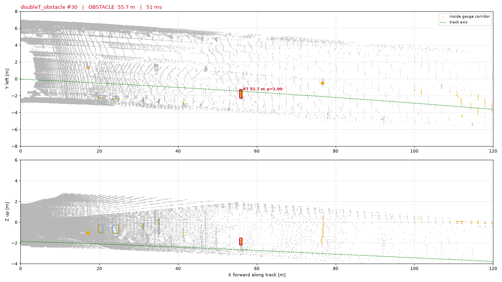

# ReSense — LiDAR obstacle detection inside the metro clearance gauge

> ЛЦТ 2026 · Кейс 05 · «Обнаружение посторонних объектов в тоннеле метро по данным 3D-лидара»
> (Московский транспорт / ГУП «Московский метрополитен»). Organizers' materials: [`docs/organizers/`](docs/organizers/).

ReSense answers one question for a driverless metro train, 10 times a second:
**"Is there anything on my path that should not be there — and how far is it?"**

It builds a geometric model of the *normal* tunnel from the LiDAR stream (track bed, rail head,
track axis and its curvature from the tunnel walls), cuts out the corridor that the train's
clearance gauge sweeps, and reports every persistent cluster inside it with its distance along
the track, lateral offset, size and confidence. No labelled obstacle classes are required.

```
ROS 2 bag ─▶ PointCloud2 ─▶ resense_ros/detector_node ─▶ /resense/obstacle_detected (Bool)
                                                         ├▶ /resense/nearest_distance (Float32)
                                                         ├▶ /resense/detections (vision_msgs/Detection3DArray)
                                                         ├▶ /resense/markers (RViz)  ─▶ RViz2 / Foxglove / web/
                                                         └▶ /resense/status (JSON)
```

Status: **v0.6 (22.09) — rebuilt around the organizers' Q&A answers**
([`docs/organizers/QA_session.md`](docs/organizers/QA_session.md): the recorded session,
transcribed and summarised). The strict decision now uses **the train envelope the organizers
gave (2.1 m wide × 3.0 m high)**; objects **hanging** into it (broken cables) are obstacles
whatever their shape; **low objects lying on a rail** are found by a bed-anomaly stage; tall
objects are reported out to the trusted axis range (~200 m on straight track) instead of the
height-reference range; the **LiDAR mount is found from the data** (orientation, roll, pitch)
because "the LiDAR position is not fixed"; and every frame says **how far the path was
verified clear** and whether the input can be trusted (`/resense/decision`
GO / CAUTION / STOP / FAULT, `/resense/clear_distance`, `/resense/health`).

Measured on **all 13 558 real frames** of the organizers' data at 10 Hz
([`docs/EXPERIMENTS.md`](docs/EXPERIMENTS.md) §0, §1d): false alarms on the five obstacle-free
bags **83 frames / 25 events** (v0.5 logic on the same frames: 116 / 32) and on the 20-minute
ride **258 frames / 74 events** (448 / 93); the person crossing the track in
`doubleT_obstacle` is reported in 58 of the 61 frames in which the person is inside the
envelope, the first alarm 0.3 s after entering it, distance error < 0.35 m. Long range on the
moving ride (objects ray-cast into consecutive real frames, no speed input, §2d): a person
approaching on straight track is first confirmed at **165 m median** (110–168 m, 6 of 6), a 1 m
crate at 127 m, a trolley at 121 m (up to 198 m), a 3 cm hanging cable at 107 m; in R ≈ 350 m
curves at the sightline (79 m). 300 m is beyond this sensor: the farthest return in all
13 558 frames is 208.5 m. Other LiDAR mounts (upside down, `+x` forward, backwards, rolled /
pitched) are recovered from the rails and the bed: orientation found and tilt within 0.8° on
re-mounted real frames of three recordings (§6). Clean timing: 42–58 ms mean, p95 52–69 ms per
frame on every recording (4-core sandbox, pure Python, §3).
The container chain (`docker build → run → bag play → result`) is verified in CI on a synthetic
bag on every push. Self-assessment against every criterion: [`docs/SCORECARD.md`](docs/SCORECARD.md).


*Real data, v0.5: `doubleT_obstacle` frame 30, the person on the track at 55.7 m. Videos: [offline renders of the whole bag](docs/video/doubleT_obstacle_offline.mp4) (20 s) and [the dashboard replaying the same run](docs/video/dashboard_doubleT_obstacle.mp4).*

## What to look at (for the jury)

The organizers asked that every team "say clearly what to look at". One line per question:

| question | topic | values |
|---|---|---|
| can the train go? | **`/resense/decision`** (`std_msgs/String`) | `GO` (clear), `CAUTION` (object next to the envelope, or degraded health), `STOP` (obstacle inside the 2.1 × 3.0 m envelope), `FAULT` (input cannot be trusted or stopped arriving) |
| is there an obstacle? | **`/resense/obstacle_detected`** (`std_msgs/Bool`) | per frame, confirmed over 0.3 s |
| how far is it? | **`/resense/nearest_distance`** (`std_msgs/Float32`) | m along the track, −1 if none |
| how far is the path verified clear? | **`/resense/clear_distance`** (`std_msgs/Float32`) | the obstacle distance, else how far the corridor was actually checked (sightline, trusted track model); 0 on a fault |
| everything else | `/resense/detections` (`vision_msgs/Detection3DArray`), `/resense/status` (JSON: every object with distance, lateral offset, size, confidence, kind; track model; health; mount calibration; timing) | |

Decision logic, thresholds and their measured effect: [`docs/ALGORITHM.md`](docs/ALGORITHM.md) §4, §4b.

## Repository layout

| Path | What |
|---|---|
| [`resense/`](resense/) | core library (numpy / scipy / scikit-learn, no ROS): PointCloud2 decoding, mount calibration, track model, gauge corridor, low-object stage, clustering, tracking, health, detector, synthetic obstacle injection, metrics, CLI |
| [`ros2_ws/src/resense_ros/`](ros2_ws/src/resense_ros/) | ROS 2 Humble node, launch file, parameters, RViz layout |
| [`docker/`](docker/), [`docker-compose.yml`](docker-compose.yml), [`scripts/`](scripts/) | reproducible build and demo |
| [`configs/default.yaml`](configs/default.yaml) | every tunable parameter (also installed as the ROS parameter file) |
| [`tests/`](tests/) | pytest on a synthetic ray-cast tunnel — runs without the dataset (algorithm, envelope, calibration, guards, and the ROS node against stand-ins: `test_node.py`) |
| [`web/`](web/) | browser dashboard (live via rosbridge or offline replay of a `resense run` JSONL), Foxglove layout, label tool, headless checks |
| [`docs/`](docs/) | [ARCHITECTURE](docs/ARCHITECTURE.md) · [ALGORITHM](docs/ALGORITHM.md) · [EXPERIMENTS](docs/EXPERIMENTS.md) · [SCORECARD](docs/SCORECARD.md) · [EVALUATION](docs/EVALUATION.md) · [DATASET](docs/DATASET.md) · [SENSOR](docs/SENSOR.md) · [RESEARCH](docs/RESEARCH.md) · [PLAN](docs/PLAN.md) · [CAPTAIN](docs/CAPTAIN.md) · [SUBMISSION](docs/SUBMISSION.md) · [PRESENTATION](docs/PRESENTATION.md) · [QUESTIONS](docs/QUESTIONS.md) · organizers' README / ТЗ / [**Q&A session**](docs/organizers/QA_session.md) ([transcript](docs/organizers/QA_session_transcript_ru.md)) · [test-stand software](docs/organizers/test_stand_software.md) · sensor manual ([`docs/sensor/`](docs/sensor/)) |
| [`labels/`](labels/) | real labels: `doubleT_obstacle.json` (the crossing person, the object on the rail, the walking person), `new_data_objects.json` (every object the detector confirmed on the 20-minute ride, with cause class) |

## Quick start (no ROS needed)

```bash
pip install -e ".[dev]"                       # numpy scipy scikit-learn pyyaml + rosbags matplotlib open3d pytest
pytest -q                                     # expect no skips: "skipped" means open3d is missing (RESENSE_REQUIRE_SYNTHETIC=1 makes that fail, as in CI)

# unpack the dataset (see docs/DATASET.md), then:
resense info  /data/for_hackathon/roundT_doubleT
resense run   --bag /data/for_hackathon/doubleT_obstacle --out results.jsonl --render out/   # PNG per frame
resense bench --bag /data/for_hackathon/roundT_doubleT --every 5                             # per-stage timing

# synthetic obstacles ray-cast into real empty frames + evaluation
resense inject --bag /data/for_hackathon/roundT_doubleT --every 10 --out data/synth --distances 10:250 --kinds person,box,plank
resense eval data/synth

# the real-data report card over every recording (frames cached once, docs/DATASET.md "Cached frames")
for b in /data/for_hackathon/*/; do python scripts/cache_frames.py $b /data/cache/$(basename $b) --every 1 --int16 --stamps; done
python scripts/eval_real.py --cache /data/cache --out out/eval          # false alarms, the labelled person / object, latency
python scripts/far_range_eval.py --cache /data/cache/new_data --files 46,68,98 --kinds person,box1.0,cable \
    --start 220 --out out/far.json                                    # objects approaching on the moving ride (set F)
python scripts/mine_objects.py out/eval --bag new_data                  # every confirmed object of a ride, by cause
```

## ROS 2 / Docker (the way the jury runs it)

```bash
./scripts/build.sh                                   # docker build -t resense -f docker/Dockerfile .
./scripts/run_demo.sh /data/for_hackathon/roundT_doubleT   # detector + RViz + bag playback in one container
./scripts/run_headless.sh /data/for_hackathon/doubleT_obstacle   # same, no X11: prints the distance
./scripts/dry_run.sh /data/for_hackathon/doubleT_obstacle        # acceptance test, exits non-zero on failure
WITH_TOOLS=1 ./scripts/build.sh                      # + rosbags / matplotlib / open3d / pytest inside the image
docker run --rm resense python3 -m pytest -q /opt/resense/tests   # the test suite inside the image (CI does this)

# or step by step
docker run --rm -it --net=host -v /data/for_hackathon:/data resense \
    ros2 launch resense_ros detector.launch.py            # terminal 1: detector
docker run --rm -it --net=host -v /data/for_hackathon:/data resense \
    ros2 bag play /data/roundT_doubleT --clock            # terminal 2: playback
ros2 topic echo /resense/nearest_distance                 # terminal 3 (any ROS 2 Humble host)
```

Launch arguments: `input_topic:=...` (comma-separated candidates, default
`/lidar_points,/sensing/lidar/hesai128/pointcloud`), `auto_discover:=true|false`,
`config_file:=/path/to/detector.yaml`, `rviz:=true|false`, `bag:=/data/<bag>`, `rate:=1.0`,
`loop:=true|false`, `delay:=3.0` (seconds the player waits before the first message, so that DDS
discovery completes: without it the first 1–3 s of a bag are lost), plus `publish_markers`,
`publish_corridor_cloud`, `marker_x_max`,
`output_frame`, `stats_period`, `discover_period`. For multi-frame accumulation the node needs
the train speed: `ego_speed_mps:=22.0`, or `speed_topic:=/vehicle/speed` (`std_msgs/Float32`,
m/s), or `odom_topic:=/odom` (`nav_msgs/Odometry`, `twist.linear.x`); with none of them the
detector uses its own estimate. `publish_tf:=true|false` and `tf_parent_frame:=resense_lidar`
control the static TF that lets one RViz / Foxglove layout serve every bag.

**The bags disagree on the topic name** — `roundT_doubleT` publishes `/lidar_points`,
`doubleT_obstacle` publishes `/sensing/lidar/hesai128/pointcloud` — so the node takes a list of
candidates and, unless `auto_discover:=false`, subscribes to any other `PointCloud2` topic that
appears on the graph. The first topic to deliver a frame wins and is logged; the others are
dropped. The control bag therefore needs no argument. `docker compose --profile viz up` starts
RViz and a Foxglove bridge (port 8765) next to the detector.

### Where the data lives

The bags are never copied into the image. **The directory that holds them is mounted at `/data`
inside the container**, and there is exactly one way to name it per entry point:

| entry point | how the directory is chosen |
|---|---|
| `scripts/run_demo.sh <bag>`, `run_headless.sh <bag>`, `dry_run.sh <bag>` | the parent of the bag path you pass |
| `docker compose` | `$RESENSE_DATA` (default `/data/for_hackathon`); `$RESENSE_BAG` picks the bag the `player` and `echo` services use |
| plain `docker run` | your own `-v <host dir>:/data:ro` |

```bash
RESENSE_DATA=/mnt/bags RESENSE_BAG=doubleT_obstacle docker compose --profile tools up
```

The organizers' extended recording (`new_data`, one 20-minute bag of 221 split files, 90 GB
unpacked — [`docs/DATASET.md`](docs/DATASET.md) "Extended dataset") is used the same way once
unpacked next to the six bags: `scripts/run_headless.sh /data/new_data`, or
`RESENSE_DATA=/data RESENSE_BAG=new_data docker compose up`.

The organizers' download is a zip inside a zip around a 4 GB zstd tar; unpacking it by hand
needs ~30 GB of scratch space. `scripts/unpack_dataset.py` streams zip → zip → zstd → tar and
writes only the bags you ask for:

```bash
python scripts/unpack_dataset.py Датасет.zip --list
python scripts/unpack_dataset.py Датасет.zip --out /data --only doubleT_obstacle,roundT_doubleT
python scripts/unpack_dataset.py https://disk.yandex.ru/d/N8IUpAyd7jyvow --out /data   # extended dataset (17 GB, streamed from the link)
```

### Demo without a display

Every step of the jury scenario works over ssh, with no X11 and no RViz — the detector prints
`fps`, latency mean / p95 / max and dropped frames, and the distance readout comes from the topic:

```bash
./scripts/run_headless.sh /data/for_hackathon/doubleT_obstacle      # one container, prints "OBSTACLE 55.7 m"
docker compose up detector                                          # or: detector alone,
docker compose --profile tools up player                            #     bag in a second terminal,
docker compose --profile tools run --rm echo                        #     distance in a third
```

### Remote real-time demo (spec §4)

Two ways to show the chain tunnel → cloud → detection → distance to a jury that is not in the room:

1. **Screen share of RViz**: `./scripts/run_demo.sh /data/for_hackathon/doubleT_obstacle` on the
   demo machine and share the RViz window; for a continuous replay use the launch file directly
   with `loop:=true`:
   `docker run --rm -it --net=host -e DISPLAY -v /tmp/.X11-unix:/tmp/.X11-unix -v /data/for_hackathon:/data:ro resense ros2 launch resense_ros detector.launch.py bag:=/data/doubleT_obstacle loop:=true rviz:=true`.
2. **Foxglove over the network**, nothing graphical on the demo machine:
   ```bash
   docker compose --profile viz up detector foxglove                      # detector + foxglove_bridge :8765
   RESENSE_BAG=doubleT_obstacle docker compose --profile tools up player   # second terminal
   ```
   On any laptop open Foxglove (desktop app or app.foxglove.dev) → Open connection →
   `ws://<demo-host>:8765` (`ssh -L 8765:localhost:8765 <demo-host>` first if only ssh is open) →
   Layout → Import → [`web/foxglove_layout.json`](web/foxglove_layout.json): raw cloud, corridor
   points, boxes, status text and the distance / latency / fps plots. Details and limits in
   [`web/README.md`](web/README.md). Over a slow link switch the raw-cloud panel off and keep
   `/resense/corridor_points` (a few thousand points): the detections and the status text do not
   depend on it.

### Acceptance test (`scripts/dry_run.sh`)

The 28.09 dry run is a script, not a checklist. It builds the image with `--no-cache`, waits for
the node to advertise before playing the bag (the launch file's own `bag:=` races startup and
loses the first frames), captures `/resense/status` and checks it:

```bash
./scripts/dry_run.sh /data/for_hackathon/doubleT_obstacle
# == checking out/dry_run/status.jsonl ==
# status messages / alarm frames / obstacle distance / latency mean,p95,max / dropped frames / fps
# PASS: all dry-run criteria met

SKIP_BUILD=1 ./scripts/dry_run.sh /data/for_hackathon/roundT_doubleT --expect-clear   # false-alarm check
```

Defaults for `doubleT_obstacle`: the person is reported in 50–62 m, p95 of decode + detect is
≤ 100 ms (the 10 Hz frame period) and no input frame is dropped. Any argument after the bag path
is forwarded to `scripts/check_dry_run.py`, which holds the thresholds (`--expect-obstacle`,
`--expect-clear`, `--distance LO:HI`, `--first-clear N`, `--max-p95-latency`, `--max-dropped`,
...) and can also run on a capture someone else recorded. Raw output stays in `$OUT` (default
`out/dry_run/`): `status.jsonl` and `node.log`.

### Dataset-free smoke test (what CI runs)

The same procedure runs on every push without the dataset. `scripts/make_smoke_bag.py` writes a
40-frame bag of the synthetic tunnel (15 clear frames, then a person on the track at 60 m) in the
organizers' exact bag layout (sqlite3, `/lidar_points`, `hesai_lidar`, dual-return empty slots),
`scripts/smoke_test.sh` plays it through the node inside the image, and the checker asserts a
clear lead-in, the alarm at 55–66 m and no dropped frames:

```bash
WITH_TOOLS=1 ./scripts/build.sh                    # the generator needs open3d
docker run --rm resense:latest bash -lc "python3 scripts/make_smoke_bag.py /tmp/smoke_bag && scripts/smoke_test.sh /tmp/smoke_bag"
```

The image contains only what the node needs (pinned numpy / scipy / scikit-learn / pyyaml, ROS 2
packages, RViz, rosbag2, Foxglove bridge). `configs/default.yaml` is copied into the ROS package
at build time, so the node always runs the committed parameters; `./scripts/sync_params.sh`
keeps the in-repo copy identical (CI checks it).

### Topics published by the node

| topic | type | meaning |
|---|---|---|
| `/resense/obstacle_detected` | `std_msgs/Bool` | confirmed object inside the clearance gauge |
| `/resense/warning` | `std_msgs/Bool` | confirmed object in the advisory zone only |
| `/resense/nearest_distance` | `std_msgs/Float32` | m along the track to the nearest gauge obstacle, −1 if none |
| `/resense/detections` | `vision_msgs/Detection3DArray` | boxes in the sensor frame, `class_id` = `gauge_obstacle` / `warning_obstacle`, score = confidence |
| `/resense/status` | `std_msgs/String` | JSON: full per-frame result (detections, track model, per-stage timing) plus `node` = `{latency_ms, fps, frames, dropped_frames, input_period_ms, ego_speed_mps, ego_speed_source}` |
| `/resense/latency_ms` | `std_msgs/Float32` | per frame: decode + detect + publish, ms |
| `/resense/fps` | `std_msgs/Float32` | frames processed per second, every `stats_period` s (default 2) |
| `/resense/decision` | `std_msgs/String` | v0.6: `GO` / `CAUTION` / `STOP` / `FAULT` (see "What to look at") |
| `/resense/clear_distance` | `std_msgs/Float32` | v0.6: m of track verified clear (the obstacle, else the monitored range; 0 on a fault or a silent input) |
| `/resense/health` | `diagnostic_msgs/DiagnosticArray` | v0.6: OK / WARN / ERROR / STALE with messages and values: points, window dirt, blocked sectors, visibility, rail lock, latency p95, monitored range, mount calibration |
| `/resense/markers`, `/resense/corridor_points` | `MarkerArray`, `PointCloud2` | RViz: boxes, labels, corridor outline, status text; points inside the corridor |
| `/tf_static` | `tf2_msgs/TFMessage` | identity transform `resense_lidar` → the input cloud's `frame_id`, sent once per frame id: the layouts keep `resense_lidar` as the fixed frame whether the bag says `hesai_lidar` or `lidar_livox` |

Node parameters: `input_topic`, `auto_discover`, `discover_period`, `config_file`,
`publish_markers`, `publish_corridor_cloud`, `marker_x_max`, `output_frame`, `stats_period`,
`ego_speed_mps`, `speed_topic`, `odom_topic`, `speed_timeout`, `publish_tf`, `tf_parent_frame`,
and since v0.6 the **sensor mount** — `sensor_forward` / `sensor_left` / `sensor_up` (axis
mapping, e.g. `sensor_forward:=+x`), `mount_roll_deg` / `mount_pitch_deg` / `mount_yaw_deg`
(fixed tilt), `auto_calibrate` (default `true`: orientation, roll and pitch found from the rails
and the bed in the first frames, reported in `/resense/status` → `mount`) — and the **guards**
`stale_timeout` (s without a frame before `FAULT`, default 0.5) and `max_consecutive_errors`
(processing exceptions before the detector is reset, default 5). All of them are launch
arguments too. Every `stats_period` seconds the node logs
`fps`, latency mean / p95 / max, the measured input period and the number of frames the
input queue dropped (estimated from gaps in the header stamps).

## Parameters worth knowing (`configs/default.yaml`)

| key | default | meaning |
|---|---|---|
| `sensor.forward/left/up`, `sensor.roll_deg/pitch_deg/yaw_deg` | `-y/+x/+z`, 0 | sensor → vehicle axis mapping (hackathon Hesai frame) and a fixed mount tilt |
| `calibration.*` | on, 5 frames | automatic mount calibration (orientation, roll, pitch, yaw > 3°) |
| `track.rails_*` | | rail-ridge template (gauge 1.52 m) for the track axis and rail-head level |
| `track.walls_*` | band 1.6–2.8 m | tunnel-boundary fit for yaw / curvature; `axis_valid_*` = how far the corridor is trusted |
| `gauge.profile` | \|dy\| ≤ 1.05 m, 0.12–3.0 m | **the organizers' 2.1 × 3.0 m train envelope**; `warning_margin` 0.35 m = advisory zone; `edge_margin_per_100m` 0.15 m |
| `lowobj.*` | on, ≤ 60 m | low objects on the rails (bumps above the learned bed that rise ≥ 3 cm above the rail head) |
| `cluster.far_*` | 0.6 m tall, ≤ 3 m long | what may alarm beyond the height reference (far field of straight track) |
| `cluster.eps / range_scale / voxel` | 0.35 / 40 / 0.05 | range-adaptive DBSCAN: ε(r) = eps·(1 + r/40 m) |
| `cluster.*_max_*`, signatures | | infrastructure filters (thin hardware, low hardware, wall-like, column, floating, edge, wall face); thin objects hanging near the axis are never demoted |
| `tracking.confirm_hits / conf_threshold` | 3 / 0.6 | persistence before an alarm (low objects: 5 hits) |
| `health.*` | | thresholds of the production guards |

## Documentation required by the organizers (spec §5, §7)

| requirement | where |
|---|---|
| project description | this README (top) |
| build the Docker image | "ROS 2 / Docker" above, `scripts/build.sh` |
| run, process a bag | "ROS 2 / Docker" (`run_demo.sh`, launch arguments), "Quick start" (offline `resense run`) |
| parameters and configuration | "Parameters worth knowing", [`docs/ALGORITHM.md`](docs/ALGORITHM.md) §5, `configs/default.yaml` |
| architecture (components, data flow) | [`docs/ARCHITECTURE.md`](docs/ARCHITECTURE.md) |
| algorithm (problem, data, processing, decision, parameters, limitations) | [`docs/ALGORITHM.md`](docs/ALGORITHM.md) |
| experiments (range, latency, FPS, false alarms, hard cases, evolution) | [`docs/EXPERIMENTS.md`](docs/EXPERIMENTS.md), protocol in [`docs/EVALUATION.md`](docs/EVALUATION.md) |
| input data format, sensor | [`docs/DATASET.md`](docs/DATASET.md), [`docs/SENSOR.md`](docs/SENSOR.md) (Hesai Pandar128 specs and what they imply) |
| video | [`docs/video/doubleT_obstacle_offline.mp4`](docs/video/doubleT_obstacle_offline.mp4) (top-down and side renders of every frame of the real bag, v0.5) and [`docs/video/dashboard_doubleT_obstacle.mp4`](docs/video/dashboard_doubleT_obstacle.mp4) (the web dashboard replaying the same run); recipe in [`web/README.md`](web/README.md); the RViz screen recording on the jury chain is still to be made on a machine with Docker |
| submission status | [`docs/SUBMISSION.md`](docs/SUBMISSION.md) |

## Team

Four people, mapped onto the five roles the organizers suggest (system analyst, computer-vision
engineer, ROS 2 robotics developer, data specialist, C++/Python software developer):

| # | who | organizers' roles | owns |
|---|---|---|---|
| P1 | captain / lead | system analyst + ROS 2 robotics developer | requirements, architecture, ROS 2 node & Docker, evaluation protocol, submission, pitch lead |
| P2 | frontend | software developer (Python/JS tooling & UI) | RViz / Foxglove / web dashboard, label tool, video, presentation (mandatory slides 7–11) |
| P3 | member 3 | computer-vision engineer | track model, gauge corridor, clustering, tracking, long range, false-positive suppression, performance |
| P4 | member 4 | data specialist | dataset tooling, synthetic obstacles & augmentation, labelling, metrics, tests, CI |

Detailed plan and sprint calendar to the 29 September deadline: [`docs/PLAN.md`](docs/PLAN.md).
