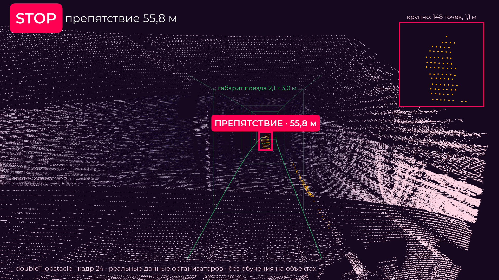
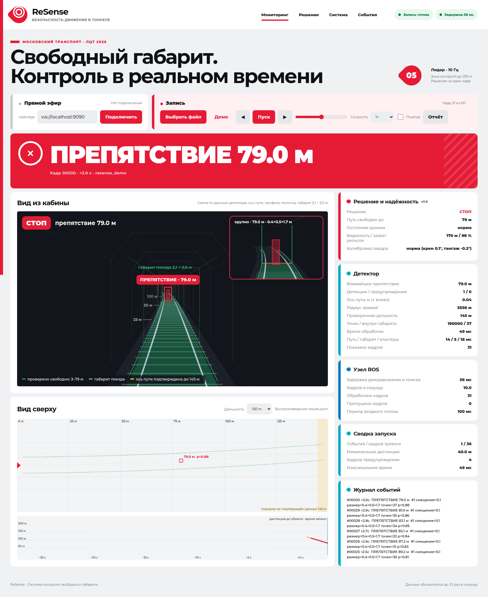

# ReSense: LiDAR Obstacle Detection in the Metro Clearance Gauge

> **Purpose:** what ReSense does, how the jury runs it, what to look at, headline results.
> **Audience:** jury, team · **Owner:** P1 · **Language:** EN, RU block «Кратко для жюри»
> **Last verified:** 2026-09-26 against inherited P3d detector commit `fa18832` and its frozen
> defaults (package 1.0.0: detector v0.6.3 with the 10 s STOP-keep rule, node v0.6.4) · **Status:** current

ЛЦТ 2026 · Кейс 05 · «Обнаружение посторонних объектов в тоннеле метро по данным 3D-лидара»
(Московский транспорт / ГУП «Московский метрополитен»). Organizers' material:
[`docs/organizers/`](docs/organizers/). Every document: [`docs/README.md`](docs/README.md).

## Кратко для жюри

ReSense 10 раз в секунду отвечает беспилотному поезду метро: есть ли на пути то, чего там быть не
должно, и как далеко. По облаку LiDAR он строит модель нормального тоннеля (полотно, головки
рельсов, ось пути и её кривизну по стенам), вырезает коридор габарита поезда 2,1 × 3,0 м, заданного
организаторами, и сообщает о каждом устойчивом объекте в нём: расстояние вдоль пути, боковое
смещение, размер, уверенность. Классы объектов и обучение на разметке не нужны.

**На стенде нет интернета** (организаторы, 25.09), поэтому `docker build` там не сработает
(базовый образ, apt, pip). Образ сдаётся готовым архивом `resense-image-<версия>.tar.gz` (рядом
его `.sha256`) и загружается без сети; нода и всё, что ей нужно при работе, сети не требуют.

```bash
sudo sysctl -w net.core.rmem_max=33554432                # 0. на хосте, до перезагрузки: буфер UDP для 360° облаков
docker load -i resense-image-<версия>.tar.gz             # 1. один раз, без интернета
docker run --rm -it --net=host --ipc=host resense        # 2. консоль 1: нода, без аргументов
ros2 bag play <бэг> --delay 3                            # 3. консоль 2: любой пользователь, ROS 2 Humble
ros2 topic echo /resense/decision --field data           # 4. консоль 3: GO | CAUTION | STOP | FAULT
ros2 topic echo /resense/nearest_distance --field data   # 5. расстояние до препятствия, м; −1 — нет
```

Увидеть облако, коридор габарита и препятствия в RViz (нужен X11): вместо шага 2 — одна строка:

```bash
xhost +local:docker && docker run --rm -it --net=host --ipc=host -e DISPLAY -e QT_X11_NO_MITSHM=1 -v /tmp/.X11-unix:/tmp/.X11-unix resense ros2 launch resense_ros detector.launch.py rviz:=true
```

**Где взять архив.** Архив коммита ветки `claude/nifty-pascal-lzgl78` или `main` — артефакт CI:
Actions → прогон `ci` этого коммита (задание `offline-build` зелёное) → Artifacts →
`resense-image-<версия>-<коммит>` (zip с `.tar.gz` и `.sha256`, хранится 30 дней, нужен вход в
GitHub; или `gh run download <id прогона> -n resense-image-<версия>-<коммит>`). Без CI его делает
`scripts/export_image.sh` на машине с интернетом (`dist/resense-image-<версия>.tar.gz` и его
`.sha256`). С интернетом шаг 1 можно заменить сборкой: `docker build -t resense -f
docker/Dockerfile .`. Проверка архива: `sha256sum -c resense-image-<версия>.tar.gz.sha256`, или
`scripts/load_image.sh <архив>` (сумма, загрузка и запуск образа без сети). Сборка без интернета —
запасной путь с оговорками ([ARCHITECTURE](docs/ARCHITECTURE.md) «Deployment without internet»):
после шага 1, в исходниках того же коммита, `chmod -R u+rwX,go+rX,go-w . && docker build
--cache-from resense:<версия> -t resense -f docker/Dockerfile .` берёт все слои из архива; не
вышло — образ из шага 1 не тронут, шаг 2 работает.

**`--net=host` обязателен.** Образ передаёт DDS только по UDP; без общей с хостом сети плеер не
находит ноду, и `/resense/decision` остаётся `FAULT`. `ROS_DOMAIN_ID` плеера и ноды должен
совпадать (по умолчанию 0). Нет ROS 2 на хосте — плеер из того же образа: `docker run --rm
--net=host -v <папка с бэгами>:/data:ro resense ros2 bag play /data/<бэг> --delay 3`.
**Шаг 0 нужен для 360-градусных облаков (24 МБ) с плеером на CycloneDDS:** при `rmem_max` 212992
(по умолчанию в Ubuntu) нода получала 0–1 из 201 такого облака, при 32 МиБ — все; штатный Fast DDS
(`rmw_fastrtps_cpp`, по умолчанию в Humble) доставлял все и при 212992, шаг 0 ему не мешает (25.09,
три машины команды, [EXPERIMENTS](docs/EXPERIMENTS.md) §3b). 120-градусные облака (3 МБ) доходят и без него. Нода пишет WARN при старте, если буфер меньше.

Ожидаемый вывод шага 4 на `doubleT_obstacle` (сокращён; сообщения идут 10 раз в секунду):

```text
FAULT     # с 2 с после старта ноды, пока плеер загружает бэг (2,6–4 с): кадров ещё нет
GO        # первая секунда записи; CAUTION, когда человек подходит к габариту
STOP      # с 1,3–1,6 с записи: человек на пути, затем предмет на рельсе, 55,5–56,6 м
CAUTION   # дважды по одному кадру в конце (предмет пропущен в кадре), затем снова STOP
FAULT     # через 0,5 с после конца бэга: входа нет, путь не контролируется
```

| `/resense/decision` | значение |
|---|---|
| `STOP` | **тревога**: подтверждённое препятствие в габарите 2,1 × 3,0 м |
| `CAUTION` | подсказка, **не тревога**: объект у габарита снаружи или за проверенной дальностью, известная инфраструктура, сниженная исправность; в обычном тоннеле частая |
| `GO` | в габарите ничего нет, исправность в норме (насколько далеко проверено — `/resense/clear_distance`) |
| `FAULT` | входа нет (до первого кадра, > 0,5 с без кадров) или ему нельзя доверять |

**Что оценивать:** тревога — `STOP` в `/resense/decision` (то же — `true` в
`/resense/obstacle_detected`); расстояние до препятствия вдоль пути — `/resense/nearest_distance`,
м (−1 — препятствия нет). Задержка сверх бюджета (p95 > 100 мс, нагруженная машина) с 26.09 видна
только в `/resense/health` и `/resense/status` и решение не меняет. Дальше:
[архитектура](docs/ARCHITECTURE.md), [алгоритм](docs/ALGORITHM.md),
[эксперименты](docs/EXPERIMENTS.md), [ключевые решения](docs/DECISIONS.md),
[оценка по критериям](docs/SCORECARD.md).

## How a bag is processed (the jury path)

```text
ros2 bag play <bag>  ──PointCloud2 (either topic / frame pair), 10 Hz──▶  resense_detector node
(any console on the same ROS 2 network,        (docker run --net=host … resense)
 or inside our image: sqlite3 + mcap plugins)        ├─▶ /resense/decision        GO / CAUTION / STOP / FAULT
                                                     ├─▶ /resense/obstacle_detected, /resense/nearest_distance
                                                     ├─▶ /resense/clear_distance, /resense/health
                                                     └─▶ /resense/detections, /resense/status (JSON), RViz markers
```

1. **Load the image** (command 1). **The stand has no internet** (organizers, 25.09,
   [`docs/organizers/answers.md`](docs/organizers/answers.md) §7), so the image comes built, as the
   archive of `scripts/export_image.sh`; `docker load` reads the gzip directly, and
   `scripts/load_image.sh <archive>` also checks its `.sha256` and runs the image with
   `--network none`. With internet, build it instead (`docker build -t resense -f
   docker/Dockerfile .` or `./scripts/build.sh`: ROS 2 Humble and exactly pinned Python packages).
   Nothing in the node, the launch file or the entrypoint uses the network at run time.
2. **Start the node** (command 2), no arguments for any organizers' recording. **`--net=host` is
   required**: the image runs Fast DDS over UDP only (`docker/fastdds_udp.xml`, so that a player run
   by any user reaches the root node), and in Docker's default bridge network the host's player and
   the node do not discover each other. `--ipc=host` is harmless, kept for older images. Opt-in,
   off by default until tested on the team's VM: `-e RESENSE_DDS=shm` (with `--ipc=host`) adds
   shared memory, so that a stock Fast DDS player on the host delivers the clouds through `/dev/shm`
   whatever `net.core.rmem_max` is ([`docs/VM_GUIDE.md`](docs/VM_GUIDE.md) §4.6).
3. **Play the bag** (ReSense reads no bag files: it subscribes to what the player publishes) on the
   same `ROS_DOMAIN_ID` (default 0); `--delay 3` lets DDS discovery complete. CI plays it as uid
   1000 from a second container of the image, with the image's profile and with the stock Humble
   RMW (`rmw_fastrtps_cpp`, no XML profile, shared memory on: `PLAYER_DDS=stock
   scripts/console_test.sh`), as a host console does; stock clients reach the node over UDP
   because the node announces no shared-memory locators. A 360° recording needs
   `net.core.rmem_max` ≥ 32 MiB on the host for its 24 MB clouds (jury step 0, `sudo sysctl -w
   net.core.rmem_max=33554432`): at Ubuntu's 212992 a CycloneDDS player delivered none and a stock
   Fast DDS player 0–1 of 201 on one of two team VMs (25.09, EXPERIMENTS §3b); the 120° clouds
   arrive either way; the node logs a WARN at start below 32 MiB.
4. **Read the answer** ("What to look at"). `ros2 bag play` (Humble) preloads up to 1 000 messages,
   all of a short recording, while its clock runs, then sends the overdue first seconds back to
   back: `FAULT` until then (2.6–4 s for 1.9 GB in the page cache, longer from a slow disk). The
   node works through the burst from the first frame, one frame every 0.3 s of recording
   (`catchup_step`), and is back in real time within ~2 s.

**The bags disagree on the topic and frame id** (`/lidar_points` in `hesai_lidar` for
`roundT_doubleT` and four more, `/sensing/lidar/hesai128/pointcloud` in `lidar_livox` for
`doubleT_obstacle`), and the control data may use either pair (organizers, 23.09). The node listens
to both and, unless `auto_discover:=false`, to any other `PointCloud2` topic; it processes one input
at a time and switches when the active one is silent for `input_switch_timeout` (1 s). A **new
recording** (another topic or frame id, stamps that jump back or forward by > `new_input_gap`,
30 s) gets a fresh detector, a shorter hole (> `hole_reset_gap`, 1 s) resets the scene only, so
control bags can be played one after another into one running node. The offline tool
(`resense run --bag <dir>`) reads rosbag2 directly and writes the same per-frame JSON.

## Status (26.09): package 1.0.0, detector v0.6.3 with integrated P3d rules, node v0.6.4

The v0.6.4 node works through the burst of the first seconds of a played bag instead of losing
them: the first `STOP` on `doubleT_obstacle` comes 1.3–1.6 s into the recording, was 3.2–4.5 s.
History: [`CHANGELOG.md`](CHANGELOG.md). Key decisions on one page:
[`docs/DECISIONS.md`](docs/DECISIONS.md). Criteria judgement of 24.09 (two independent judges,
reconciled): **60 / 100** (last independently re-judged 26.09: **65 / 100**, before the P3c
and P3d integrations; no score has been issued for the integrated head); strongest 8.7 team
approach (8.5 / 10) and 8.6 ease of launch (8 / 10), lowest 8.1 "does it work" (14.5 / 25) and
8.2 range (7.5 / 15), mainly on the organizers' synthetic-obstacle recording:
[`docs/SCORECARD.md`](docs/SCORECARD.md). Since then (the 1.0.0 entry of
[`CHANGELOG.md`](CHANGELOG.md)): optional C++ kernels (38–57 % less detector time,
identical output, built and tested in the CI image), DBSCAN on scipy's cKDTree with scikit-learn's
exact labels (1.3–2.6 ms less per frame, identical output), the near-bed opt-in box fix, a
measured answer on the train speed (EXPERIMENTS §9), delivery as an image archive for the offline
stand, a CI step with a stock Fast DDS player, the long overhead rule for the station false STOPs
(on since 25.09, decided on the ride: five bags 20 → 14 events, ride 47 → 46; the short-signature
rule for the organizers' small objects tried and not shipped, EXPERIMENTS §1f), version 1.0.0
with a release workflow that publishes the image archive on a tag push, and a captioned 2:50
overview video. When all caches are present, `scripts/regression_gate.py` re-checks the real-data
rows, set O, the ride and set F straight. On 26.09 evening every cache was rebuilt on a second
machine from the organizers' links and the strict gate passed with every gated row the same as the
`_ride_p3d` baseline, the ride and set F straight included. All current numbers:
[`docs/EXPERIMENTS.md`](docs/EXPERIMENTS.md) "Current results" and §1p.

**P4 data and evaluation update (26.09).** The six original caches contain all 2,488 expected
frames, and the set O cache contains all 1,510. Their regression metrics match the inherited P3d
baseline: set O has 384/801 inside STOP frames and object #8 has 51/124 STOP frames, a STOP on
every frame from 101.3 m (the scorer's 90 % held-from field reads 111.4 m). P4's own strict
full-gate command exited 1 because the 221-split ride cache was absent on that workstation; **on
26.09 evening the ride was cached on a second machine (11 271 frames, 221 splits) and the strict
gate passed with no `--allow`: the 3 ride rows (45 events in 13 km, 38 STOP episodes) and the 15
set F straight rows are the archived baseline's values, measured again** (EXPERIMENTS §1p). No P4
detector change was shipped: candidates A and C did not improve their targets; candidate B improves
set O #4 from 2 to 3 STOP frames and passes the full gate with the ride, so it is eligible by P4's
rules, but it is left for the captain's decision at the freeze (one frame at 7 m against a lower
voxel bar for every demoted track). The measured re-judgement of 26.09 evening is **67/100**
([`docs/SCORECARD.md`](docs/SCORECARD.md) §0); the independent judgement of 26.09 morning was
65/100 on the pre-P3c/P3d commit. See the
[`P4 data and evaluation audit`](docs/P4_AUDIT.md) for cache integrity, false alarms, stress
results, candidate decisions and the completion on the second machine. The software checks pass
586 tests with the ride cache present (585 and one deselected without it), recorded in the
[`completion record`](docs/evidence/results/p4_completion_2026-09-26_evening.json).

What the organizers' answers changed ([`docs/organizers/answers.md`](docs/organizers/answers.md)):

* the strict decision uses **their train envelope, 2.1 × 3.0 m**; the wider v0.5 polygon is the
  advisory zone; objects **hanging** into it (broken cables) are obstacles; one that dips in with
  only a few returns is found by the hanging stage only for groups ≤ 0.5 m, within 0.8 m of the
  axis, out to 60 m and where the rails are locked (ALGORITHM §6);
* **low objects on a rail**, or straddling the envelope floor like their object, are found by a
  bed-anomaly stage; tall objects are reported out to the trusted axis range (~200 m on straight
  track; the tunnel returns nothing beyond ~210 m), but on the organizers' own objects no STOP
  comes beyond ~101 m (set O), and the 148–154 m person is our own synthetic;
* the **mount is found from the data** (orientation, roll, pitch). 24.09
  ([`mount_and_switch_qa.md`](docs/organizers/mount_and_switch_qa.md)): the test bags use the
  mounts of the provided ones, the LiDAR 1 075 mm above the rail head on the train's centreline,
  so the auto-calibration stays as a safeguard; glitches at switches (states unknown) will not
  count against a solution;
* every frame says **how far the path was verified clear** and whether the input can be trusted.

Headline results (kinds and placement modes: [`docs/README.md`](docs/README.md) "Glossary"):

| metric | value | kind | date | source |
|---|---|---|---|---|
| false alarms, five obstacle-free bags (2 287 frames) | **13 events**, 58 alarm frames, 16 STOP episodes (14 / 60 / 17 before `tracking.column_hold` 2, 20 / 107 / 27 before the long overhead rule of 25.09) | real | 25.09 | EXPERIMENTS §1f, §3a |
| false alarms, 20-minute 13 km ride (11 271 frames) | **45 events, 3.5 per km** (in-sample: the ride decided the rules of 25.09), 183 alarm frames, 38 STOP episodes (46 / 187 / 39 before `lowobj.rail_start_within` of 26.09, 46 / 197 / 39 before `tracking.column_hold` 2, 47 / 204 / 39 before the rule) | real | 25.09, 26.09 | EXPERIMENTS §1f, §3a, §1n |
| crossing person, `doubleT_obstacle` | STOP in **58 of 61** frames inside the envelope, first alarm frame 11 (0.3 s after entering), distance error ≤ 0.23 m | real | 24.09 | EXPERIMENTS §0 |
| object lying across the rail (0.45 × 0.6 × 0.3 m) | **125 of the 126** frames after the person leaves it (124 before `calibration.keep_within_deg`, 25.09 round 2) | real | 24.09, 25.09 | EXPERIMENTS §0, §1i |
| health warnings, `CAUTION` | warnings on 196 of 13 759 frames (1.4 %: stations, switches); `CAUTION` on 27–68 % of the frames of the empty bags, 41 % of the ride | real | 24.09 | EXPERIMENTS §0 |
| organizers' synthetic objects (set O, 1 510 frames) | STOP for **8 of 8** in-envelope objects since the near escalation of 26.09 (6 of 8 before, 5 of them held; 5 of 8 before the hanging stage of 25.09): 2 × 2 m box from 98 m, plank across the rails 82 m, 0.3 m cubes from 43–53 m (the hanging one from 52.5 m since round 2 of 25.09, 34.0 m before), the 5 cm hanging object from 30.1 m (missed before 25.09), the 2 × 2 m box at the envelope top in **51 of 124 frames**, STOP on every frame from 101.3 m under the P3d STOP keep (the scorer's 90 % held-from field reads 111.4 m) (22 frames, held-from 23.9 m on P3c), the edge 2 × 2 m box from 10.3 m (6 frames), and the edge 0.3 m cube at 5.2 m (2 frames); STOP in **384 of 801** visible in-envelope object-frames, 6 false STOP frames on the outside 2 × 2 m box, 3 background alarm frames; set O has been inspected before and is not unseen validation | organizers' synthetic | 24.09, 25.09, 26.09 | [P4_AUDIT](docs/P4_AUDIT.md), EXPERIMENTS §1h, §1i, §1l, §1o |
| long range, straight track | person first confirmed at **148 m** median (6 of 6), held in ≥ 90 % of frames from 149 m and of every 10 m band from 115 m; trolley 144 m; 1 m crate 111 m; 3 cm hanging cable 95 m, held only from ~50 m (4 of 6); the regression gate's run of the same set on the current evaluation script (25.09): person 151 m, held from 143 m | synthetic, legacy | 24.09, 25.09 | EXPERIMENTS §2d |
| long range with a given train speed | person 167 m, crate 182 m (held only from 79 m) | synthetic, legacy | 24.09 | EXPERIMENTS §2d |
| train speed | none is given (no odometry in the recordings); our LiDAR-only estimate is accurate (median error 0.06–0.08 m/s on 55–96 % of the moving frames), but even a perfect speed does not improve the organizers' check (no earlier first STOP, 6 → 17 false STOP frames on the box outside), so it stays off | real, organizers' synthetic | 24.09 | EXPERIMENTS §9 |
| curves, stations, low objects | R ≈ 350 m curves 6 of 7 from 58–86 m (sightline past the inner wall); station stops 6 of 6 from 113 m; 30 cm on a rail head 6 of 6 from 42–49 m; person lying across the rails 6 of 6 from ~64 m | synthetic, legacy | 24.09 | EXPERIMENTS §2d |
| sensor limit | no return beyond 210 m in any of the 13 759 frames: 300 m is beyond this sensor | real | 24.09 | EXPERIMENTS §2d |
| other mounts | upside down, `+x` forward, backwards found; tilt recovered to 0.0–0.5° on re-mounted frames of 3 recordings | real, re-mounted | 22–23.09 | EXPERIMENTS §6 |
| offline timing per frame | 42–64 ms mean, p95 53–78 ms on every recording (one core, numpy path, health monitor not included: 7–14 ms more); 24.09 on another idle VM 36.5–52.2 / 50.3–67.1 ms; the optional C++ kernels: −38…−57 %, identical output; DBSCAN on cKDTree (25.09): −1.3…−2.6 ms more on the native path | timing: sandbox | 23–25.09 | EXPERIMENTS §3, ARCHITECTURE "Native kernels" |
| ROS node in Docker | 120°: 10 fps, p95 76 ms; 360°: 7–10 fps (the sandbox is at the frame period); ~100 % of one core, 186 MB (v0.6.3); v0.6.4 peak RSS 403–434 MB at 360° | timing: sandbox | 23–24.09 | EXPERIMENTS §3b |

Set F uses legacy placement, which can flatter curves and envelope edges: P4's paired rerun found
0 matches beyond 100 m on seven curve / edge scenes in either mode, and on straight track a person
anchored on the near rails first at 154 m (legacy 150 m, 5 approaches; not surveyed ground truth).
Set S on 108 real empty frames: 22 / 67 bed placement, 30 / 68 legacy (small samples; the P3d
replay uses the same sample identities as the P3c run). Details:
[`p3d paired set S report`](docs/evidence/results/p4_p3d_setS_paired_2026-09-26.json).


*Real data, v0.6.2: `doubleT_obstacle` frame 24 from the cab (`scripts/hero_view.py`), the person
at 55.8 m. Video: the 2:50 captioned overview
[`docs/video/resense_overview.mp4`](docs/video/resense_overview.mp4) (silent, Russian subtitles
burned in and in `resense_overview.ru.srt`); the clips it is cut from (v0.6.2; Docker chain
v0.6.3; the dashboard clip shows the earlier UI) in [`docs/video/`](docs/video/). Slides:
[`docs/presentation/`](docs/presentation/). Below: the
dashboard (synthetic UI demo, not evaluation evidence; [gallery](docs/images/README.md)).*



The [scheme and detailed system view](docs/images/dashboard-plan.png) are available in the second tab.

## What to look at

The organizers asked every team to "say clearly what to look at" and left the outputs to the
teams (23.09). Decision logic and thresholds: [`docs/ALGORITHM.md`](docs/ALGORITHM.md) §4, §4b.

| question | topic | values |
|---|---|---|
| can the train go? | **`/resense/decision`** (`std_msgs/String`) | `GO` (clear), `CAUTION` (advisory: a confirmed object in the band just outside the envelope, a far cluster beyond the verified range, known infrastructure or degraded health (since 26.09 not latency: that shows in `/resense/health` and the status JSON only); on 27–68 % of the frames of the obstacle-free recordings and 41 % of the ride, so it is not an alarm), `STOP` (obstacle inside the 2.1 × 3.0 m envelope), `FAULT` (input cannot be trusted or stopped arriving, and before the first frame) |
| is there an obstacle? | **`/resense/obstacle_detected`** (`std_msgs/Bool`) | per processed frame, confirmed over 0.5 s, held over one missed frame; `false` while no frame arrives (then `decision` says `FAULT`) |
| how far is it? | **`/resense/nearest_distance`** (`std_msgs/Float32`) | m along the track, −1 if none |
| how far is the path verified clear? | **`/resense/clear_distance`** (`std_msgs/Float32`) | the obstacle distance, else how far the corridor was actually checked (sightline, trusted track model), since 25.09 no farther than an unconfirmed or advisory object in the envelope (`health.clear_cap`); 0 on a fault |
| everything else | `/resense/detections` (`vision_msgs/Detection3DArray`), `/resense/status` (JSON: every object with distance, lateral offset, size, confidence, kind; track model; health; mount calibration; timing) | |

## Repository layout

| path | what |
|---|---|
| [`resense/`](resense/) | core library (numpy / scipy / scikit-learn, no ROS): PointCloud2 decoding, mount calibration, track model, gauge corridor, low-object stage, clustering, tracking, health, detector, synthetic obstacle injection, metrics, CLI |
| [`ros2_ws/src/resense_ros/`](ros2_ws/src/resense_ros/) | ROS 2 Humble node, launch file, parameters, RViz layout |
| [`docker/`](docker/), [`docker-compose.yml`](docker-compose.yml), [`scripts/`](scripts/) | reproducible build and demo |
| [`docs/VM_GUIDE.md`](docs/VM_GUIDE.md) | instructions for the team's temporary cloud VM (a person or an agent), plain commands of the tools above: data (the ride streamed split by split), 8-core bench, dry run with the original bags, stock-player and host console, regression gate with the ride, image archive, offline rehearsal, results into a PR |
| [`configs/default.yaml`](configs/default.yaml) | the tunable parameters, copied into the ROS package at build time (`scripts/sync_params.sh`, checked in CI) |
| [`native/`](native/) | optional C++ kernels for the per-frame hot spots (track stage, corridor selection, health visibility): about half the detector time, bit-identical output; built by `pip install`, numpy fallback without a compiler or with `RESENSE_NATIVE=0` ([ARCHITECTURE](docs/ARCHITECTURE.md) "Native kernels") |
| [`tests/`](tests/) | 586 pytest tests on a synthetic ray-cast tunnel, no dataset needed (algorithm, envelope, calibration, guards, the native kernels and the cKDTree DBSCAN against their reference code, the regression gate's rules, the release tooling, the overview video's table, the ROS node against stand-ins, the dry-run checker) |
| [`web/`](web/) | browser dashboard (offline replay; live via rosbridge, installed separately), Foxglove layout, label tool, 13 headless tests |
| [`docs/`](docs/) | [`docs/README.md`](docs/README.md): every document, its purpose and owner; organizers' material in [`docs/organizers/`](docs/organizers/) |
| [`labels/`](labels/) | `doubleT_obstacle.json` (real labels), `new_data_objects.json` (every object confirmed on the ride, by cause), `cloud_with_fake_obj.json` (the organizers' synthetic objects) |

## Quick start (no ROS needed)

```bash
pip install -e ".[dev]"                   # numpy scipy scikit-learn pyyaml + rosbags matplotlib open3d pytest
                                          # + the optional C++ kernels (native/); scripts/build_native.sh without pip
pytest -q                                 # "skipped" means open3d is missing (RESENSE_REQUIRE_SYNTHETIC=1 fails then, as in CI)
pipx run ruff==0.15.8 check .             # lint, as the CI job "lint"

# unpack the dataset (docs/DATASET.md), then:
resense info  /data/for_hackathon/roundT_doubleT
resense run   --bag /data/for_hackathon/doubleT_obstacle --out results.jsonl --render out/   # PNG per frame
resense bench --bag /data/for_hackathon/roundT_doubleT --every 5                             # per-stage timing
resense inject --bag /data/for_hackathon/roundT_doubleT --every 10 --out data/synth --distances 10:250 --kinds person,box,plank
resense eval data/synth                   # synthetic obstacles ray-cast into real empty frames: recall by range

# the real-data report card over every recording (frames cached once, docs/DATASET.md "Cached frames")
for b in /data/for_hackathon/*/; do python scripts/cache_frames.py $b /data/cache/$(basename $b) --every 1 --int16 --stamps; done
python scripts/eval_real.py --cache /data/cache --out out/eval          # false alarms, the labelled person / object, latency
python scripts/far_range_eval.py --cache /data/cache/new_data --files 46,68,98 --kinds person,box1.0,cable \
    --start 220 --out out/far.json                                    # set F: synthetic positives, legacy placement by default
python scripts/mine_objects.py out/eval --bag new_data                  # every confirmed object of a ride, by cause
python scripts/regression_gate.py --cache /data/cache \
    --baseline docs/evidence/results/regression_baseline_2026-09-26_ride_p3d.json   # the gate for every detector change (exit 1 = worse, or a baseline set missing here)
```

## ROS 2 / Docker

```bash
./scripts/build.sh                                               # docker build -t resense -f docker/Dockerfile .
./scripts/run_demo.sh /data/for_hackathon/roundT_doubleT         # detector + RViz + bag playback in one container
./scripts/run_headless.sh /data/for_hackathon/doubleT_obstacle   # same, no X11: prints "OBSTACLE 55.7 m"
./scripts/dry_run.sh /data/for_hackathon/doubleT_obstacle        # acceptance test (all wrappers: exit 3 without a Docker daemon)
PLAYER_DDS=stock ./scripts/console_test.sh <bags>/roundT_doubleT <bags>/doubleT_obstacle -- --expect-obstacle \
    --obstacle-in 2 --expect-inputs 2 --min-frames 20 --max-p95-latency 1000 --max-dropped 100000   # the organizers' console: uid-1000 player, stock Fast DDS
./scripts/bench_8core.sh <bags>/doubleT_obstacle <bags>/roundT_doubleT   # 8-core bench: build, dry runs native + numpy, console tests, docker stats, offline timing -> docs/evidence/bench_<date>/
./scripts/export_image.sh           # offline delivery: dist/resense-image-<ver>.tar.gz + .sha256
./scripts/load_image.sh dist/resense-image-<ver>.tar.gz    # sha256, docker load, --network none check
scripts/verify_release.sh <tag>     # a published release's archive into dist/, sha256 checked (none yet: releases deferred, 25.09)
scripts/release.sh <tag>            # in a clean clone of the tag: release.yml by hand (DRY_RUN=1 plan, PUBLISH=1 publish)
IMAGE_TAR=dist/resense-image-<ver>.tar.gz OFFLINE=1 ./scripts/dry_run.sh <bag>   # as on the stand
WITH_TOOLS=1 ./scripts/build.sh     # + rosbags / matplotlib / open3d / pytest inside the image
PULL=1 ./scripts/build.sh           # refresh the ros:humble base first (an old cached one fails apt-get update)
docker run --rm -w / -e RESENSE_REQUIRE_SYNTHETIC=1 resense python3 -m pytest -q /opt/resense/tests   # WITH_TOOLS=1 image, as CI
docker run --rm resense bash -lc "python3 scripts/make_smoke_bag.py /tmp/b && scripts/smoke_test.sh /tmp/b"   # the CI smoke test
```

### Node parameters (all are launch arguments)

* **input**: `input_topic` (comma-separated, default: both names above), `auto_discover` (true),
  `discover_period` (2 s), `input_switch_timeout` (1 s), `new_input_gap` (30 s), `hole_reset_gap`
  (1 s), `input_reliability` (`auto`: reliable for `ros2 bag play` of the organizers' recordings,
  best-effort for a best-effort driver), `input_queue_depth` (40), `catchup_step` (0.3 s of
  recording between frames while frames wait; 0 = newest only), `catchup_max_lag` (5 s);
* **mount**: `sensor_forward` / `sensor_left` / `sensor_up` (axis mapping, e.g. `+x`),
  `mount_roll_deg` / `mount_pitch_deg` / `mount_yaw_deg` (fixed tilt), `auto_calibrate` (true:
  orientation, roll and pitch from the rails and the bed, reported in `/resense/status` → `mount`);
* **guards**: `stale_timeout` (0.5 s without a frame before `FAULT`), `startup_grace` (2.0 s after
  start before "no LiDAR frame received yet" is published as `FAULT`), `max_consecutive_errors` (5);
* **speed**: for multi-frame accumulation the node needs the train speed: `ego_speed_mps:=22.0`, or
  `speed_topic:=/vehicle/speed` (`std_msgs/Float32`, m/s), or `odom_topic:=/odom`
  (`nav_msgs/Odometry`, `twist.linear.x`), `speed_timeout`; with none of them the detector runs the
  single-frame path (no accumulation). The LiDAR-only speed estimator is off by default: it is
  accurate, but a speed buys nothing on the organizers' check (EXPERIMENTS §9);
* **output**: `config_file`, `publish_markers`, `publish_corridor_cloud`, `marker_x_max`,
  `output_frame`, `stats_period` (2 s: fps, latency mean / p95 / max, input period, dropped frames),
  `publish_tf` / `tf_parent_frame` (`resense_lidar`: one RViz / Foxglove layout for every bag);
* **launch file only**: `bag:=/data/<bag>`, `rviz:=true`, `rate:=1.0`, `loop:=true`, `delay:=3.0`
  (s before the player starts, so that DDS discovery completes; the burst the player then sends is
  worked through by the node, `catchup_step`).

### Where the data lives

The bags are never copied into the image; **their directory is mounted at `/data`**: the scripts
mount the parent of the bag path, `docker compose` uses `$RESENSE_DATA` (default
`/data/for_hackathon`) and `$RESENSE_BAG`, a plain `docker run` takes `-v <host dir>:/data:ro`. The
20-minute ride (`new_data`, 90 GB unpacked) and the organizers' synthetic-obstacle recording
(`cloud_with_fake_obj`, 24.09) work the same way. `scripts/unpack_dataset.py` streams the
organizers' zip → zip → zstd → tar and writes only the bags asked for, e.g. `--only
doubleT_obstacle,roundT_doubleT` (links and commands: [`docs/DATASET.md`](docs/DATASET.md)).

### Remote real-time demo (spec §4)

Over ssh: `run_headless.sh`, or `docker compose up detector`, `docker compose --profile tools up
player` and `docker compose --profile tools run --rm echo` in three terminals. For a jury that is
not in the room: **share the RViz window** of `./scripts/run_demo.sh <bag>` (continuous: the launch
file with `loop:=true rviz:=true`; result:
[`docs/video/docker_chain_rviz.mp4`](docs/video/docker_chain_rviz.mp4)), or **Foxglove**: `docker
compose --profile viz up detector foxglove` plus the player, then on any laptop Open connection →
`ws://<demo-host>:8765` → import [`web/foxglove_layout.json`](web/foxglove_layout.json); over a slow
link keep `/resense/corridor_points` instead of the raw cloud ([`web/README.md`](web/README.md)).

### Acceptance test and CI

`scripts/dry_run.sh <bag>` builds with `--no-cache`, waits for the node before playing, captures
`/resense/status` and checks it (`scripts/check_dry_run.py`): on `doubleT_obstacle` the person in
50–62 m, p95 of decode + detect ≤ 100 ms, no frame of the recording left unprocessed after the
start-up; `--expect-clear --max-alarm-frames 2` on `roundT_doubleT` is the false-alarm half (the
allowance covers the trackside device at 48–54 m, 1 frame in 3 of the 10 ROS runs of 25.09; the
column at 101–149 m, 3 frames at 111–115 m from the original bag and 2 at 128–130 m from the cache,
is advisory since `tracking.column_hold`, EXPERIMENTS §3a); thresholds are arguments of
`scripts/check_dry_run.py`, the raw capture goes to `out/dry_run/` (`status.jsonl`, `node.log`).
The 23.09 rehearsal in the sandbox: EXPERIMENTS §3b.

**"After the start-up"** (25.09): `ros2 bag play` (Humble) preloads the bag with its clock running
and then sends the overdue first seconds back to back; the node works through that burst one frame
per 0.3 s of recording and skips the rest on purpose (`node.catchup_skipped`), at 360° on a 4-core
VM until +7.7–7.9 s: 39–53 frames of `doubleT_obstacle` skipped by design in the passing runs of
25.09, none lost in transport after the start-up (EXPERIMENTS §3a). So `--max-dropped` counts from
the later of `--settle-s` (5 s) and the frame on which the node is back on the newest one
(`node.catchup` false), at most `--max-settle-s` (15 s): a catch-up still running then fails, one
that never ends does not move the settle point at all.
`dry_run.sh` also passes `--bag`: the checker then counts the recording's own messages the node did
not process, so the 4 frames `doubleT_obstacle` itself lacks (at +14.0 and +16.9 s) are not drops.
The node's stamp-gap count `node.dropped_frames` is printed as before (EXPERIMENTS §3a).

**Clean-machine dry run** (part of the later deployment, [`docs/CAPTAIN.md`](docs/CAPTAIN.md) C7):
a team machine that has never built the project, 8 cores for the latency and drop criteria (the
organizers' i7 stand is not available before the upload), the original bags:

```bash
./scripts/dry_run.sh <bags>/doubleT_obstacle                  # builds --no-cache, plays, checks, exits 0/1
SKIP_BUILD=1 ./scripts/dry_run.sh <bags>/roundT_doubleT --expect-clear --max-alarm-frames 2
# offline, as on the stand: ./scripts/export_image.sh with internet (<ver> = the pyproject.toml version), copy
# dist/resense-image-<ver>.tar.gz and its .sha256 over, disconnect the network (cable out, Wi-Fi off)
IMAGE_TAR=dist/resense-image-<ver>.tar.gz OFFLINE=1 ./scripts/dry_run.sh <bags>/doubleT_obstacle
SKIP_BUILD=1 OFFLINE=1 ./scripts/dry_run.sh <bags>/roundT_doubleT --expect-clear --max-alarm-frames 2
# then "Кратко для жюри" 1-5 by hand, the player from a normal user's console, still offline
```

`IMAGE_TAR` loads the archive (`scripts/load_image.sh`) instead of building; `OFFLINE=1` runs node,
player and recorder with `--network none` and refuses to build. On the team's VM the same steps,
with the offline rehearsal's safety net: [`docs/VM_GUIDE.md`](docs/VM_GUIDE.md).

CI runs the chain without the dataset on every push: 40-frame synthetic bags in the organizers'
exact layout (clear, then a person at 60 m; both topic / frame pairs) played through the node in
the image, also by a uid-1000 player from another container, the alarm asserted at 55–66 m, and by
a uid-1000 player and listener with stock Fast DDS (shared memory on, checked in `/dev/shm`) that
must hear `STOP`. The offline delivery is checked the same way: the built image goes through
`docker save` → `docker rmi` → `docker load` (`export_image.sh`, `load_image.sh`), then the bags
are played through the loaded image with `--network none` and on an internal Docker network with
no way out. The `offline-build` job does the same with the jury's own image: the runtime archive,
made as for the release, is loaded after every image was removed, rebuilt offline with Docker Hub
blocked (every layer from the archive's cache), and both synthetic bags are played through the
runtime image exactly as loaded, by a uid-1000 player on an internal network.
`IMAGE_TAR=<archive> OFFLINE=1 ./scripts/dry_run.sh <bag>` is the same on real bags. A pushed
release tag (`v1.0.0-rcN`, `v1.0.0`) would run `.github/workflows/release.yml`: tests, the runtime
archive built, removed and loaded back, both bags through the loaded image (internal network and
`--net=host` with a stock player), then the GitHub release with the archive, its `.sha256` and
`SHA256SUMS`; no tag or release is planned now (deferred by the captain, 25.09: the system is still
in development). `scripts/bench_8core.sh` bundles the acceptance runs and the timing for the team's
8-core machine (the organizers' i7 stand is not available before the upload).

### Topics published by the node

| topic | type | meaning |
|---|---|---|
| `/resense/decision` | `std_msgs/String` | `GO` / `CAUTION` / `STOP` / `FAULT` (see "What to look at") |
| `/resense/obstacle_detected` | `std_msgs/Bool` | confirmed object inside the clearance gauge |
| `/resense/warning` | `std_msgs/Bool` | confirmed object in the advisory zone only |
| `/resense/nearest_distance` | `std_msgs/Float32` | m along the track to the nearest gauge obstacle, −1 if none |
| `/resense/clear_distance` | `std_msgs/Float32` | m of track verified clear (the obstacle, else the monitored range, capped at an unconfirmed or advisory object in the envelope since 25.09; 0 on a fault) |
| `/resense/health` | `diagnostic_msgs/DiagnosticArray` | OK / WARN / ERROR / STALE with messages and values: points, window dirt, blocked sectors, visibility, rail lock, latency p95, monitored range, mount calibration |
| `/resense/detections` | `vision_msgs/Detection3DArray` | boxes in the sensor frame, `class_id` = `gauge_obstacle` / `warning_obstacle`, score = confidence |
| `/resense/status` | `std_msgs/String` | JSON: full per-frame result (detections, track model, health, mount, per-stage timing) plus `node` = `{latency_ms, fps, frames, dropped_frames, catchup_skipped, catchup, input_period_ms, ego_speed_mps, ego_speed_source, input_topic, recording}` (`catchup_skipped`: the part of `dropped_frames` the node received and skipped while catching up; `catchup`: this frame was processed while behind) |
| `/resense/latency_ms`, `/resense/fps` | `std_msgs/Float32` | per frame: decode + detect + publish, ms; frames processed per second, every `stats_period` s |
| `/resense/markers`, `/resense/corridor_points` | `MarkerArray`, `PointCloud2` | RViz: boxes, labels, corridor outline, status text; points inside the corridor |
| `/tf_static` | `tf2_msgs/TFMessage` | identity `resense_lidar` → the input cloud's `frame_id`, once per frame id |

**A fault is a complete snapshot.** When no frame has arrived `startup_grace` (2 s) after start,
when the input is silent for `stale_timeout` (0.5 s; repeated at 2 Hz while it stays silent), or
when processing a frame raises, the node publishes on every output at once: `decision` `FAULT`,
`clear_distance` 0, `obstacle_detected` and `warning` false, `nearest_distance` −1, empty
`detections`, markers `DELETEALL`, a status JSON with `decision: FAULT` and `health.level: error`
but no `node` object (so acceptance tools do not count it as a frame), and `/resense/health`
`STALE` for a silent input, `ERROR` otherwise. No earlier `STOP` stays latched on any topic.

## Parameters worth knowing (`configs/default.yaml`)

| key | default | meaning |
|---|---|---|
| `sensor.forward/left/up`, `sensor.roll_deg/pitch_deg/yaw_deg` | `-y/+x/+z`, 0 | sensor → vehicle axis mapping (hackathon Hesai frame) and a fixed mount tilt |
| `calibration.*` | on, 20 observations every 10 frames | automatic mount calibration (orientation, roll, pitch, yaw > 3°); a tilt is applied from 0.75° |
| `calibration.time_cadence / refine_min_deg / keep_within_deg`, `track.rates_per_period / walls_smoothing_per_period` | on, 0 (off), 0.25°, on, on | since 25.09 (SCORECARD #13): calibration spacing, axis rate limits and yaw / curvature EMA per period of the input rate, a confirming final kept; five bags 5 Hz 13 → 10, +3° roll 16 → 14, +3° pitch 17 → 17 false events; 10 Hz gate identical but `doubleT_obstacle` +1 hit. The refinement of a provisional tilt by the spaced observations (0.5° in round 2: +3° roll 11, pitch 16 events) is off since the safety review of 26.09: a refined tilt lost a `doubleT_obstacle` STOP frame that the provisional one keeps (EXPERIMENTS §1i) |
| `calibration.reseed_keep_max_deg`, `tracking.reseed_hold`, `health.clear_cap_lost`, `cluster.hanging_yield_gauge_only` | 1°, 5, true, true | since the safety review of 26.09: a mount-calibration change up to 1° rotates the track model instead of re-seeding it, a STOP stays reported for a fixed window of 5 frames from any change, matched or not (6 at 10 Hz when the model is re-seeded; the re-review of 26.09) (a re-seed lost a confirmed STOP for 2 frames on `doubleT_obstacle`), `clear_distance` is capped at a lost reported track, and a hanging cluster yields only to an obstacle, not to an advisory cluster (a cable demoted as `floating` STOPs again); decisions on the five bags, the ride, set O and `doubleT_obstacle` identical frame by frame (EXPERIMENTS §1i) |
| `tracking.low_min_seen_distance`, `lowobj.pending_advisory`, `lowobj.min_model_age` | 0 (off), false, 0 | tried 26.09 for the start-up of a fresh bag, not shipped (EXPERIMENTS §1j): a fresh start at a standing train STOPped at 2.9–3.1 m on the rail heads; the 4 m rule removed that STOP (ride 46 → 45 events) but never reports a low object that stays within 4 m (a 30 × 30 × 10 cm object 3.0–3.9 m ahead of a standing train, or one that falls there); the other two drop or delay a real low object 20–40 m ahead at a fresh start |
| `lowobj.rail_start_within` (`_margin`, `_lateral`, `_max_width`, `_min_ref`) | 4 m (0.05, 0.10, 0.45, 0.06 m) | on since 26.09 (EXPERIMENTS §1k): a `low` cluster under 4 m that reaches a rail line, is at most 0.45 m wide and rises at most 0.05 m above the rail head's own returns along the track is rail geometry, where that line is at least 0.06 m above the model's rail-head plane (a young model; the safety review of 26.09); a low track on it never matched at ≥ 4 m is not newly reported. Removes the fresh start's 2.9–3.1 m STOP on the rail heads; the 30 × 30 × 10 cm object and objects across a rail 3.0–3.9 m ahead still STOP on the same frames; 0 = off |
| `tracking.near_escalate_voxels / _distance / _hits`, `cluster.wall_keep_gauge_voxels / _distance` | 10, 35 m, 5; 10, 20 m | since 26.09 (EXPERIMENTS §1l): within 35 m a track whose last 5 hits each had ≥ 10 strict-envelope voxels is a STOP whatever demoted it (`elevated`, `floating`, the zone vote; reason `near_envelope`; a column, `beyond_axis` or `beyond_height_ref` never), and a tall side cluster with ≥ 10 strict voxels (measured from the rails) within 20 m is not dropped as a wall; set O inside STOP frames 337 → 355 (the box at the envelope top from 23.9 m, the edge box from 10.3 m), the ride, the five bags, `doubleT_obstacle`, set F and the outside objects identical; 0 = off |
| `tracking.stop_keep_signature`, `tracking.stop_keep_thin`, `tracking.stop_keep_min_voxels`, `tracking.stop_keep_max_s` | true, 1, 10, 10 s | since 26.09 (EXPERIMENTS §1o): a track that was a STOP in the previous frame keeps its zone vote when its cluster is demoted only by a shape signature (`elevated`, `floating`, `edge`, `wall_face`; never a column, `beyond_axis`, `beyond_height_ref` or `overhead`), and may be continued by a scan line (a cluster flatter than `min_height`) inside the envelope; either needs ≥ 10 strict-envelope voxels (the near escalation's bar) and acts only within 10 s of sensor time of the track's last clean hit (the safety review's cap: a false STOP at a standing train cannot be kept indefinitely). Neither starts or confirms a track (reason `stop_hold`). Set O box at the envelope top 22 → 51 STOP frames (advisory 27 → 6), continuous from its first STOP at 101.3 m; no first STOP moves, set O still has one STOP frame beyond 100 m; the ride (frame by frame), the five bags, `doubleT_obstacle`, set F and the other set O rows identical; without the bar (round 1) the ride's alarm frames rose 183 → 192; mode 2 (a scan line also confirming) added a STOP on `doubleT_platform`; 0 / false = off |
| `gauge.axis_union` (`_range`, `_max_offset`, `_max_curvature`) | 0 (off); 50 m, 0.30 m, 2e-4 /m | tried 26.09, not shipped (EXPERIMENTS §1m): 1 adds the envelope measured from the sensor axis (the organizers' placement frame) near the train on straight track; it passed its gate (set O #6 0 → 1 STOP frame), but the safety review of 26.09 blocked it: it can take in a long line at the corridor edge beside an object, and the oversize split then dropped both (ray-cast 19 → 6 STOP frames; the split falls back to the rails' part since); 2 / 3 tried too |
| `track.rails_*`, `track.walls_*` | gauge 1.52 m; walls band 1.6–2.8 m | rail-ridge template for the track axis and rail-head level; tunnel-boundary fit for yaw / curvature; `axis_valid_*` = how far the corridor is trusted |
| `track.rails_far_check_enabled` | false | experimental station-wall axis check, off by default (24.09); measured 25.09: it never fires on the six recordings and set O (EXPERIMENTS §1f) |
| `gauge.profile` | \|dy\| ≤ 1.05 m, 0.12–3.0 m | **the organizers' 2.1 × 3.0 m train envelope**; `warning_margin` 0.35 m = advisory zone; `edge_margin_per_100m` 0.15 m |
| `lowobj.*` | on, ≤ 60 m | low objects on the rails (bumps above the learned bed that rise ≥ 3 cm above the rail head) |
| `lowobj.near_enabled` | false | experimental central near-bed path, off: its first gates raised the ride's false events from 47 to 667 [24.09, raw not committed]; with the current gates (`537e220`, box fix `7df1796`) the five bags give 107 instead of 145 events, the ride not re-run (EXPERIMENTS §1e) |
| `accumulation.estimate_speed` | false | LiDAR-only speed estimation opt-in (median error 0.06–0.08 m/s, +6.6–6.8 ms per frame, no gain on the organizers' check, EXPERIMENTS §9); without a supplied speed, single-frame detection |
| `cluster.far_*` | 0.6 m tall, ≤ 3 m long | what may alarm beyond the height reference (far field of straight track) |
| `cluster.floating_long_min_length` | 3.0 | on since 25.09 (decided on the ride): an overhead duct / tray / beam > 3 m along the track near the axis with its bottom above `floating_long_min_bottom` is advisory; five bags 20 → 14 events, ride 47 → 46 (EXPERIMENTS §1f) |
| `cluster.floating_long_min_bottom` | 1.6 | since the review of 25.09: the long rule applies only when the cluster's lowest point is above 1.6 m, so a tray or duct fallen onto the axis lower down is a STOP; five bags, ride, set O and set F straight unchanged (2.0 / 1.8 m would bring back a ride event; EXPERIMENTS §1f) |
| `track.floor_shadow_height`, `cluster.oversize_split_max_length`, `cluster.gauge_distance` | 1.0, 3.0, true | on since 25.09 (rail shadow): the bed and the rail pair are fitted in front of a large near object's shadow or held (start within `floor_shadow_range` 30 m, two adjacent bins); an object touching a long edge line is kept (within 30 m); a STOP reports the part inside the envelope, widened by the axis margin so never beyond where the object enters it; set O #1 wrong-distance frames 12 → 0, ride / five bags unchanged (EXPERIMENTS §1h) |
| `track.floor_shadow_max_hold` | 20 | review of 25.09: the bed is held at most 20 frames in a row, then the rule is released until no shadow is found (a 3.4° pitch step held it for good); set O #1 holds the bed 14 frames in a row; the status `health` counts the frames (`floor_shadow_frames`, `floor_held_frames`, `floor_released_frames`) |
| `cluster.floating_free_max_size` | 0.5 | on since 25.09 (round 2): a compact cluster (every extent ≤ 0.5 m, outermost point ≤ `floating_free_max_dy` 0.95 m off the axis, top ≤ `floating_free_max_top` 2.5 m) hanging free inside the envelope is not demoted by `floating`: the organizers' floating 0.3 m cube is a STOP from 52.5 m instead of 34.0 m; six recordings and the ride identical (EXPERIMENTS §1i) |
| `cluster.hanging_enabled` (`hanging_*`) | true; ≥ 1 voxel inside, \|dy\| < 0.8 m, ≤ 0.5 m, ≤ 60 m; `hanging_needs_rails` true | on since 25.09: a thin object hanging from above that dips into the envelope near the axis, linked to its part above the envelope top, is an obstacle; the organizers' 5 cm object STOPs from 30.1 m (was `GO`), five bags, ride, `doubleT_obstacle`, the other set O objects and set F straight unchanged; since round 2 only on frames with the rail pair found (28 of its 29 ride groups were station column tops without one; set O and the gate identical with and without it) (EXPERIMENTS §1i) |
| `cluster.short_signature_max_length` | 0 (off) | tried, not shipped (25.09): set O 303 → 352 STOP frames, but ride STOP episodes 39 → 45 (EXPERIMENTS §1f) |
| `cluster.far_axis_both_sides` | 0 (off) | tried, not shipped (25.09): a far obstacle needs both tunnel boundaries to reach it; mode 2 removes the 147.5 m switch STOPs and ride 46 → 42 events, but costs a person 1.9 m on gentle curves (EXPERIMENTS §1h) |
| `health.clear_cap` | true (candidate R1) | on since 25.09, round 2, by the captain's delegate although it **missed** its pre-registered clutter limit: caps `clear_distance` at the nearest unconfirmed or advisory cluster touching the envelope, columns excluded; no detection or decision changes. Set O overclaim 172 → 82 object-frames (67 on the round-2 code, 60 since the review fixes of 26.09); the five obstacle-free recordings' median clear distance −5.5 % (limit −5 %), the ride −3.1 % (EXPERIMENTS §1i) |
| `cluster.eps / range_scale / voxel`; `cluster.*_max_*`, signatures | 0.35 / 40 / 0.05 | range-adaptive DBSCAN: ε(r) = eps·(1 + r/40 m); infrastructure filters (thin hardware, low hardware, wall-like, column, floating, edge, wall face); thin objects hanging near the axis are never demoted |
| `tracking.confirm_time_s / confirm_hits / conf_threshold` | 0.5 s / 3 / 0.6 | persistence before an alarm (low objects: 5 hits); `tracking.hold_misses` 1 (code default in `resense/config.py`) keeps a reported obstacle over one missed frame |

## Documentation required by the organizers (spec §5, §7)

| requirement | where |
|---|---|
| project description | this README (top) |
| build the Docker image, run, process a bag | "Кратко для жюри" (the stand has no internet: `docker load` of the image archive; with internet `docker build`), "How a bag is processed", "ROS 2 / Docker"; without ROS: "Quick start" |
| parameters and configuration | "Node parameters", "Parameters worth knowing", [`docs/ALGORITHM.md`](docs/ALGORITHM.md) §5, `configs/default.yaml` |
| architecture (components, data flow); algorithm (problem, data, processing, decision, parameters, limitations) | [`docs/ARCHITECTURE.md`](docs/ARCHITECTURE.md); [`docs/ALGORITHM.md`](docs/ALGORITHM.md) |
| experiments (range, latency, FPS, false alarms, hard cases, evolution) | [`docs/EXPERIMENTS.md`](docs/EXPERIMENTS.md), protocol in [`docs/EVALUATION.md`](docs/EVALUATION.md) |
| input data format, sensor | [`docs/DATASET.md`](docs/DATASET.md), [`docs/SENSOR.md`](docs/SENSOR.md) (Hesai Pandar128) |
| video | [`docs/video/resense_overview.mp4`](docs/video/resense_overview.mp4): the 2:50 overview (problem → idea → algorithm → demo → the organizers' objects → numbers → next), 1920×1080, no audio track, Russian subtitles burned in and as [`resense_overview.ru.srt`](docs/video/resense_overview.ru.srt), every number marked real / our synthetic / organizers' synthetic; built by `scripts/make_overview_video.py` from the clips, renders, UI captures and deck. Clips in [`docs/video/`](docs/video/): the jury chain in Docker with RViz (`docker_chain_rviz.mp4`, 69 s, v0.6.3: node, `ros2 bag play` as a normal user from another container, `/resense/decision`; sandbox, bag at 0.5×); the bag from the cab, offline renders, the dashboard replay (v0.6.2); the organizers' 2 × 2 m box from the cab on the moving train, STOP from 98 m (`fake_objects_cab.mp4`, 25.09); all silent; recipes in [`web/README.md`](web/README.md) |
| presentation (slides 7–11 per the template) | [`docs/presentation/`](docs/presentation/) (public build of 25.09, `scripts/build_deck.py`; texts in [`docs/PRESENTATION.md`](docs/PRESENTATION.md)); the final presentation comes later (team) |
| submission | handled by the captain personally, with all its links (25.09; [`docs/CAPTAIN.md`](docs/CAPTAIN.md) C12) |

## Team

Team «Молоток» (Molotok; ReSense is the solution): four people on the five roles the organizers
suggest (system analyst, computer-vision engineer, ROS 2 developer, data specialist, C++/Python
developer). Plan and sprint calendar to the 29.09 deadline: [`docs/PLAN.md`](docs/PLAN.md).

| # | who | organizers' roles | owns |
|---|---|---|---|
| P1 | captain / lead | system analyst + ROS 2 robotics developer | requirements, architecture, ROS 2 node and Docker, evaluation protocol, submission, pitch lead |
| P2 | frontend | software developer (Python/JS tooling and UI) | RViz / Foxglove / web dashboard, label tool, video, presentation (mandatory slides 7–11) |
| P3 | member 3 | computer-vision engineer | track model, gauge corridor, clustering, tracking, long range, false-positive suppression, performance |
| P4 | member 4 | data specialist | dataset tooling, synthetic obstacles and augmentation, labelling, metrics, tests, CI |
