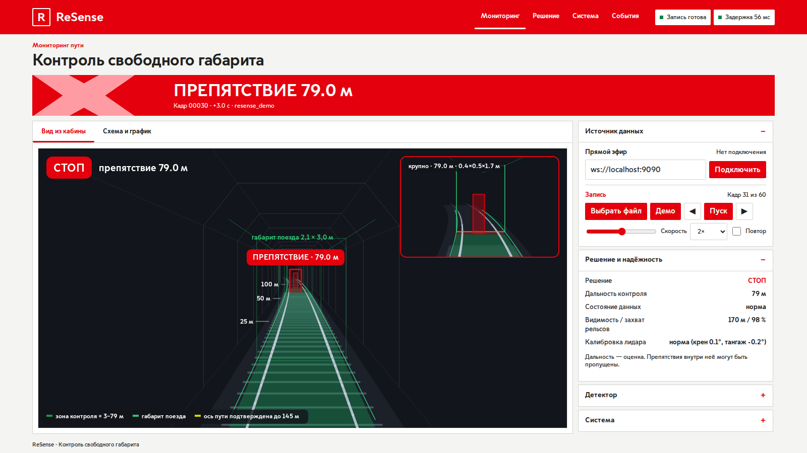

# ReSense: LiDAR Obstacle Detection in the Metro Clearance Gauge

> **Purpose:** what ReSense does, how the jury runs it, what to look at, the current results, and
> how to build, run and process a bag with its parameters (spec §5).
> **Audience:** jury, team · **Owner:** P1 · **Language:** EN, RU block «Кратко для жюри»
> **Last verified:** 2026-09-28 at `d359a06`: the jury commands and the image's default command
> against `docker/Dockerfile` and the launch file; the example output and every figure of
> "Current results" against the committed node captures, the gate files and the per-frame outputs
> of the sealed detector ([`docs/evidence/judge_outputs_2026-09-28/`](docs/evidence/judge_outputs_2026-09-28/README.md));
> every relative link. Package 1.0.0; the detector of the 27.09 quality cycle, sealed
> ([`docs/DETECTOR_FREEZE.md`](docs/DETECTOR_FREEZE.md)); the node of 28.09.
> **Status:** detector sealed and frozen; release `v1.0.0` scheduled for 28.09 21:00 Moscow time,
> not yet published. Dated history: [`CHANGELOG.md`](CHANGELOG.md).

ЛЦТ 2026 · Кейс 05 · «Обнаружение посторонних объектов в тоннеле метро по данным 3D-лидара»
(Московский транспорт / ГУП «Московский метрополитен»). Organizers' material:
[`docs/organizers/`](docs/organizers/). Every document: [`docs/README.md`](docs/README.md).

**What it is.** A ROS 2 node, delivered as a Docker image, that tells a driverless metro train ten
times a second whether something that should not be there is inside its clearance envelope and how
far ahead along the track (`/resense/decision`: `GO` / `CAUTION` / `STOP` / `FAULT`;
`/resense/nearest_distance`). From each LiDAR cloud it models the normal tunnel (track bed, rail
heads, track axis and its curvature from the walls), cuts the organizers' 2.1 × 3.0 m train
envelope along it and reports every persistent object inside. No object classes, no map, no
labels; CPU only.

## Кратко для жюри

ReSense 10 раз в секунду отвечает беспилотному поезду метро: есть ли на пути то, чего там быть не
должно, и как далеко. По облаку LiDAR он строит модель нормального тоннеля (полотно, головки
рельсов, ось пути и её кривизну по стенам), вырезает коридор габарита поезда 2,1 × 3,0 м, заданного
организаторами, и сообщает о каждом устойчивом объекте в нём: расстояние вдоль пути, боковое
смещение, размер, уверенность. Классы объектов и разметка не нужны: решает геометрия, а небольшая
обученная модель лишь откладывает сомнительный дальний STOP — не больше чем на 10 обработанных
кадров за жизнь трека (≈1 с при 10 Гц, ≈2 с при 5 Гц и дольше, пока нода догоняет поток).

**На стенде нет интернета** (организаторы, 25.09), поэтому `docker build` там не сработает
(базовый образ, apt, pip). Образ сдаётся готовым архивом `resense-image-<версия>.tar.gz` (рядом
его `.sha256`) и загружается без сети; нода и всё, что ей нужно при работе, сети не требуют.

```bash
sudo sysctl -w net.core.rmem_max=33554432                # 0. на хосте, до перезагрузки: буфер UDP для 360° облаков
docker load -i resense-image-<версия>.tar.gz             # 1. один раз, без интернета
docker run --rm -it --net=host --ipc=host resense      # 2. консоль 1: нода (команда образа по умолчанию — для записанных бэгов)
ros2 bag play <бэг> --delay 3 --read-ahead-queue-size 10 # 3. консоль 2: любой пользователь, ROS 2 Humble
ros2 topic echo /resense/decision --field data           # 4. консоль 3: GO | CAUTION | STOP | FAULT
ros2 topic echo /resense/nearest_distance --field data   # 5. расстояние до препятствия, м; −1 — нет
```

**Или одной командой** (шаги 0–5 в одном скрипте, нужен только Docker): `scripts/play_bag.sh <бэг>
[--archive resense-image-<версия>.tar.gz]` — проверит и загрузит архив, поднимет буфер UDP, запустит
ноду, проиграет бэг от имени текущего пользователя и напечатает каждую смену решения с расстоянием
(«12.3 s  STOP  55.6 m»), затем остановит контейнеры. Проверяется в CI на синтетическом бэге.

Для автоматического потребителя одного `/resense/decision` недостаточно: читайте временные
поля и `freshness.valid` из `/resense/status` и ограничивайте срок действия результата своим
таймером. При остановке входа STOP может удерживаться с последним расстоянием.
[Контракт свежести](#topics-published-by-the-node) описывает часы, срок действия и восстановление.

Увидеть облако, коридор габарита и препятствия в RViz (нужен X11): вместо шага 2 — одна строка:

```bash
xhost +local:docker && docker run --rm -it --net=host --ipc=host -e DISPLAY -e QT_X11_NO_MITSHM=1 -v /tmp/.X11-unix:/tmp/.X11-unix resense ros2 launch resense_ros detector.launch.py rviz:=true freshness_mode:=replay
```

**Где взять архив.** Релиз `v1.0.0` запланирован на 28.09, 21:00 МСК (на момент проверки ещё не
опубликован); после публикации архив и его `.sha256` лежат в Assets релиза. До этого архив любого
коммита `main` или рабочей ветки `claude/amazing-fermi-t67v8g` — артефакт CI: Actions → прогон
`ci` этого коммита (задание `offline-build` зелёное) → Artifacts → `resense-image-<версия>-<коммит>`
(zip с `.tar.gz` и `.sha256`, хранится 30 дней, нужен вход в GitHub; или `gh run download <id
прогона> -n resense-image-<версия>-<коммит>`). Без CI его делает `scripts/export_image.sh` на
машине с интернетом (`dist/resense-image-<версия>.tar.gz` и его `.sha256`). С интернетом шаг 1
можно заменить сборкой: `docker build -t resense -f docker/Dockerfile .`. Проверка архива:
`sha256sum -c resense-image-<версия>.tar.gz.sha256`, или `scripts/load_image.sh <архив>` (сумма,
загрузка и запуск образа без сети). Сборка без интернета — запасной путь с оговорками
([ARCHITECTURE](docs/ARCHITECTURE.md) «Deployment without internet»): после шага 1, в исходниках
того же коммита, `chmod -R u+rwX,go+rX,go-w . && docker build --cache-from resense:<версия> -t
resense -f docker/Dockerfile .` берёт все слои из архива; не вышло — образ из шага 1 не тронут,
шаг 2 работает.

**`--net=host` обязателен.** Образ передаёт DDS только по UDP; без общей с хостом сети плеер не
находит ноду, и `/resense/decision` остаётся `FAULT`. `ROS_DOMAIN_ID` плеера и ноды должен
совпадать (по умолчанию 0). Нет ROS 2 на хосте — плеер из того же образа: `docker run --rm
--net=host -v <папка с бэгами>:/data:ro resense ros2 bag play /data/<бэг> --delay 3 --read-ahead-queue-size 10`.
**Шаг 0 нужен для 360-градусных облаков (24 МБ) с плеером на CycloneDDS:** при `rmem_max` 212992
(по умолчанию в Ubuntu) нода получала 0–1 из 201 такого облака, при 32 МиБ — все; штатный Fast DDS
(`rmw_fastrtps_cpp`, по умолчанию в Humble) доставлял все и при 212992, шаг 0 ему не мешает (25.09,
три машины команды, [EXPERIMENTS](docs/EXPERIMENTS.md) §3b). 120-градусные облака (3 МБ) доходят и
без него. Нода пишет WARN при старте, если буфер меньше. Для 360-градусной записи с медленного
диска можно заранее прочитать `cat <бэг>/*.db3 > /dev/null`, если позволяет память: это
уменьшает задержку диска, но не заменяет ограничение очереди в шаге 3.

Вывод на `doubleT_obstacle` (нода 28.09, запечатанный детектор; одинаков во всех захватах, где
нода обработала все 201 кадр, [захваты](docs/evidence/node_input_2026-09-28/README.md));
одинаковые решения подряд свёрнуты в одну строку:

```text
FAULT     # до первого кадра, пока плеер загружает бэг
STOP      # с 0,8 с записи (кадр 8): человек на пути, затем предмет на рельсе; 55,5–56,6 м
GO        # один кадр, 11,1 с (кадр 111): предмет на рельсе не найден два кадра подряд — известное ограничение детектора
STOP
CAUTION   # по одному кадру на 11,7 и 20,1 с (кадры 117 и 197): тот же пропуск, в кадре есть объект-подсказка
STOP      # до конца записи; после конца бэга STOP удерживается (stop_held: путь не контролируется)
```

GO в кадре 111 — ограничение запечатанного детектора, а не ноды: подтверждённый низкий трек
предмета на рельсе пропущен два кадра подряд, удержание (`tracking.hold_misses` 1) покрывает только
один; `/resense/clear_distance` в этом кадре остаётся 56,2 м, т. е. дальше предмета путь свободным
не объявлен ([ARCHITECTURE «Known limitations»](docs/ARCHITECTURE.md#limitations-of-the-sealed-2709-detector-verified-2809)).
На `roundT_doubleT` (без препятствий): STOP нет, CAUTION в 170–172 из 252 кадров, остальное GO;
после конца бэга — FAULT.

| `/resense/decision` | значение |
|---|---|
| `STOP` | **тревога**: подтверждённое препятствие в габарите 2,1 × 3,0 м |
| `CAUTION` | подсказка, **не тревога**: объект у габарита снаружи или за дальностью контроля, известная инфраструктура, сниженная исправность; в обычном тоннеле частая |
| `GO` | препятствие не обнаружено, нет предупреждения по исправности, влияющего на решение; оценка дальности контроля — `/resense/clear_distance`. Одиночный GO среди STOP не значит, что путь свободен (см. выше) |
| `FAULT` | входа нет (до первого кадра, > 0,5 с без кадров) или ему нельзя доверять |

**Что оценивать:** тревога — `STOP` в `/resense/decision` (то же — `true` в
`/resense/obstacle_detected`); расстояние до препятствия вдоль пути — `/resense/nearest_distance`,
м (−1 — препятствия нет). Задержка сверх бюджета (p95 > 100 мс, нагруженная машина) видна только
в `/resense/health` и `/resense/status` и решение не меняет. Дальше:
[архитектура](docs/ARCHITECTURE.md), [алгоритм](docs/ALGORITHM.md),
[эксперименты](docs/EXPERIMENTS.md), [ключевые решения](docs/DECISIONS.md),
[оценка по критериям](docs/SCORECARD.md).

## What to look at

The organizers asked every team to "say clearly what to look at" and left the outputs to the
teams (23.09). Decision logic and thresholds: [`docs/ALGORITHM.md`](docs/ALGORITHM.md) §4, §4b.

| question | topic | values |
|---|---|---|
| what did the detector report? | **`/resense/decision`** (`std_msgs/String`) | `GO` (no obstacle detected and no health warning affecting the decision), `CAUTION` (advisory: a confirmed object in the band just outside the envelope, a far cluster beyond the trusted model range, known infrastructure or degraded health (since 26.09 not latency: that shows in `/resense/health` and the status JSON only); on 170–172 of the 252 frames of the obstacle-free `roundT_doubleT` through the node, so it is not an alarm), `STOP` (obstacle detected inside the 2.1 × 3.0 m envelope), `FAULT` (input cannot be trusted or stopped arriving, and before the first frame) |
| is there an obstacle? | **`/resense/obstacle_detected`** (`std_msgs/Bool`) | per processed frame, confirmed over 0.5 s, held over one missed frame (two misses in a row release it for a frame: `doubleT_obstacle` frame 111); `true` while a previous STOP is held through invalid input; a fresh valid non-STOP frame clears it |
| how far is it? | **`/resense/nearest_distance`** (`std_msgs/Float32`) | m along the track, −1 if none |
| what is the estimated monitored range? | **`/resense/clear_distance`** (`std_msgs/Float32`) | sightline and trusted track-model range, capped at a detected obstacle, at an eligible unconfirmed/advisory cluster in the envelope (`health.clear_cap`, columns excluded) and at the predicted distance of a reported track it has just lost (`health.clear_cap_lost`); 0 on a fault. Objects that form no eligible cluster can remain inside this range |
| everything else | `/resense/detections` (`vision_msgs/Detection3DArray`), `/resense/status` (JSON: every object with distance, lateral offset, size, confidence, kind; track model; health; mount calibration; timing; freshness) | |

`clear_distance` does not establish that the track is empty. On the organizers' unquantized
object recording it extends past an object with points in the rail envelope in 51 of 505
object-frames (44 with `GO`; [SCORECARD §0.3](docs/SCORECARD.md#03-what-judge-a-measured)).
Read `STOP` and `nearest_distance` alongside health and warnings; `GO` is a detection result,
not authorization to move a train.

## Current results

The sealed 27.09 detector and the node of 28.09. **Kinds:** real = the organizers' recordings;
organizers' synthetic = set O, objects added by their own tool; team synthetic = our objects
ray-cast into real frames. **In-sample:** the rules (and the learned opinion's negatives) were
tuned on these same recordings and on set O; only the ride figure marked "held out" was measured
on data a component never saw. The same recordings give slightly different figures when replayed
from the team's 1 cm frame cache (the regression gate) and from the raw recording (offline or
through the node: the product path); both are given where they differ. Raw sources: the
detector's record [`docs/QUALITY_CYCLE_2026-09-27.md`](docs/QUALITY_CYCLE_2026-09-27.md) with its
[gate](docs/evidence/results/regression_gate_2026-09-27_quality.json) (frame cache); per-frame
outputs of the sealed detector on the raw recordings with a recompute script,
[`docs/evidence/judge_outputs_2026-09-28/`](docs/evidence/judge_outputs_2026-09-28/README.md); the
node's timing, [`docs/EXPERIMENTS.md`](docs/EXPERIMENTS.md) §3d and
[`docs/evidence/node_input_2026-09-28/`](docs/evidence/node_input_2026-09-28/README.md). The
complete P4 frame-cache replay of the frozen detector passes all 146 enforced comparisons
(208 unchanged rows including 62 informational rows); its
per-object, stress, placement and intake records are in
[`docs/evidence/results/p4_full_data_2026-09-28/`](docs/evidence/results/p4_full_data_2026-09-28/README.md).
The table below keeps the raw-recording figures where they differ from cache replay, and marks
both sources.

Current internal assessment: **69/100** on `20e8229`, unchanged after the latest fixture and
rejected continuity experiment. [Review by criterion and fresh checks](docs/CURRENT_REVIEW_2026-09-28.md).

| metric | value | kind |
|---|---|---|
| false alarms, five obstacle-free recordings (2 287 frames) | raw recordings: **8 events**, 23 alarm frames, 7 STOP episodes; frame cache: 11 / 40 / 13 | real, in-sample |
| false alarms, 20-minute ride (11 271 frames, 13 km) | **37 events (2.8 per km)**, 34 STOP episodes on ride pieces the learned opinion never saw (the rules in-sample); in-sample 32 / 31; aggregate files only (no per-frame output of this detector on the full ride is committed) | real; held out for the opinion only |
| crossing person, `doubleT_obstacle` | STOP in **61 of 61** frames inside the envelope, from the first (frame 8); distance error ≤ 0.24 m | real, in-sample |
| object lying across the rail, `doubleT_obstacle` (~0.45 × 0.6 × 0.3 m, 56 m) | through the node and offline on the raw recording: STOP in **123 of the 126** frames after the person leaves it — **GO at frame 111**, CAUTION at 117 and 197 (a detector limitation, above); from the frame cache: 125 of 126 | real, in-sample |
| organizers' objects (set O, 1 510 frames) | STOP for **8 of 8** in-envelope objects, in 414 of 801 visible object-frames (node 416, cache 411); first STOP: 2 × 2 m box 98 m, box at the envelope top 111 m, plank across the rails 87–89 m, 0.3 m cubes 48–56 m (43–56 m on the cache), edge cube 35 m, edge 2 × 2 m box 18 m (its track from 29 m), 5 cm hanging object 30 m; 7 false STOP frames on the 2 × 2 m box outside (6 on the cache), at 126–142 m | organizers' synthetic, in-sample |
| organizers' shapes at new places (72 pre-registered cases) | 723 of 2 458 visible frames, 45 of 72 cases, 0 paired controls: a sensitivity study on seen shapes and seen backgrounds, **not held-out recall** | organizers' synthetic shapes |
| long range, straight track (set F) | first confirmed: person **151 m** median (6 of 6), 1 m crate 124 m, 3 cm cable 99 m; **0.5 m box on the bed 1 of 6** (a blind spot) | team synthetic |
| sensor reach | no return beyond 210 m in any of the 13 759 frames: 300 m is beyond this sensor | real |
| detector time, offline, one core | 18.0–22.9 ms mean, p95 22.7–32.6 ms (4-vCPU sandbox, 27.09; an independent judge's 4-vCPU Xeon 2.1 GHz: p95 41.6 ms at 360°); a dense station stretch of the ride: p95 111 ms (team record) | timing |
| ROS node in Docker, end to end (player publication → result) | p95 of the current results at 360°: **102 ms** cached, **118 ms** from a cold disk (an independent judge, 4-vCPU Xeon 2.1 GHz): not reliably under the 100 ms frame period there; with the start-up included (no current result for the first 1.5–4 s at 360°), p95 0.24–0.46 s (team captures); 120°: 54–64 ms; CI runner, cold: 60 ms (360°), 37 ms (120°); the organizers' 8-core stand not measured | timing: sandbox, CI |

Known limits of this detector (all documented, none fixed after the seal):
[`docs/ARCHITECTURE.md`](docs/ARCHITECTURE.md#limitations-of-the-sealed-2709-detector-verified-2809) "Limitations of the sealed 27.09 detector" — the
single-frame GO above, the learned opinion's delay counted in processed frames, small objects low
on the bed and objects at the envelope edge found late, `CAUTION` on most frames of some empty
tunnels, all figures in-sample, and ground truth made with the team's own tools
([`docs/EVALUATION.md`](docs/EVALUATION.md) §1). The questions behind each design choice:
[`docs/DECISIONS.md`](docs/DECISIONS.md).

**Scope fixed by the organizers' answers** ([`docs/organizers/answers.md`](docs/organizers/answers.md)):
the strict decision uses their train envelope, 2.1 × 3.0 m (a band 0.35 m wider is advisory);
objects hanging into it (broken cables) are obstacles; an object on the bed between the rails is
not; the test bags use the mounts of the provided ones (LiDAR 1 075 mm above the rail head on the
train's centreline, [`mount_and_switch_qa.md`](docs/organizers/mount_and_switch_qa.md)), so the
mount auto-calibration stays as a safeguard; glitches at switches will not count against a
solution. Every frame reports an estimated monitored range and input health; `GO` means no
obstacle was detected.


*Real data, v0.6.2: `doubleT_obstacle` frame 24 from the cab (`scripts/hero_view.py`), the person
at 55.8 m. Video: the 2:50 captioned overview
[`docs/video/resense_overview.mp4`](docs/video/resense_overview.mp4) (silent, Russian subtitles
burned in and in `resense_overview.ru.srt`); the clips it is cut from (v0.6.2; Docker chain
v0.6.3; the dashboard clip shows the earlier UI) in [`docs/video/`](docs/video/). Slides:
[`docs/presentation/`](docs/presentation/). Below: the
dashboard (synthetic UI demo, not evaluation evidence; [gallery](docs/images/README.md)).*



The [scheme and detailed system view](docs/images/dashboard-plan.png) are available in the second tab.

## How a bag is processed (the jury path)

```text
ros2 bag play <bag>  ──PointCloud2 (either topic / frame pair), 10 Hz──▶  resense_detector node
(any console on the same ROS 2 network,        (docker run --net=host … resense)
 or inside our image: sqlite3 + mcap plugins)        ├─▶ /resense/decision        GO / CAUTION / STOP / FAULT
                                                     ├─▶ /resense/obstacle_detected, /resense/nearest_distance
                                                     ├─▶ /resense/clear_distance, /resense/health
                                                     └─▶ /resense/detections, /resense/status (JSON), RViz markers
```

1. **Load the image** (command 1). **The stand has no internet** (organizers, 25.09,
   [`docs/organizers/answers.md`](docs/organizers/answers.md) §7), so the image comes built, as the
   archive of `scripts/export_image.sh`; `docker load` reads the gzip directly, and
   `scripts/load_image.sh <archive>` also checks its `.sha256` and runs the image with
   `--network none`. With internet, build it instead (`docker build -t resense -f
   docker/Dockerfile .` or `./scripts/build.sh`: ROS 2 Humble and exactly pinned Python packages).
   Nothing in the node, the launch file or the entrypoint uses the network at run time.
2. **Start the node** (command 2). The image's default command (since 28.09) is
   `ros2 launch resense_ros detector.launch.py freshness_mode:=replay`, for recorded bags: the
   input's age is taken from its publication by the player. On a train with a live LiDAR pass
   `freshness_mode:=live` (the node's own default: acquisition timestamps compared with system
   UTC; a recorded bag gives `FAULT` on every message in that mode). **`--net=host` is
   required**: the image runs Fast DDS over UDP only (`docker/fastdds_udp.xml`, so that a player run
   by any user reaches the root node), and in Docker's default bridge network the host's player and
   the node do not discover each other. `--ipc=host` is harmless, kept for older images. Opt-in,
   off by default until tested on the team's VM: `-e RESENSE_DDS=shm` (with `--ipc=host`) adds
   shared memory, so that a stock Fast DDS player on the host delivers the clouds through `/dev/shm`
   whatever `net.core.rmem_max` is ([`docs/VM_GUIDE.md`](docs/VM_GUIDE.md) §4.6).
3. **Play the bag** (ReSense reads no bag files: it subscribes to what the player publishes) on the
   same `ROS_DOMAIN_ID` (default 0); `--delay 3` lets DDS discovery complete. CI plays it as uid
   1000 from a second container of the image, with the image's profile and with the stock Humble
   RMW (`rmw_fastrtps_cpp`, no XML profile, shared memory on: `PLAYER_DDS=stock
   scripts/console_test.sh`), as a host console does; stock clients reach the node over UDP
   because the node announces no shared-memory locators. A 360° recording played from a
   CycloneDDS console needs `net.core.rmem_max` ≥ 32 MiB on the host for its 24 MB clouds (jury
   step 0); a genuine stock Fast DDS player delivered every cloud at Ubuntu's 212992 too
   (EXPERIMENTS §3b); the 120° clouds arrive either way. From a cold disk a 360° recording
   (240 MB/s of recording) can make the player fall behind at the start; the optional pre-read
   (`cat <bag>/*.db3 > /dev/null`) helps when memory allows (dated measurements:
   [`CHANGELOG.md`](CHANGELOG.md) "Dated status notes", EXPERIMENTS §3c).
4. **Read the answer** ("What to look at"). Keep step 3's `--read-ahead-queue-size 10`: without it
   `ros2 bag play` (Humble) preloads up to 1 000 messages, all of a short recording, while its
   clock runs, then sends the overdue first seconds back to back, and the default read-ahead
   failed the freshness check on a cold disk. The node works through the start-up burst (up to 20 s
   of backlog for a new recording, 5 s for later stalls; the `catchup_*` parameters) and skips
   frames when it falls behind; results made while it catches up are not current (FAULT, CAUTION
   or a held STOP, never GO).
   The [tested procedure and remaining limitation](docs/VM_GUIDE.md#41-dry-run-with-the-original-bags).

**The bags disagree on the topic and frame id** (`/lidar_points` in `hesai_lidar` for
`roundT_doubleT` and four more, `/sensing/lidar/hesai128/pointcloud` in `lidar_livox` for
`doubleT_obstacle`), and the control data may use either pair (organizers, 23.09). The node listens
to both and, unless `auto_discover:=false`, to any other `PointCloud2` topic; it processes one input
at a time and switches when the active one is silent for `input_switch_timeout` (1 s). A **new
recording** (another topic or frame id, stamps that jump back or forward by > `new_input_gap`,
30 s) gets a fresh detector, a shorter hole (> `hole_reset_gap`, 1 s) resets the scene only, so
control bags can be played one after another into one running node. The offline tool
(`resense run --bag <dir>`) reads rosbag2 directly and writes the same per-frame JSON.

## ROS 2 / Docker

```bash
./scripts/build.sh                                               # docker build -t resense -f docker/Dockerfile .
./scripts/run_demo.sh /data/for_hackathon/roundT_doubleT         # detector + RViz + bag playback in one container
./scripts/run_headless.sh /data/for_hackathon/doubleT_obstacle   # same, no X11: prints "OBSTACLE 55.7 m"
./scripts/dry_run.sh /data/for_hackathon/doubleT_obstacle        # acceptance test (all wrappers: exit 3 without a Docker daemon)
PLAYER_DDS=stock ./scripts/console_test.sh <bags>/roundT_doubleT <bags>/doubleT_obstacle -- --expect-obstacle \
    --obstacle-in 2 --expect-inputs 2 --min-frames 20 --max-p95-latency 1000 --max-dropped 100000   # the organizers' console: uid-1000 player, stock Fast DDS
./scripts/bench_8core.sh <bags>/doubleT_obstacle <bags>/roundT_doubleT   # 8-core bench: build, dry runs native + numpy, console tests, docker stats, offline timing -> docs/evidence/bench_<date>/
./scripts/export_image.sh           # offline delivery: dist/resense-image-<ver>.tar.gz + .sha256
./scripts/load_image.sh dist/resense-image-<ver>.tar.gz    # sha256, docker load, --network none check
scripts/verify_release.sh <tag>     # a published release's archive into dist/, sha256 checked (v1.0.0 scheduled for 28.09 21:00 MSK)
scripts/release.sh <tag>            # in a clean clone of the tag: release.yml by hand (DRY_RUN=1 plan, PUBLISH=1 publish)
IMAGE_TAR=dist/resense-image-<ver>.tar.gz OFFLINE=1 ./scripts/dry_run.sh <bag>   # as on the stand
WITH_TOOLS=1 ./scripts/build.sh     # + rosbags / matplotlib / open3d / pytest inside the image
PULL=1 ./scripts/build.sh           # refresh the ros:humble base first (an old cached one fails apt-get update)
docker run --rm -w / -e RESENSE_REQUIRE_SYNTHETIC=1 resense python3 -m pytest -q /opt/resense/tests   # WITH_TOOLS=1 image, as CI
docker run --rm resense bash -lc "python3 scripts/make_smoke_bag.py /tmp/b && scripts/smoke_test.sh /tmp/b"   # the CI smoke test
```

### Node parameters (all are launch arguments)

* **input**: `input_topic` (comma-separated, default: both names above), `auto_discover` (true),
  `discover_period` (2 s), `input_switch_timeout` (1 s), `new_input_gap` (30 s), `hole_reset_gap`
  (1 s), `input_reliability` (`auto`: reliable for `ros2 bag play` of the organizers' recordings,
  best-effort for a best-effort driver), `input_queue_depth` (40), `catchup_step` (0.3 s of
  recording between frames while frames wait; 0 = newest only), `catchup_max_lag` (5 s),
  `catchup_startup_max_lag` (20 s for the first catch-up of each recording; the entry window
  expires after 1 s if no catch-up starts, and later stalls keep the 5 s bound), `raw_input`
  (true: the clouds are read from their serialized bytes instead of rclpy's conversion, which
  cost 12.5 ms median / 32 ms p95 per 24 MB 360° cloud on a 4-vCPU sandbox; the detector's input
  identical byte for byte; false = rclpy's messages);
* **mount**: `sensor_forward` / `sensor_left` / `sensor_up` (axis mapping, e.g. `+x`),
  `mount_roll_deg` / `mount_pitch_deg` / `mount_yaw_deg` (fixed tilt), `auto_calibrate` (true:
  orientation, roll and pitch from the rails and the bed, reported in `/resense/status` → `mount`);
* **freshness**: `freshness_mode` (the node's default `live`; the image's default command passes
  `replay`, for recorded bags; a live LiDAR on a train: `live`), `max_result_age` (0.5 s),
  `future_tolerance` (0.05 s);
* **guards**: `stale_timeout` (0.5 s without a frame before `FAULT`), `startup_grace` (2.0 s after
  start before "no LiDAR frame received yet" is published as `FAULT`), `max_consecutive_errors` (5);
* **speed**: for multi-frame accumulation the node needs the train speed: `ego_speed_mps:=22.0`, or
  `speed_topic:=/vehicle/speed` (`std_msgs/Float32`, m/s), or `odom_topic:=/odom`
  (`nav_msgs/Odometry`, `twist.linear.x`), `speed_timeout`; with none of them the detector runs the
  single-frame path (no accumulation). The LiDAR-only speed estimator is off by default: it is
  accurate, but a speed buys nothing on the organizers' check (EXPERIMENTS §9);
* **output**: `config_file`, `publish_markers`, `publish_corridor_cloud`, `marker_x_max`,
  `output_frame`, `stats_period` (2 s: fps, latency mean / p95 / max, input period, dropped frames),
  `publish_tf` / `tf_parent_frame` (`resense_lidar`: one RViz / Foxglove layout for every bag);
* **launch file only**: `bag:=/data/<bag>`, `rviz:=true`, `rate:=1.0`, `loop:=true`, `delay:=3.0`
  (s before the player starts, so that DDS discovery completes; the burst the player then sends is
  worked through by the node, `catchup_step`).

### Where the data lives

The bags are never copied into the image; **their directory is mounted at `/data`**: the scripts
mount the parent of the bag path, `docker compose` uses `$RESENSE_DATA` (default
`/data/for_hackathon`) and `$RESENSE_BAG`, a plain `docker run` takes `-v <host dir>:/data:ro`. The
20-minute ride (`new_data`, 90 GB unpacked) and the organizers' synthetic-obstacle recording
(`cloud_with_fake_obj`, 24.09) work the same way. `scripts/unpack_dataset.py` streams the
organizers' zip → zip → zstd → tar and writes only the bags asked for, e.g. `--only
doubleT_obstacle,roundT_doubleT` (links and commands: [`docs/DATASET.md`](docs/DATASET.md)).

### Remote real-time demo (spec §4)

Over ssh: `run_headless.sh`, or `docker compose up detector`, `docker compose --profile tools up
player` and `docker compose --profile tools run --rm echo` in three terminals. For a jury that is
not in the room: **share the RViz window** of `./scripts/run_demo.sh <bag>` (continuous: the launch
file with `loop:=true rviz:=true`; result:
[`docs/video/docker_chain_rviz.mp4`](docs/video/docker_chain_rviz.mp4)), or **Foxglove**: `docker
compose --profile viz up detector foxglove` plus the player, then on any laptop Open connection →
`ws://<demo-host>:8765` → import [`web/foxglove_layout.json`](web/foxglove_layout.json); over a slow
link keep `/resense/corridor_points` instead of the raw cloud ([`web/README.md`](web/README.md)).

### Acceptance test and CI

`scripts/dry_run.sh <bag>` builds with `--no-cache`, waits for the node before playing, captures
`/resense/status` and checks it (`scripts/check_dry_run.py`): on `doubleT_obstacle` the person in
50–62 m, p95 of decode + detect ≤ 100 ms, no frame of the recording left unprocessed after the
start-up; `--expect-clear --max-alarm-frames 2` on `roundT_doubleT` is the false-alarm half (the
allowance covers the trackside device at 48–54 m and the column at 101–149 m, advisory since
`tracking.column_hold`, EXPERIMENTS §3a); thresholds are arguments of `scripts/check_dry_run.py`
(`--max-p95-e2e` asserts the end-to-end latency of the current results), the raw capture goes to
`out/dry_run/` (`status.jsonl`, `node.log`). The drop criterion counts from the settle point: the
later of `--settle-s` (5 s) and the frame on which the node is back on the newest one after its
start-up catch-up, at most `--max-settle-s` (15 s); with `--bag` the frames the recording itself
lacks (4 in `doubleT_obstacle`, at +14.0 and +16.9 s) are not drops. The dated cold-disk and
start-up runs of 25–27.09 are in [`CHANGELOG.md`](CHANGELOG.md) "Dated status notes" and
EXPERIMENTS §3a–§3d.

**Clean-machine dry run** (part of the later deployment, [`docs/CAPTAIN.md`](docs/CAPTAIN.md) C7):
a team machine that has never built the project, 8 cores for the latency and drop criteria (the
organizers' i7 stand is not available before the upload), the original bags:

```bash
./scripts/dry_run.sh <bags>/doubleT_obstacle                  # builds --no-cache, plays, checks, exits 0/1
SKIP_BUILD=1 ./scripts/dry_run.sh <bags>/roundT_doubleT --expect-clear --max-alarm-frames 2
# offline, as on the stand: ./scripts/export_image.sh with internet (<ver> = the pyproject.toml version), copy
# dist/resense-image-<ver>.tar.gz and its .sha256 over, disconnect the network (cable out, Wi-Fi off)
IMAGE_TAR=dist/resense-image-<ver>.tar.gz OFFLINE=1 ./scripts/dry_run.sh <bags>/doubleT_obstacle
SKIP_BUILD=1 OFFLINE=1 ./scripts/dry_run.sh <bags>/roundT_doubleT --expect-clear --max-alarm-frames 2
# then "Кратко для жюри" 1-5 by hand, the player from a normal user's console, still offline
```

`IMAGE_TAR` loads the archive (`scripts/load_image.sh`) instead of building; `OFFLINE=1` runs node,
player and recorder with `--network none` and refuses to build. On the team's VM the same steps,
with the offline rehearsal's safety net: [`docs/VM_GUIDE.md`](docs/VM_GUIDE.md).

CI runs the chain without the dataset on every push: 40-frame synthetic bags in the organizers'
exact layout (clear, then a person at 60 m; both topic / frame pairs) played through the node in
the image, also by a uid-1000 player from another container, the alarm asserted at 55–66 m, and by
a uid-1000 player and listener with stock Fast DDS (shared memory on, checked in `/dev/shm`) that
must hear `STOP`; the in-image smoke test runs with `--network none` (loopback only). The
offline delivery is checked with the jury's own image (job `offline-build`): the runtime archive,
made as for the release, goes through `docker save` → `docker rmi` → `docker load`
(`export_image.sh`, `load_image.sh`) after every image was removed, is rebuilt offline with Docker
Hub blocked (every layer from the archive's cache), and both synthetic bags are played through the
runtime image exactly as loaded, starting the node with its bare default command, by a uid-1000
player on an internal Docker network with no way out. On `main` and the working branch the job
`docker` also plays both original bags cold through the node (`scripts/p1_cold_bag_test.sh`) and checks that the detector's input
from the serialized bytes is byte-identical to rclpy's (`scripts/check_fast_input.py`).
`IMAGE_TAR=<archive> OFFLINE=1 ./scripts/dry_run.sh <bag>` is the same on real bags. A pushed
release tag (`v1.0.0-rcN`, `v1.0.0`) runs `.github/workflows/release.yml`: tests, the runtime
archive built, removed and loaded back, both bags through the loaded image (internal network and
`--net=host` with a stock player), then the GitHub release with the archive, its `.sha256` and
`SHA256SUMS`; `v1.0.0` is scheduled for 28.09 21:00 Moscow time (not yet published).

### Topics published by the node

| topic | type | meaning |
|---|---|---|
| `/resense/decision` | `std_msgs/String` | `GO` / `CAUTION` / `STOP` / `FAULT` (see "What to look at") |
| `/resense/obstacle_detected` | `std_msgs/Bool` | confirmed object inside the clearance gauge |
| `/resense/warning` | `std_msgs/Bool` | confirmed object in the advisory zone only |
| `/resense/nearest_distance` | `std_msgs/Float32` | m along the track to the nearest gauge obstacle, −1 if none |
| `/resense/clear_distance` | `std_msgs/Float32` | estimated monitored range in m, capped at detected obstacles and eligible unconfirmed/advisory clusters; objects without such a cluster can be missed inside this range; 0 on a fault |
| `/resense/health` | `diagnostic_msgs/DiagnosticArray` | OK / WARN / ERROR / STALE with messages and values: points, window dirt, blocked sectors, visibility, rail lock, latency p95, monitored range, mount calibration |
| `/resense/detections` | `vision_msgs/Detection3DArray` | boxes in the sensor frame, `class_id` = `gauge_obstacle` / `warning_obstacle`, score = confidence |
| `/resense/status` | `std_msgs/String` | JSON: full per-frame result (detections, track model, health, mount, per-stage timing) plus `node` = `{latency_ms, fps, frames, dropped_frames, catchup_skipped, catchup, input_period_ms, ego_speed_mps, ego_speed_source, input_topic, recording, decode_ms, detect_ms, cpu_cores, rss_peak_mb}` (`catchup_skipped`: the part of `dropped_frames` the node received and skipped while catching up; `catchup`: this frame was processed while behind; since 28.09 `decode_ms` + `detect_ms` = `latency_ms`, `cpu_cores`: the node process's CPU time per wall second over the last `stats_period`, `rss_peak_mb`: its peak resident memory). The end-to-end latency of a result is `freshness.source_age_s` (input publication or acquisition → result) |
| `/resense/latency_ms`, `/resense/fps` | `std_msgs/Float32` | per frame: decode + detect + publish, ms; frames processed per second, every `stats_period` s |
| `/resense/markers`, `/resense/corridor_points` | `MarkerArray`, `PointCloud2` | RViz: boxes, labels, corridor outline, status text; points inside the corridor; built only while something subscribes (28.09) |
| `/tf_static` | `tf2_msgs/TFMessage` | identity `resense_lidar` → the input cloud's `frame_id`, once per frame id |

**Freshness and held STOP.** The node's default `freshness_mode:=live` compares the acquisition
header with system UTC; the image's default command selects `freshness_mode:=replay` for
historical bags, which uses the DDS publisher timestamp and reports acquisition age as unknown. A
result must be no more than 0.5 s old, with no more than 0.05 s future clock skew. Python
residence and recording queue lag are also bounded at 0.5 s. First frames, clock/input jumps and
the first frame after a pause are invalid until progression resumes. Missing timestamps fail
closed. A queued older frame cannot produce GO. The JSON `freshness` object reports the clocks,
ages, validity and reason; `go_allowed` is true only for a GO result valid at evaluation.
`evaluated_at_utc_s`, `max_result_age_s` and `future_tolerance_s` let consumers expire it,
assuming synchronized UTC clocks. Consumers must enforce their own expiry: the single-threaded
node watchdog runs every 0.1 s when the executor is available and cannot publish while processing
is blocked. A latched `/decision` string alone carries no age and is insufficient for motion
control. `clear_distance` is zero during invalid monitoring; `detector_clear_distance` preserves
the detector's raw estimate.

When input goes silent or processing fails, all outputs report invalid monitoring. A previous
STOP remains visible with `stop_held: true`, its original source stamp/frame, and zero monitored
range until a fresh valid non-STOP frame clears it. Without a prior STOP the decision is FAULT.
Watchdog/error snapshots have `snapshot_kind: watchdog|processing_error`; acceptance tooling
excludes them from frame counts. Processed results use `snapshot_kind: frame`. STOP takes
priority over invalid input; otherwise invalid or stale clocks mean FAULT, and catch-up means
CAUTION. Health diagnostics, status JSON, scalar topics and RViz use this same policy.

## Quick start (no ROS needed)

```bash
pip install -e ".[dev]"                   # numpy scipy scikit-learn pyyaml + rosbags matplotlib open3d pytest
                                          # + the optional C++ kernels (native/); scripts/build_native.sh without pip
pytest -q                                 # "skipped" means open3d is missing (RESENSE_REQUIRE_SYNTHETIC=1 fails then, as in CI)
pipx run ruff==0.15.8 check .             # lint, as the CI job "checks"

# unpack the dataset (docs/DATASET.md), then:
resense info  /data/for_hackathon/roundT_doubleT
resense run   --bag /data/for_hackathon/doubleT_obstacle --out results.jsonl --render out/   # PNG per frame
resense bench --bag /data/for_hackathon/roundT_doubleT --every 5                             # per-stage timing
resense inject --bag /data/for_hackathon/roundT_doubleT --every 10 --out data/synth --distances 10:250 --kinds person,box,plank
resense eval data/synth                   # synthetic obstacles ray-cast into real empty frames: recall by range

# the real-data report card over every recording (frames cached once, docs/DATASET.md "Cached frames")
for b in /data/for_hackathon/*/; do python scripts/cache_frames.py $b /data/cache/$(basename $b) --every 1 --int16 --stamps; done
python scripts/eval_real.py --cache /data/cache --out out/eval          # false alarms, the labelled person / object, latency
python scripts/far_range_eval.py --cache /data/cache/new_data --files 46,68,98 --kinds person,box1.0,cable \
    --start 220 --out out/far.json                                    # set F: synthetic positives, legacy placement by default
python scripts/mine_objects.py out/eval --bag new_data                  # every confirmed object of a ride, by cause
python scripts/regression_gate.py --cache /data/cache \
    --baseline docs/evidence/results/regression_baseline_2026-09-27_quality.json   # the gate for every detector change (exit 1 = worse, or a baseline set missing here)
python3 docs/evidence/judge_outputs_2026-09-28/recompute.py            # the headline figures from committed per-frame outputs, no data needed
```

## Parameters worth knowing (`configs/default.yaml`)

| key | default | meaning |
|---|---|---|
| `sensor.forward/left/up`, `sensor.roll_deg/pitch_deg/yaw_deg` | `-y/+x/+z`, 0 | sensor → vehicle axis mapping (hackathon Hesai frame) and a fixed mount tilt |
| `calibration.*` | on, 20 observations every 10 frames | automatic mount calibration (orientation, roll, pitch, yaw > 3°); a tilt is applied from 0.75° |
| `calibration.time_cadence / refine_min_deg / keep_within_deg`, `track.rates_per_period / walls_smoothing_per_period` | on, 0 (off), 0.25°, on, on | since 25.09 (SCORECARD #13): calibration spacing, axis rate limits and yaw / curvature EMA per period of the input rate, a confirming final kept; five bags 5 Hz 13 → 10, +3° roll 16 → 14, +3° pitch 17 → 17 false events; 10 Hz gate identical but `doubleT_obstacle` +1 hit. The refinement of a provisional tilt by the spaced observations (0.5° in round 2: +3° roll 11, pitch 16 events) is off since the safety review of 26.09: a refined tilt lost a `doubleT_obstacle` STOP frame that the provisional one keeps (EXPERIMENTS §1i) |
| `calibration.reseed_keep_max_deg`, `tracking.reseed_hold`, `health.clear_cap_lost`, `cluster.hanging_yield_gauge_only` | 1°, 5, true, true | since the safety review of 26.09: a mount-calibration change up to 1° rotates the track model instead of re-seeding it, a STOP stays reported for a fixed window of 5 frames from any change, matched or not (6 at 10 Hz when the model is re-seeded; the re-review of 26.09) (a re-seed lost a confirmed STOP for 2 frames on `doubleT_obstacle`), `clear_distance` is capped at a lost reported track, and a hanging cluster yields only to an obstacle, not to an advisory cluster (a cable demoted as `floating` STOPs again); decisions on the five bags, the ride, set O and `doubleT_obstacle` identical frame by frame (EXPERIMENTS §1i) |
| `gauge.reference` (`_range`, `_max_offset`) | 3; 60 m, 0.2 m | since 27.09 (the quality cycle): within 60 m on straight track a return is inside when it is inside the envelope measured from the rails **or** from the sensor axis (the organizers' placement frame), the offset clamped to 0.2 m; nowhere narrower than the rails'; the edge cube 5.2 → 35.0 m, the person 58 → 61 of 61 frames ([QUALITY_CYCLE](docs/QUALITY_CYCLE_2026-09-27.md)) |
| `tracking.doubt_*` | model `track_opinion.json`, 10 frames, threshold 0.015, 25 m, body 1.0 m / 40 m | since 27.09: the learned track opinion may keep a doubtful STOP advisory for at most 10 **processed** frames in a track's life (~1 s at 10 Hz, ~2 s at 5 Hz), never within 25 m or for a body ≥ 1 m tall within 40 m; never a veto; ride 43 → 37 events held out (32 in-sample) |
| `health.clear_cap_thin`, `health.clear_cap_persist` | true, 4 | since 27.09: `clear_distance` also capped by supported scan lines in the envelope and by sparse evidence chained over 4 frames; set O GO overclaims 46 → 16, no decision changes |
| `tracking.gate_along_only`, `cluster.column_width_trim` (`_min_cut`) | true, 0.05 (0.25 m) | since 27.09: the approach allowance widens the association gate along the track only; the column rule reads the body width between the 5–95 % lateral quantiles; the history-dependent clear-run STOP gone |
| `tracking.thin_far_min_distance`, `cluster.weak_min_points` | 60 m, 4 | since 27.09: beyond 60 m a scan line or a cluster one voxel under the bar may start or continue a track; it becomes a STOP only while it approaches, advisory otherwise, never hidden; the box at the envelope top 101.3 → 111.4 m |
| `tracking.low_min_seen_distance`, `lowobj.pending_advisory`, `lowobj.min_model_age` | 0 (off), false, 0 | tried 26.09 for the start-up of a fresh bag, not shipped (EXPERIMENTS §1j): a fresh start at a standing train STOPped at 2.9–3.1 m on the rail heads; the 4 m rule removed that STOP (ride 46 → 45 events) but never reports a low object that stays within 4 m (a 30 × 30 × 10 cm object 3.0–3.9 m ahead of a standing train, or one that falls there); the other two drop or delay a real low object 20–40 m ahead at a fresh start |
| `lowobj.rail_start_within` (`_margin`, `_lateral`, `_max_width`, `_min_ref`) | 4 m (0.05, 0.10, 0.45, 0.06 m) | on since 26.09 (EXPERIMENTS §1k): a `low` cluster under 4 m that reaches a rail line, is at most 0.45 m wide and rises at most 0.05 m above the rail head's own returns along the track is rail geometry, where that line is at least 0.06 m above the model's rail-head plane (a young model; the safety review of 26.09); a low track on it never matched at ≥ 4 m is not newly reported. Removes the fresh start's 2.9–3.1 m STOP on the rail heads; the 30 × 30 × 10 cm object and objects across a rail 3.0–3.9 m ahead still STOP on the same frames; 0 = off |
| `tracking.near_escalate_voxels / _distance / _hits`, `cluster.wall_keep_gauge_voxels / _distance` | 10, 35 m, 5; 10, 20 m | since 26.09 (EXPERIMENTS §1l): within 35 m a track whose last 5 hits each had ≥ 10 strict-envelope voxels is a STOP whatever demoted it (`elevated`, `floating`, the zone vote; reason `near_envelope`; a column, `beyond_axis` or `beyond_height_ref` never), and a tall side cluster with ≥ 10 strict voxels (measured from the rails) within 20 m is not dropped as a wall; set O inside STOP frames 337 → 355 (the box at the envelope top from 23.9 m, the edge box from 10.3 m), the ride, the five bags, `doubleT_obstacle`, set F and the outside objects identical; 0 = off |
| `tracking.stop_keep_signature`, `tracking.stop_keep_thin`, `tracking.stop_keep_min_voxels`, `tracking.stop_keep_max_s` | true, 1, 10, 10 s | since 26.09 (EXPERIMENTS §1o): a track that was a STOP in the previous frame keeps its zone vote when its cluster is demoted only by a shape signature (`elevated`, `floating`, `edge`, `wall_face`; never a column, `beyond_axis`, `beyond_height_ref` or `overhead`), and may be continued by a scan line (a cluster flatter than `min_height`) inside the envelope; either needs ≥ 10 strict-envelope voxels (the near escalation's bar) and acts only within 10 s of sensor time of the track's last clean hit (the safety review's cap: a false STOP at a standing train cannot be kept indefinitely). Neither starts or confirms a track (reason `stop_hold`). Set O box at the envelope top 22 → 51 STOP frames (advisory 27 → 6), continuous from its first STOP at 101.3 m; no first STOP moves, set O still has one STOP frame beyond 100 m; the ride (frame by frame), the five bags, `doubleT_obstacle`, set F and the other set O rows identical; without the bar (round 1) the ride's alarm frames rose 183 → 192; mode 2 (a scan line also confirming) added a STOP on `doubleT_platform`; 0 / false = off |
| `gauge.axis_union` (`_range`, `_max_offset`, `_max_curvature`) | 0 (off); 50 m, 0.30 m, 2e-4 /m | tried 26.09, not shipped (EXPERIMENTS §1m): 1 adds the envelope measured from the sensor axis (the organizers' placement frame) near the train on straight track; it passed its gate (set O #6 0 → 1 STOP frame), but the safety review of 26.09 blocked it: it can take in a long line at the corridor edge beside an object, and the oversize split then dropped both (ray-cast 19 → 6 STOP frames; the split falls back to the rails' part since); 2 / 3 tried too; superseded on 27.09 by `gauge.reference` 3 |
| `track.rails_*`, `track.walls_*` | gauge 1.52 m; walls band 1.6–2.8 m | rail-ridge template for the track axis and rail-head level; tunnel-boundary fit for yaw / curvature; `axis_valid_*` = how far the corridor is trusted |
| `track.rails_far_check_enabled` | false | experimental station-wall axis check, off by default (24.09); measured 25.09: it never fires on the six recordings and set O (EXPERIMENTS §1f) |
| `gauge.profile` | \|dy\| ≤ 1.05 m, 0.12–3.0 m | **the organizers' 2.1 × 3.0 m train envelope**; `warning_margin` 0.35 m = advisory zone; `edge_margin_per_100m` 0.15 m |
| `lowobj.*` | on, ≤ 60 m | low objects on the rails (bumps above the learned bed that rise ≥ 3 cm above the rail head) |
| `lowobj.near_enabled` | false | experimental central near-bed path, off: its first gates raised the ride's false events from 47 to 667 [24.09, raw not committed]; with the current gates (`537e220`, box fix `7df1796`) the five bags give 107 instead of 145 events, the ride not re-run (EXPERIMENTS §1e) |
| `accumulation.estimate_speed` | false | LiDAR-only speed estimation opt-in (median error 0.06–0.08 m/s, +6.6–6.8 ms per frame, no gain on the organizers' check, EXPERIMENTS §9); without a supplied speed, single-frame detection |
| `cluster.far_*` | 0.6 m tall, ≤ 3 m long | what may alarm beyond the height reference (far field of straight track) |
| `cluster.floating_long_min_length` | 3.0 | on since 25.09 (decided on the ride): an overhead duct / tray / beam > 3 m along the track near the axis with its bottom above `floating_long_min_bottom` is advisory; five bags 20 → 14 events, ride 47 → 46 (EXPERIMENTS §1f) |
| `cluster.floating_long_min_bottom` | 1.6 | since the review of 25.09: the long rule applies only when the cluster's lowest point is above 1.6 m, so a tray or duct fallen onto the axis lower down is a STOP; five bags, ride, set O and set F straight unchanged (2.0 / 1.8 m would bring back a ride event; EXPERIMENTS §1f) |
| `track.floor_shadow_height`, `cluster.oversize_split_max_length`, `cluster.gauge_distance` | 1.0, 3.0, true | on since 25.09 (rail shadow): the bed and the rail pair are fitted in front of a large near object's shadow or held (start within `floor_shadow_range` 30 m, two adjacent bins); an object touching a long edge line is kept (within 30 m); a STOP reports the part inside the envelope, widened by the axis margin so never beyond where the object enters it; set O #1 wrong-distance frames 12 → 0, ride / five bags unchanged (EXPERIMENTS §1h) |
| `track.floor_shadow_max_hold` | 20 | review of 25.09: the bed is held at most 20 frames in a row, then the rule is released until no shadow is found (a 3.4° pitch step held it for good); set O #1 holds the bed 14 frames in a row; the status `health` counts the frames (`floor_shadow_frames`, `floor_held_frames`, `floor_released_frames`) |
| `cluster.floating_free_max_size`, `cluster.floating_free_max_dy` | 0.5, 1.2 | on since 25.09 (round 2): a compact cluster (every extent ≤ 0.5 m, outermost point ≤ `floating_free_max_dy` off the axis, top ≤ `floating_free_max_top` 2.5 m) hanging free inside the envelope is not demoted by `floating`: the organizers' floating 0.3 m cube is a STOP from 52.5 m instead of 34.0 m (EXPERIMENTS §1i); `floating_free_max_dy` 0.95 → 1.2 m on 27.09 (the edge cube's 35 m needs it; a window bracketed by two set O objects: in-sample tuning) |
| `cluster.hanging_enabled` (`hanging_*`) | true; ≥ 1 voxel inside, \|dy\| < 0.8 m, ≤ 0.5 m, ≤ 60 m; `hanging_needs_rails` true | on since 25.09: a thin object hanging from above that dips into the envelope near the axis, linked to its part above the envelope top, is an obstacle; the organizers' 5 cm object STOPs from 30.1 m (was `GO`), five bags, ride, `doubleT_obstacle`, the other set O objects and set F straight unchanged; since round 2 only on frames with the rail pair found (28 of its 29 ride groups were station column tops without one; set O and the gate identical with and without it) (EXPERIMENTS §1i) |
| `cluster.short_signature_max_length` | 0 (off) | tried, not shipped (25.09): set O 303 → 352 STOP frames, but ride STOP episodes 39 → 45 (EXPERIMENTS §1f) |
| `cluster.far_axis_both_sides` | 0 (off) | tried, not shipped (25.09): a far obstacle needs both tunnel boundaries to reach it; mode 2 removes the 147.5 m switch STOPs and ride 46 → 42 events, but costs a person 1.9 m on gentle curves (EXPERIMENTS §1h) |
| `health.clear_cap` | true (candidate R1) | on since 25.09, round 2, by the captain's delegate although it **missed** its pre-registered clutter limit: caps `clear_distance` at the nearest unconfirmed or advisory cluster touching the envelope, columns excluded; no detection or decision changes. Set O overclaim 172 → 82 object-frames (67 on the round-2 code, 60 since the review fixes of 26.09); the five obstacle-free recordings' median clear distance −5.5 % (limit −5 %), the ride −3.1 % (EXPERIMENTS §1i) |
| `cluster.eps / range_scale / voxel`; `cluster.*_max_*`, signatures | 0.35 / 40 / 0.05 | range-adaptive DBSCAN: ε(r) = eps·(1 + r/40 m); infrastructure filters (thin hardware, low hardware, wall-like, column, floating, edge, wall face); thin objects hanging near the axis are never demoted |
| `tracking.confirm_time_s / confirm_hits / conf_threshold` | 0.5 s / 3 / 0.6 | persistence before an alarm (low objects: 5 hits); `tracking.hold_misses` 1 (code default in `resense/config.py`) keeps a reported obstacle over one missed frame; a second miss in a row releases it for that frame (the GO at `doubleT_obstacle` frame 111) |

## Repository layout

| path | what |
|---|---|
| [`resense/`](resense/) | core library (numpy / scipy / scikit-learn, no ROS): PointCloud2 decoding, mount calibration, track model, gauge corridor, low-object stage, clustering, tracking, the learned track opinion, health, detector, synthetic obstacle injection, metrics, CLI |
| [`ros2_ws/src/resense_ros/`](ros2_ws/src/resense_ros/) | ROS 2 Humble node, launch file, parameters, RViz layout |
| [`docker/`](docker/), [`docker-compose.yml`](docker-compose.yml), [`scripts/`](scripts/) | reproducible build and demo |
| [`docs/VM_GUIDE.md`](docs/VM_GUIDE.md) | instructions for the team's temporary cloud VM (a person or an agent), plain commands of the tools above: data (the ride streamed split by split), 8-core bench, dry run with the original bags, stock-player and host console, regression gate with the ride, image archive, offline rehearsal, results into a PR |
| [`configs/default.yaml`](configs/default.yaml) | the tunable parameters, copied into the ROS package at build time (`scripts/sync_params.sh`, checked in CI) |
| [`native/`](native/) | optional C++ kernels for the per-frame hot spots (track stage, corridor selection, health visibility): about half the detector time, bit-identical output; built by `pip install`, numpy fallback without a compiler or with `RESENSE_NATIVE=0` ([ARCHITECTURE](docs/ARCHITECTURE.md) "Native kernels") |
| [`tests/`](tests/) | pytest suite (core, tools, node with stubs); 28.09 on the host at `d359a06` with these documents: 753 passed, 6 subtests, 1 deselected (its `/data/cache/new_data` ride cache absent) |
| [`web/`](web/) | browser dashboard (offline replay; live via rosbridge, installed separately), Foxglove layout, label tool, headless Chromium tests |
| [`docs/`](docs/) | [`docs/README.md`](docs/README.md): every document, its purpose and owner; organizers' material in [`docs/organizers/`](docs/organizers/); raw evidence in [`docs/evidence/`](docs/evidence/README.md) |
| [`labels/`](labels/) | `doubleT_obstacle.json` (real labels, made with the team's tools), `new_data_objects.json` (every object confirmed on the ride, by cause), `cloud_with_fake_obj.json` (the organizers' synthetic objects) |

## Documentation required by the organizers (spec §5, §7)

| requirement | where |
|---|---|
| project description | this README (top: "What it is", «Кратко для жюри») |
| build the Docker image, run, process a bag | «Кратко для жюри» (the stand has no internet: `docker load` of the image archive; with internet `docker build`), "How a bag is processed", "ROS 2 / Docker"; without ROS: "Quick start" |
| parameters and configuration | "Node parameters", "Parameters worth knowing", [`docs/ALGORITHM.md`](docs/ALGORITHM.md) §5, `configs/default.yaml` |
| architecture (components, data flow); algorithm (problem, data, processing, decision, parameters, limitations) | [`docs/ARCHITECTURE.md`](docs/ARCHITECTURE.md); [`docs/ALGORITHM.md`](docs/ALGORITHM.md) |
| experiments (range, latency, FPS, false alarms, hard cases, evolution) | [`docs/EXPERIMENTS.md`](docs/EXPERIMENTS.md) (dated runs; the 27.09 detector in [`docs/QUALITY_CYCLE_2026-09-27.md`](docs/QUALITY_CYCLE_2026-09-27.md)), protocol in [`docs/EVALUATION.md`](docs/EVALUATION.md), decisions in [`docs/DECISIONS.md`](docs/DECISIONS.md), history in [`CHANGELOG.md`](CHANGELOG.md) |
| input data format, sensor | [`docs/DATASET.md`](docs/DATASET.md), [`docs/SENSOR.md`](docs/SENSOR.md) (Hesai Pandar128) |
| video | [`docs/video/resense_overview.mp4`](docs/video/resense_overview.mp4): the 2:50 overview (problem → idea → algorithm → demo → the organizers' objects → numbers → next), 1920×1080, no audio track, Russian subtitles burned in and as [`resense_overview.ru.srt`](docs/video/resense_overview.ru.srt), every number marked real / our synthetic / organizers' synthetic; built by `scripts/make_overview_video.py` from the clips, renders, UI captures and deck. Clips in [`docs/video/`](docs/video/): the jury chain in Docker with RViz (`docker_chain_rviz.mp4`, 69 s, v0.6.3: node, `ros2 bag play` as a normal user from another container, `/resense/decision`; sandbox, bag at 0.5×); the bag from the cab, offline renders, the dashboard replay (v0.6.2); the organizers' 2 × 2 m box from the cab on the moving train, STOP from 98 m (`fake_objects_cab.mp4`, 25.09); all silent; recipes in [`web/README.md`](web/README.md) |
| presentation (slides 7–11 per the template) | [`docs/presentation/`](docs/presentation/) (`scripts/build_deck.py`; texts in [`docs/PRESENTATION.md`](docs/PRESENTATION.md)) |
| submission | handled by the captain personally, with all its links ([`docs/CAPTAIN.md`](docs/CAPTAIN.md) C12) |

## Team

Team «Молоток» (Molotok; ReSense is the solution): four people on the five roles the organizers
suggest (system analyst, computer-vision engineer, ROS 2 developer, data specialist, C++/Python
developer). Plan and sprint calendar to the 29.09 deadline: [`docs/PLAN.md`](docs/PLAN.md).

| # | who | organizers' roles | owns |
|---|---|---|---|
| P1 | captain / lead | system analyst + ROS 2 robotics developer | requirements, architecture, ROS 2 node and Docker, evaluation protocol, submission, pitch lead |
| P2 | frontend | software developer (Python/JS tooling and UI) | RViz / Foxglove / web dashboard, label tool, video, presentation (mandatory slides 7–11) |
| P3 | member 3 | computer-vision engineer | track model, gauge corridor, clustering, tracking, long range, false-positive suppression, performance |
| P4 | member 4 | data specialist | dataset tooling, synthetic obstacles and augmentation, labelling, metrics, tests, CI |
