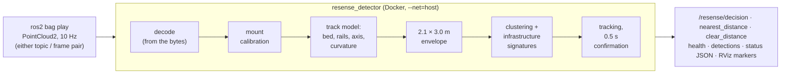

# ReSense — LiDAR obstacle detection in the metro clearance gauge

[](https://github.com/pmixay/ReSense/actions/workflows/ci.yml)
· LCT 2026, case 05 (Moscow Metro) · team «Молоток» · package 1.0.0 ·
**User guide (RU): [resense.gitbook.io/resense-docs](https://resense.gitbook.io/resense-docs/)**

ReSense tells a driverless metro train, ten times a second, whether something that should not be
there is inside its clearance envelope and how far ahead along the track. It is a ROS 2 Humble node
in a Docker image, CPU only. From every LiDAR cloud it models the normal tunnel — track bed, rail
heads, the track axis and its curvature from the walls — cuts the organizers' 2.1 × 3.0 m train
envelope along it and reports every persistent object inside: no object classes, no map, no
training on obstacles. The answer is `/resense/decision` (`GO` / `CAUTION` / `STOP` / `FAULT`) and
`/resense/nearest_distance` in metres.

## Кратко для жюри

**На стенде нет интернета**, поэтому образ поставляется архивом `resense-image-<версия>.tar.gz` (и
его `.sha256`) и загружается без сети; нода и всё, что ей нужно при работе, сети не используют.

```bash
sudo sysctl -w net.core.rmem_max=33554432                # 0. на хосте, до перезагрузки: буфер UDP для 360° облаков
docker load -i resense-image-<версия>.tar.gz             # 1. один раз, без интернета
docker run --rm -it --net=host --ipc=host resense        # 2. консоль 1: нода (команда образа — для записанных бэгов)
ros2 bag play <бэг> --delay 3 --read-ahead-queue-size 10 # 3. консоль 2: любой пользователь, ROS 2 Humble
ros2 topic echo /resense/decision --field data           # 4. консоль 3: GO | CAUTION | STOP | FAULT
ros2 topic echo /resense/nearest_distance --field data   # 5. расстояние до препятствия, м; −1 — нет
```

* **Одной командой:** `scripts/play_bag.sh <бэг> [--archive resense-image-<версия>.tar.gz]` —
  проверит и загрузит архив, поднимет буфер, запустит ноду, проиграет бэг и напечатает каждую смену
  решения с расстоянием («12.3 s  STOP  55.6 m»).
* **Где взять архив:** Assets релиза GitHub `v1.0.0` (его собирает и проверяет
  `.github/workflows/release.yml` при публикации тега); до публикации — артефакт CI
  `resense-image-<версия>-<коммит>` прогона `ci` на `main` (нужен вход в GitHub) или
  `scripts/export_image.sh` на машине с интернетом. С интернетом шаг 1 заменяет сборка:
  `docker build -t resense -f docker/Dockerfile .` (≈1,5 мин с кэшем базового образа, ≈9 мин с нуля).
* **Обязательно:** `--net=host` (DDS только по UDP) и `--read-ahead-queue-size 10` в шаге 3: без
  него `ros2 bag play` Humble отправляет начало записи пачкой, и результаты помечаются устаревшими.
  Шаг 0 нужен плееру на CycloneDDS; штатный Fast DDS доставляет облака и без него.
* **RViz** (нужен X11): вместо шага 2 — `xhost +local:docker && docker run --rm -it --net=host
  --ipc=host -e DISPLAY -v /tmp/.X11-unix:/tmp/.X11-unix resense ros2 launch resense_ros
  detector.launch.py rviz:=true freshness_mode:=replay`.

| `/resense/decision` | значение |
|---|---|
| `STOP` | **тревога**: подтверждённое препятствие в габарите 2,1 × 3,0 м; расстояние — `/resense/nearest_distance` |
| `CAUTION` | подсказка, не тревога: объект у габарита снаружи или за доверенной дальностью, известная инфраструктура, сниженная исправность |
| `GO` | препятствие не обнаружено (оценка дальности контроля — `/resense/clear_distance`; это оценка, а не гарантия) |
| `FAULT` | входа нет (до первого кадра, > 0,5 с без кадров) или ему нельзя доверять |

На `doubleT_obstacle` нода выдаёт `STOP` с 8-го кадра (человек входит в габарит) до конца записи на
55,5–56,6 м; один кадр `GO` (111) и два `CAUTION` (117, 197) — известное ограничение детектора
(предмет на рельсе пропущен два кадра подряд). На `roundT_doubleT` (без препятствий) `STOP` нет.

## Results

Measured on the organizers' data by the independent judgement of 28.09
([`docs/SCORECARD.md`](docs/SCORECARD.md), raw outputs in
[`docs/evidence/judgement_2026-09-28/`](docs/evidence/judgement_2026-09-28/README.md)) and on the
team's 4-core VM ([`docs/evidence/vm_2026-09-28/`](docs/evidence/vm_2026-09-28/summary.md)).
*In-sample*: the detector's rules were tuned on these recordings; there are no untouched real
obstacles. Full tables: [`docs/EXPERIMENTS.md`](docs/EXPERIMENTS.md).

| what | result | data |
|---|---|---|
| real obstacle, `doubleT_obstacle` (person crossing at 55–57 m, object on the rail) | STOP from the person's first frame in the envelope to the end, 55.5–56.6 m (labels 55.4–56.6 m); one GO frame (111) | real |
| false alarms, five obstacle-free recordings (2 287 frames, 250 s) | 23 STOP frames (1.0 %) in 7 episodes; 2 of the 5 recordings have none at all | real, in-sample |
| false alarms, 20-minute ride (11 271 frames, 13 km, no obstacles) | 30 STOP episodes = **2.3 per km**, 1.5 % of frames | real, in-sample |
| the organizers' 10 ray-cast objects (1 510 frames) | STOP for **8 of 8** objects inside the envelope; first STOP: 2 m box 98 m (its first appearance), box on the envelope top 111 m, plank on the rails 87 m, 0.3 m cubes 48–56 m, edge objects 29–35 m, 5 cm hanging object 30 m; the outside cube never | organizers' synthetic, in-sample |
| a real person moved into the other five tunnels (15 windows) | sustained STOP at 60 m in 11 of 15 windows, 100 m in 6, 130 m in 2, 160 m in 1; no false STOP without the person | real points, judge's test |
| sensor reach | no return beyond ~210 m in any of the 13 759 frames: 300 m is beyond this LiDAR | real |
| speed, through ROS in Docker (player → result) | 10 fps, under one CPU core. Current results at 360° (24 MB clouds): e2e p95 81–82 ms, decode + detect p95 63–72 ms (4-core VM); 120°: 49–78 ms. Start-up (node of 29.09, [evidence](docs/evidence/node_startup_2026-09-29/README.md)): results of the first 3 s 38–105 ms old (median) instead of ~0.3 s; first STOP 0.8–1.0 s after the first cloud | 4-core VM, 4-vCPU sandbox |
| tests | 770 passed (`pytest`), lint clean, CI: 4 jobs incl. the Docker image, the offline archive and both original bags cold | |

**Known limits** (details: [ARCHITECTURE «Known limitations»](docs/ARCHITECTURE.md#limitations-of-the-sealed-2709-detector-verified-2809)):
small (0.3 m) and edge objects are confirmed only inside 30–56 m; beyond the trusted track-axis
range (short at platforms and double-track sections) an object on the track is `CAUTION`, not
`STOP`; a confirmed object can drop for one frame after two missed frames (the GO above);
`CAUTION` is frequent on empty track (35–69 % of frames); all figures are in-sample and the ground
truth was labelled with the team's own tools. The detector is sealed since 27.09
([`docs/DETECTOR_FREEZE.md`](docs/DETECTOR_FREEZE.md)).


*Real data: `doubleT_obstacle` from the cab, the person at 55.8 m. Video: the 2:50 overview
[`docs/video/resense_overview.mp4`](docs/video/resense_overview.mp4) (Russian subtitles) and the
Docker + RViz chain [`docs/video/docker_chain_rviz.mp4`](docs/video/docker_chain_rviz.mp4).*

## How it works


```mermaid
flowchart LR
  bag["ros2 bag play<br/>PointCloud2, 10 Hz<br/>(either topic / frame pair)"] --> node
  subgraph node["resense_detector (Docker, --net=host)"]
    direction LR
    dec["decode<br/>(from the bytes)"] --> cal["mount<br/>calibration"] --> trk["track model:<br/>bed, rails, axis,<br/>curvature"] --> env["2.1 × 3.0 m<br/>envelope"] --> clu["clustering +<br/>infrastructure<br/>signatures"] --> tr["tracking,<br/>0.5 s<br/>confirmation"]
  end
  node --> out["/resense/decision · nearest_distance · clear_distance<br/>health · detections · status JSON · RViz markers"]
```

Per frame: the cloud is read straight from its serialized bytes; the mount is calibrated from the
rails; the bed, the rail heads and the track axis are fitted (curvature from the walls, so the
corridor follows curves); the envelope is swept along the axis; points inside it are clustered with
a range-adaptive DBSCAN; clusters matching tunnel infrastructure (columns, wall faces, overhead
lines, signs) are advisory; a cluster that persists 0.5 s inside the envelope is a `STOP`. A small
learned model may hold a doubtful far `STOP` for at most 10 processed frames; it never vetoes one.
Architecture: [`docs/ARCHITECTURE.md`](docs/ARCHITECTURE.md); algorithm and its maths:
[`docs/ALGORITHM.md`](docs/ALGORITHM.md); why each choice: [`docs/DECISIONS.md`](docs/DECISIONS.md).

## Build, run, process a bag

```bash
docker build -t resense -f docker/Dockerfile .           # or ./scripts/build.sh; WITH_TOOLS=1 adds pytest, open3d, rosbags
docker run --rm -it --net=host --ipc=host resense        # the node; then play a bag from any console (above)
scripts/play_bag.sh /data/for_hackathon/doubleT_obstacle # node + player + decisions, one command
scripts/dry_run.sh  /data/for_hackathon/doubleT_obstacle # acceptance test: decisions, distance, latency, drops, pace
scripts/export_image.sh                                  # offline delivery: dist/resense-image-<ver>.tar.gz + .sha256
scripts/load_image.sh dist/resense-image-<ver>.tar.gz    # sha256, docker load, a --network none check
```

Without ROS or Docker (Python ≥ 3.10):

```bash
pip install -e ".[dev]" && pytest -q                     # the library, the tools, the C++ kernels if a compiler is present
resense run --bag /data/for_hackathon/doubleT_obstacle --out results.jsonl --render out/   # per-frame JSON + PNG
resense bench --bag /data/for_hackathon/roundT_doubleT --every 5                           # per-stage timing
```

The data (organizers' links, unpacking, frame cache) is described in
[`docs/DATASET.md`](docs/DATASET.md); a bag directory is mounted at `/data`. The node listens to
both topic / frame pairs of the organizers' recordings (`/lidar_points` + `hesai_lidar`,
`/sensing/lidar/hesai128/pointcloud` + `lidar_livox`) and to any other `PointCloud2` topic; a new
recording (topic, frame id or a stamp jump) gets a fresh detector, so bags can be played one after
another into one running node. Remote demo: RViz screen share, or Foxglove on port 8765 with
[`web/foxglove_layout.json`](web/foxglove_layout.json) ([`web/README.md`](web/README.md)).

## Parameters

Every node parameter is a launch argument (`ros2 launch resense_ros detector.launch.py <name>:=<value>`);
the full list with defaults: [GitBook — «Параметры ноды»](https://resense.gitbook.io/resense-docs/reference/node-parameters).
The ones that matter most:

| parameter | default | meaning |
|---|---|---|
| `freshness_mode` | `live` (the image's command passes `replay`) | `replay` ages a result from the player's publication (recorded bags), `live` from the acquisition stamp (a live LiDAR) |
| `max_result_age` | 0.5 s | older results are not current: `FAULT`, or a held `STOP` |
| `input_topic`, `auto_discover` | both organizer topics, true | input topics |
| `catchup_step`, `catchup_startup_step` | 0.3 s, 0.2 s | frames the node takes while behind: 0.3 s of recording apart during a stall, 0.2 s (5 Hz) through a recording's start-up burst |
| `warmup` | true | decode + a throwaway detector on synthetic frames before listening, so the first frame is not slower |
| `sensor_forward/left/up`, `mount_*_deg`, `auto_calibrate` | the recordings' mount, true | sensor axes, fixed tilt, automatic mount calibration from the rails |
| `ego_speed_mps`, `speed_topic`, `odom_topic` | none | a train speed enables multi-frame accumulation (off without one) |
| `config_file` | the package's copy of `configs/default.yaml` | the detector parameters |

Detector parameters live in one file, [`configs/default.yaml`](configs/default.yaml) (the ROS
package carries a checked copy): the envelope `gauge.profile` (|dy| ≤ 1.05 m, 0.12–3.0 m above the
rail head, advisory band +0.35 m), `tracking.confirm_time_s` 0.5 s, `cluster.eps` 0.35 m growing
with range, the infrastructure signatures and their limits. Each is explained in
[`docs/ALGORITHM.md`](docs/ALGORITHM.md) §5.

Topics: `/resense/decision`, `/resense/obstacle_detected`, `/resense/warning`,
`/resense/nearest_distance`, `/resense/clear_distance`, `/resense/health`, `/resense/detections`
(`vision_msgs/Detection3DArray`), `/resense/status` (JSON: every object with distance, lateral
offset, size, confidence; the track model; health; timing; freshness), `/resense/latency_ms`,
`/resense/fps`, RViz `/resense/markers` and `/resense/corridor_points`. A consumer should read
`freshness.valid` in the status JSON and expire results itself; after the input stops, a `STOP`
is held (`stop_held`) until a fresh non-`STOP` frame. Contract:
[GitBook — «Топики и JSON статуса»](https://resense.gitbook.io/resense-docs/reference/topics).

## Documentation

| organizers' requirement (spec §5, §7) | where |
|---|---|
| description, build, run, bag processing, parameters | this README; the Russian user guide [resense.gitbook.io/resense-docs](https://resense.gitbook.io/resense-docs/) (source [`gitbook/`](gitbook/)) |
| architecture | [`docs/ARCHITECTURE.md`](docs/ARCHITECTURE.md) |
| algorithm: problem, data, processing, decision, parameters, limitations | [`docs/ALGORITHM.md`](docs/ALGORITHM.md), [`docs/SENSOR.md`](docs/SENSOR.md), [`docs/DATASET.md`](docs/DATASET.md) |
| experiments: range, latency, FPS, false alarms, hard cases, evolution | [`docs/EXPERIMENTS.md`](docs/EXPERIMENTS.md), protocol [`docs/EVALUATION.md`](docs/EVALUATION.md), decisions [`docs/DECISIONS.md`](docs/DECISIONS.md) |
| video | [`docs/video/resense_overview.mp4`](docs/video/resense_overview.mp4) (2:50, subtitles [`.srt`](docs/video/resense_overview.ru.srt)), clips in [`docs/video/`](docs/video) |
| presentation | [`docs/presentation/`](docs/presentation) (built by `scripts/build_deck.py`; texts [`docs/PRESENTATION.md`](docs/PRESENTATION.md)) |

Every document with its purpose and owner: [`docs/README.md`](docs/README.md). What changed:
[`CHANGELOG.md`](CHANGELOG.md).

## Repository

| path | what |
|---|---|
| [`resense/`](resense), [`native/`](native) | the detector library (numpy / scipy / scikit-learn, no ROS) and its optional C++ kernels (bit-identical, about half the detector time) |
| [`ros2_ws/src/resense_ros/`](ros2_ws/src/resense_ros) | the ROS 2 node, launch file, RViz layout |
| [`docker/`](docker), [`scripts/`](scripts), [`.github/workflows/`](.github/workflows) | image, tools (dry run, export, release, evaluation), CI and release |
| [`configs/default.yaml`](configs/default.yaml) | the detector parameters |
| [`tests/`](tests), [`web/`](web) | pytest suite; dashboard, Foxglove layout, label tool |
| [`docs/`](docs), [`gitbook/`](gitbook), [`labels/`](labels) | documents and evidence; the user guide; labels of the organizers' recordings |

## Team «Молоток»

| | role (organizers' list) | owns |
|---|---|---|
| P1, captain | system analyst + ROS 2 developer | requirements, architecture, the node, Docker, CI and release, evaluation protocol, organizer liaison, submission |
| P2 | software developer (UI) | RViz / Foxglove / web dashboard, label tool; **the pitch and the video** |
| P3 | computer-vision engineer | the detector: track model, envelope, clustering, tracking, false-alarm suppression, performance |
| P4 | data specialist | data tooling, synthetic obstacles, labels, metrics, tests |

License: MIT.
