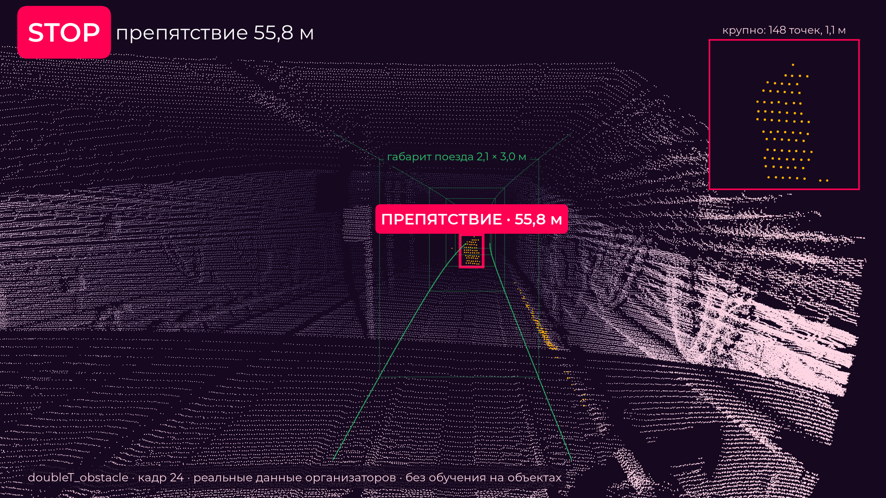
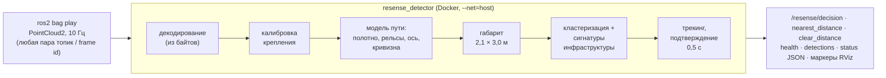

# ReSense — обнаружение препятствий по данным LiDAR в габарите метро

[](https://github.com/pmixay/ReSense/actions/workflows/ci.yml)
· ЛЦТ 2026, кейс 05 (Московский метрополитен) · команда «Молоток» · пакет 1.0.0 ·
**Руководство пользователя: [resense.gitbook.io/resense-docs](https://resense.gitbook.io/resense-docs/)**

ReSense десять раз в секунду сообщает беспилотному поезду метро, находится ли внутри его габарита
что-то, чего там быть не должно, и на каком расстоянии впереди по пути. Это нода ROS 2 Humble в
образе Docker, только CPU. По каждому облаку LiDAR она строит модель нормального тоннеля — полотно,
головки рельсов, ось пути и её кривизну по стенам, — вырезает вдоль неё габарит поезда 2,1 × 3,0 м,
заданный организаторами, и сообщает о каждом устойчивом объекте внутри него: без классов объектов,
без карты, без обучения на препятствиях. Ответ — `/resense/decision` (`GO` / `CAUTION` / `STOP` /
`FAULT`) и `/resense/nearest_distance` в метрах.

## Кратко для жюри

**На стенде нет интернета**, поэтому образ поставляется архивом `resense-image-<версия>.tar.gz` (и
его `.sha256`) и загружается без сети; нода и всё, что ей нужно при работе, сети не используют.

```bash
sudo sysctl -w net.core.rmem_max=33554432                # 0. на хосте, до перезагрузки: буфер UDP для 360° облаков
docker load -i resense-image-<версия>.tar.gz             # 1. один раз, без интернета
docker run --rm -it --net=host --ipc=host resense        # 2. консоль 1: нода (команда образа — для записанных бэгов)
ros2 bag play <бэг> --delay 3 --read-ahead-queue-size 10 # 3. консоль 2: любой пользователь, ROS 2 Humble
ros2 topic echo /resense/decision --field data           # 4. консоль 3: GO | CAUTION | STOP | FAULT
ros2 topic echo /resense/nearest_distance --field data   # 5. расстояние до препятствия, м; −1 — нет
```

* **Одной командой:** `scripts/play_bag.sh <бэг> [--archive resense-image-<версия>.tar.gz]` —
  проверит и загрузит архив, поднимет буфер, запустит ноду, проиграет бэг и напечатает каждую смену
  решения с расстоянием («12.3 s  STOP  55.6 m»).
* **Где взять архив:** Assets релиза GitHub `v1.0.0` — его собирает, проверяет и публикует
  `.github/workflows/release.yml` при пуше тега `v1.0.0` (есть ли релиз — на странице
  [Releases](https://github.com/pmixay/ReSense/releases); `scripts/verify_release.sh v1.0.0` скачает и
  проверит архив). Пока релиза нет — артефакт CI `resense-image-<версия>-<коммит>` прогона `ci` на
  `main` (хранится 30 дней, нужен вход в GitHub) или `scripts/export_image.sh` на машине с
  интернетом. С интернетом шаг 1 заменяет сборка: `docker build -t resense -f docker/Dockerfile .`
  (≈1,5 мин с кэшем базового образа, ≈9 мин с нуля).
* **Обязательно:** `--net=host` (DDS только по UDP) и `--read-ahead-queue-size 10` в шаге 3: без
  него `ros2 bag play` Humble отправляет начало записи пачкой, и результаты помечаются устаревшими.
  Шаг 0 нужен плееру на CycloneDDS; штатный Fast DDS доставляет облака и без него.
* **RViz** (нужен X11): вместо шага 2 — `xhost +local:docker && docker run --rm -it --net=host
  --ipc=host -e DISPLAY -v /tmp/.X11-unix:/tmp/.X11-unix resense ros2 launch resense_ros
  detector.launch.py rviz:=true freshness_mode:=replay`.

| `/resense/decision` | значение |
|---|---|
| `STOP` | **тревога**: подтверждённое препятствие в габарите 2,1 × 3,0 м; расстояние — `/resense/nearest_distance` |
| `CAUTION` | подсказка, не тревога: объект у габарита снаружи или за доверенной дальностью, известная инфраструктура, сниженная исправность |
| `GO` | препятствие не обнаружено (оценка дальности контроля — `/resense/clear_distance`; это оценка, а не гарантия) |
| `FAULT` | входа нет (до первого кадра, > 0,5 с без кадров) или ему нельзя доверять |

На `doubleT_obstacle` нода выдаёт `STOP` с 8-го кадра (человек входит в габарит) до конца записи на
55,5–56,6 м, без пропусков: 193 из 201 результата (текущий детектор; офлайн на сырой записи и через
ноду в Docker в CI). На `roundT_doubleT` (без препятствий) `STOP` нет.

## Результаты

Два источника, и в таблице у каждой цифры указан детектор, который она описывает:

* **текущий детектор** (печать 29.09, `1e2ed82`; в `main` — `7532a6b`): регрессионный шлюз команды на
  всех записях организаторов (кэш кадров 1 см;
  [`gate_table.md`](docs/evidence/cycle_2026-09-29/competitor_rules/gate_table.md));
* **независимая оценка 28.09** детектора `464f5bc`, то есть до правил 29.09 (каждый кадр сырых
  записей, свой подсчёт эпизодов; [`docs/SCORECARD.md`](docs/SCORECARD.md), сырые данные —
  [`docs/evidence/judgement_2026-09-28/`](docs/evidence/judgement_2026-09-28/README.md)), и прогоны на
  4-ядерной ВМ команды 28.09 ([`docs/evidence/vm_2026-09-28/`](docs/evidence/vm_2026-09-28/summary.md)).

Способы подсчёта разные, поэтому цифры двух источников напрямую не сравниваются
([`docs/EXPERIMENTS.md`](docs/EXPERIMENTS.md) «Два способа подсчёта»). *В выборке*: правила детектора
настраивались на этих записях; нетронутых реальных препятствий нет.

| что | результат | детектор, источник | данные |
|---|---|---|---|
| реальное препятствие, `doubleT_obstacle` (человек пересекает путь на 55–57 м, предмет на рельсе) | STOP с первого кадра, где человек в габарите (8-го), до конца записи без пропусков: 193 из 201 кадра, 55,5–56,6 м (метки 55,4–56,6 м) | текущий: шлюз 29.09 и сырая запись ([материалы](docs/evidence/frame111_2026-09-29/README.md)) | реальные, в выборке |
| ложные тревоги, пять записей без препятствий (2 287 кадров, 250 с) | **12 эпизодов STOP**, 8 событий, 39 кадров тревоги; в 3 из 5 записей STOP нет | текущий: шлюз 29.09 (до правил 29.09: 13 / 11 / 40) | реальные, в выборке |
| то же | 23 кадра STOP (1,0 %) в 7 эпизодах; в 2 из 5 записей их нет совсем <!-- FINAL-NUMBERS: five empty, judgement 28.09 (464f5bc): 23 STOP frames (1.0 %), 7 episodes, 0 in 2 of 5; replace from docs/evidence/judgement_2026-09-29/ --> | независимая оценка 28.09, детектор до правил 29.09 | реальные, в выборке |
| ложные тревоги, 20-минутная поездка (11 271 кадр, 13,0 км, без препятствий) | **28 эпизодов STOP = 2,2 на км**, 26 событий (2,0 на км), 123 кадра тревоги | текущий: шлюз 29.09 (до правил 29.09: 31 / 32 / 130) | реальные, в выборке |
| то же | 30 эпизодов STOP = 2,3 на км, 1,5 % кадров <!-- FINAL-NUMBERS: ride, judgement 28.09 (464f5bc): 30 STOP episodes = 2.3/km, 164 STOP frames (1.5 %); replace from docs/evidence/judgement_2026-09-29/ --> | независимая оценка 28.09, детектор до правил 29.09 | реальные, в выборке |
| 10 объектов организаторов, построенных лучевым методом (ray casting; 1 510 кадров) | STOP для **8 из 8** объектов внутри габарита, 411 кадров STOP внутри, куб снаружи — ни разу | текущий: шлюз 29.09 (без изменений) | синтетические (организаторов), в выборке |
| то же, первый STOP | коробка 2 м — 98 м (её первое появление), коробка на верхней границе габарита — 111 м, доска на рельсах — 87 м, кубы 0,3 м — 48–56 м, объекты у края габарита — 29–35 м, висящий объект 5 см — 30 м <!-- FINAL-NUMBERS: set O first STOP, judgement 28.09 (464f5bc): 98 / 111 / 87 / 48-56 / 29-35 / 30 m; replace from docs/evidence/judgement_2026-09-29/ --> | независимая оценка 28.09, детектор до правил 29.09 | синтетические (организаторов), в выборке |
| реальный человек, перенесённый в остальные пять тоннелей (15 окон) | устойчивый STOP на 60 м в 11 из 15 окон, на 100 м — в 6, на 130 м — в 2, на 160 м — в 1; без человека ложных STOP нет <!-- FINAL-NUMBERS: transplant, judgement 28.09 (464f5bc): 60 m 11/15, 100 m 6/15, 130 m 2, 160 m 1; replace from docs/evidence/judgement_2026-09-29/ --> | независимая оценка 28.09, детектор до правил 29.09. Тест вставляет человека на неизменной дистанции, пока поезд едет, а запрет эго-движения (с 29.09) не даёт STOP именно такому треку: для текущего детектора на окнах с движущимся поездом тест не показателен | реальные точки, тест независимой оценки |
| досягаемость датчика | ни одного отражения дальше ~210 м ни в одном из 13 759 кадров: 300 м этому LiDAR недостижимы | не зависит от детектора | реальные |
| скорость, через ROS в Docker (плеер → результат) | 10 кадр/с, меньше одного ядра CPU. Актуальные результаты на 360° (облака по 24 МБ): e2e p95 81–82 мс, декодирование + обнаружение p95 63–72 мс (4-ядерная ВМ); 120°: 49–78 мс. Правила 29.09 добавляют к обнаружению +2,4 мс p95 на 360° кадре и +1,6 мс на 120° ([A/B](docs/evidence/cycle_2026-09-29/competitor_rules/latency_ab.json)). Старт (нода от 29.09 с явным `catchup_startup_step:=0.2`; умолчание теперь 0, при нём старт не измерен; [материалы-доказательства (evidence)](docs/evidence/node_startup_2026-09-29/README.md)): результаты первых 3 с имеют возраст 38–105 мс (медиана) вместо ~0,3 с; первый STOP через 0,8–1,0 с после первого облака <!-- FINAL-NUMBERS: latency, VM 28.09 (464f5bc): e2e p95 81-82 ms at 360°, decode+detect p95 63-72 ms, 120° 49-78 ms; keep unless re-measured on HEAD --> | ВМ 28.09 и песочница на 4 vCPU (детектор до правил 29.09); A/B правил — 29.09 | реальные |
| тесты | 1 279 тестов пройдено (`pytest`; ещё 8 не отбираются — им нужны локальные кэши данных) и 74 теста дашборда в Chromium без интерфейса, линтер без замечаний, CI зелёный на `main`: 4 задания, включая образ Docker, офлайн-архив и оба исходных бэга на холодном старте | `main` `7532a6b`, CI 29.09 | |

**Известные ограничения** (подробности: [ARCHITECTURE «Известные ограничения»](docs/ARCHITECTURE.md#известные-ограничения)):
малые (0,3 м) объекты и объекты у края габарита подтверждаются только в пределах 30–56 м (оценка
28.09); за пределами доверенной дальности оси пути (она коротка на платформах и двухпутных участках)
объект на пути получает `CAUTION`, а не `STOP`; подтверждённый STOP низкого объекта продолжается по
возвратам чуть ниже порога высоты не дольше 0,3 с (`tracking.stop_keep_low_s`), подобрано на
`doubleT_obstacle` и вне выборки не проверено; три правила 29.09 взяты из чужих решений и проверены
только шлюзом на тех же записях, независимое ревью их безопасности не проводилось; при ходе поезда
≥ 4 м/с трек дальше 25 м, расстояние до которого не сокращается вместе с пробегом (например, объект,
уходящий вперёд почти со скоростью поезда), STOP не начинает; `CAUTION` часто выдаётся на пустом
пути (35–69 % кадров, оценка 28.09); все цифры получены в выборке, а эталонная разметка сделана
собственными инструментами команды. Печать детектора: 29.09, `1e2ed82`
([`docs/DETECTOR_FREEZE.md`](docs/DETECTOR_FREEZE.md)).

## Состояние на 29.09

`main` = `7532a6b` (PR #29, CI зелёный). 29.09 детектор менялся дважды, оба раза с полным шлюзом и
новой печатью. Днём (PR #27, `6cafb28`): ограниченное продолжение низкого STOP
`tracking.stop_keep_low_s` = 0,3 с закрыло одиночный `GO` на кадре 111 `doubleT_obstacle` и
`CAUTION` на 117 и 197 (190 → 193 из 201; подобрано на этой записи,
[материалы](docs/evidence/frame111_2026-09-29/README.md)), порог тонких дальних линий
`tracking.thin_far_min_voxels` 4 → 3 ([материалы](docs/evidence/cycle_2026-09-29/thin_far_threshold.md)),
подсчёт секторов исправности стал быстрее с теми же значениями
([материалы](docs/evidence/cycle_2026-09-29/health_compare_counts/README.md)). Вечером (PR #29): три
правила против ложных тревог из открытых решений других команд кейса 5 — «чистая серия» после
истории инфраструктуры (`tracking.explained_run` 5), прикрепление высокого дальнего кластера к
обделке (`cluster.shell_min_top` 2,3 м) и запрет эго-движения (`tracking.ego_veto_min_speed` 4 м/с);
их шлюз — PASS, 7 метрик лучше, ни одной хуже (цифры — в таблице выше; ложные обнаружения набора F:
коробка 1 м 12 → 6, кабель 3 → 0). Нода по умолчанию обрабатывает каждый кадр стартовой пачки
(`catchup_startup_step` = 0; прежнее прореживание до 5 Гц — явное `0.2`). Выключены по умолчанию и в
оценку не входят: экспериментальные правила (`cluster.weak_min_rings`, `tracking.far_min_ring_count`,
`tracking.fresh_stop_evidence`, `lowobj.local_support_enabled`; профили
[`configs/experimental_*.yaml`](configs), описания [`EXPERIMENT_CROSS_RING`](docs/EXPERIMENT_CROSS_RING.md),
[`EXPERIMENT_FRESH_STOP_EVIDENCE`](docs/EXPERIMENT_FRESH_STOP_EVIDENCE.md),
[`EXPERIMENT_LOW_LOCAL_SUPPORT`](docs/EXPERIMENT_LOW_LOCAL_SUPPORT.md)) и дальние рельсы по кольцам
LiDAR (`track.rails_far_rings`: шлюз не проходит). Подробности, цифры каждого шага и отвергнутые
варианты: [`CHANGELOG.md`](CHANGELOG.md).


*Реальные данные: `doubleT_obstacle` из кабины, человек на 55,8 м. Видео: обзор на 2:50
[`docs/video/resense_overview.mp4`](docs/video/resense_overview.mp4) (русские субтитры) и цепочка
Docker + RViz [`docs/video/docker_chain_rviz.mp4`](docs/video/docker_chain_rviz.mp4).*

## Как это работает


```mermaid
flowchart LR
  bag["ros2 bag play<br/>PointCloud2, 10 Гц<br/>(любая пара топик / frame id)"] --> node
  subgraph node["resense_detector (Docker, --net=host)"]
    direction LR
    dec["декодирование<br/>(из байтов)"] --> cal["калибровка<br/>крепления"] --> trk["модель пути:<br/>полотно, рельсы, ось,<br/>кривизна"] --> env["габарит<br/>2,1 × 3,0 м"] --> clu["кластеризация +<br/>сигнатуры<br/>инфраструктуры"] --> tr["трекинг,<br/>подтверждение<br/>0,5 с"]
  end
  node --> out["/resense/decision · nearest_distance · clear_distance<br/>health · detections · status JSON · маркеры RViz"]
```

Для каждого кадра: облако читается прямо из сериализованных байтов; крепление калибруется по
рельсам; подбираются полотно, головки рельсов и ось пути (кривизна — по стенам, поэтому коридор
следует изгибам); габарит протягивается вдоль оси; точки внутри него кластеризуются DBSCAN с
адаптивным к дальности радиусом; кластеры, соответствующие инфраструктуре тоннеля (колонны, грани
стен, воздушные линии, знаки), — это предупреждение; кластер, сохраняющийся 0,5 с внутри габарита,
— это `STOP`. Начать `STOP` не могут трек с недавней историей инфраструктуры без 5 чистых попаданий
подряд и, при ходе поезда, трек, расстояние до которого не сокращается вместе с пробегом (правила
29.09; такой трек остаётся `CAUTION`). Небольшая обученная модель может задержать сомнительный
дальний `STOP` не более чем на 10 обработанных кадров; она никогда не отменяет его.
Архитектура: [`docs/ARCHITECTURE.md`](docs/ARCHITECTURE.md); алгоритм и его математика:
[`docs/ALGORITHM.md`](docs/ALGORITHM.md); почему сделан каждый выбор: [`docs/DECISIONS.md`](docs/DECISIONS.md).

## Сборка, запуск, обработка бэга

```bash
docker build -t resense -f docker/Dockerfile .           # or ./scripts/build.sh; WITH_TOOLS=1 adds pytest, open3d, rosbags
docker run --rm -it --net=host --ipc=host resense        # the node; then play a bag from any console (above)
scripts/play_bag.sh /data/for_hackathon/doubleT_obstacle # node + player + decisions, one command
scripts/dry_run.sh  /data/for_hackathon/doubleT_obstacle # acceptance test: decisions, distance, latency, drops, pace
scripts/export_image.sh                                  # offline delivery: dist/resense-image-<ver>.tar.gz + .sha256
scripts/load_image.sh dist/resense-image-<ver>.tar.gz    # sha256, docker load, a --network none check
```

Без ROS и Docker (Python ≥ 3.10):

```bash
pip install -e ".[dev]" && pytest -q                     # the library, the tools, the C++ kernels if a compiler is present
resense run --bag /data/for_hackathon/doubleT_obstacle --out results.jsonl --render out/   # per-frame JSON + PNG
resense bench --bag /data/for_hackathon/roundT_doubleT --every 5                           # per-stage timing
```

Данные (ссылки организаторов, распаковка, кэш кадров) описаны в
[`docs/DATASET.md`](docs/DATASET.md); каталог с бэгом монтируется в `/data`. Нода слушает обе
пары топик / frame id из записей организаторов (`/lidar_points` + `hesai_lidar`,
`/sensing/lidar/hesai128/pointcloud` + `lidar_livox`) и любой другой топик `PointCloud2`; новая
запись (топик, frame id или скачок метки времени) получает свежий детектор, поэтому бэги можно
проигрывать один за другим в одну работающую ноду. Удалённая демонстрация: трансляция экрана с
RViz или Foxglove на порту 8765 с [`web/foxglove_layout.json`](web/foxglove_layout.json)
([`web/README.md`](web/README.md)).

## Параметры

Каждый параметр ноды — аргумент запуска (`ros2 launch resense_ros detector.launch.py <name>:=<value>`);
полный список со значениями по умолчанию: [GitBook — «Параметры ноды»](https://resense.gitbook.io/resense-docs/reference/node-parameters).
Самые важные:

| параметр | по умолчанию | значение |
|---|---|---|
| `freshness_mode` | `live` (команда образа передаёт `replay`) | `replay` отсчитывает возраст результата от публикации кадра плеером (записанные бэги), `live` — от метки времени получения кадра (работающий LiDAR) |
| `max_result_age` | 0,5 с | более старые результаты неактуальны: `FAULT` либо удерживаемый `STOP` |
| `input_topic`, `auto_discover` | оба топика организаторов, true | входные топики |
| `catchup_step`, `catchup_startup_step` | 0,3 с, 0 с | кадры, которые нода берёт, пока отстаёт: с интервалом 0,3 с записи при задержке передачи; на стартовой пачке записи — каждый кадр (0), явное `0.2` даёт прореживание до 5 Гц |
| `warmup` | true | декодирование и одноразовый детектор на синтетических кадрах до начала приёма, чтобы первый кадр не обрабатывался медленнее |
| `sensor_forward/left/up`, `mount_*_deg`, `auto_calibrate` | крепление, как в записях, true | оси датчика, фиксированный наклон, автоматическая калибровка крепления по рельсам |
| `ego_speed_mps`, `speed_topic`, `odom_topic` | нет | скорость поезда включает накопление по нескольким кадрам (без неё выключено) и заменяет оценку скорости по LiDAR в запрете эго-движения |
| `config_file` | копия `configs/default.yaml` в пакете | параметры детектора |

Параметры детектора находятся в одном файле, [`configs/default.yaml`](configs/default.yaml) (пакет
ROS содержит проверяемую копию): габарит `gauge.profile` (|dy| ≤ 1,05 м, 0,12–3,0 м над головкой
рельса, зона предупреждения +0,35 м), `tracking.confirm_time_s` 0,5 с, `cluster.eps` 0,35 м, растущий
с дальностью, сигнатуры инфраструктуры и их пределы. Каждый объяснён в
[`docs/ALGORITHM.md`](docs/ALGORITHM.md) §5; правила 29.09 (`tracking.explained_run`,
`cluster.shell_min_top`, `tracking.ego_veto_min_speed`) и выключенные экспериментальные флаги — в
комментариях самого файла и в [GitBook — «Файл конфигурации»](https://resense.gitbook.io/resense-docs/reference/configuration).

Топики: `/resense/decision`, `/resense/obstacle_detected`, `/resense/warning`,
`/resense/nearest_distance`, `/resense/clear_distance`, `/resense/health`, `/resense/detections`
(`vision_msgs/Detection3DArray`), `/resense/status` (JSON: каждый объект с расстоянием, боковым
смещением, размером, уверенностью; модель пути; исправность; время обработки; свежесть),
`/resense/latency_ms`, `/resense/fps`, для RViz — `/resense/markers` и `/resense/corridor_points`.
Потребитель должен читать `freshness.valid` в JSON статуса и сам отбрасывать устаревшие результаты;
после прекращения входа `STOP` удерживается (`stop_held`) до свежего кадра без `STOP`. Контракт:
[GitBook — «Топики и JSON статуса»](https://resense.gitbook.io/resense-docs/reference/topics).

## Документация

| требование организаторов (ТЗ §5, §7) | где |
|---|---|
| описание, сборка, запуск, обработка бэга, параметры | этот README; русскоязычное руководство пользователя [resense.gitbook.io/resense-docs](https://resense.gitbook.io/resense-docs/) (исходники — [`gitbook/`](gitbook/)) |
| архитектура | [`docs/ARCHITECTURE.md`](docs/ARCHITECTURE.md) |
| алгоритм: задача, данные, обработка, решение, параметры, ограничения, математическая модель | [`docs/ALGORITHM.md`](docs/ALGORITHM.md) (модель в формулах — §3), [`docs/SENSOR.md`](docs/SENSOR.md), [`docs/DATASET.md`](docs/DATASET.md) |
| эксперименты: дальность, задержка, частота кадров, ложные тревоги, трудные случаи, эволюция качества | [`docs/EXPERIMENTS.md`](docs/EXPERIMENTS.md), протокол [`docs/EVALUATION.md`](docs/EVALUATION.md), решения [`docs/DECISIONS.md`](docs/DECISIONS.md), [`CHANGELOG.md`](CHANGELOG.md) |
| карта требований ТЗ, критериев §8 и вклада команды | [`docs/REQUIREMENTS_MAP.md`](docs/REQUIREMENTS_MAP.md) |
| видео | [`docs/video/resense_overview.mp4`](docs/video/resense_overview.mp4) (2:50, субтитры [`.srt`](docs/video/resense_overview.ru.srt)), клипы в [`docs/video/`](docs/video) |
| презентация | [`docs/presentation/`](docs/presentation) (собирается `scripts/build_deck.py`; тексты — [`docs/PRESENTATION.md`](docs/PRESENTATION.md)) |

Каждый документ с его назначением и ответственным: [`docs/README.md`](docs/README.md). Что
менялось: [`CHANGELOG.md`](CHANGELOG.md).

## Репозиторий

| путь | что |
|---|---|
| [`resense/`](resense), [`native/`](native) | библиотека детектора (numpy / scipy / scikit-learn, без ROS) и её необязательные ядра на C++ (побитово идентичные; сокращают время детектора примерно вдвое) |
| [`ros2_ws/src/resense_ros/`](ros2_ws/src/resense_ros) | нода ROS 2, launch-файл, раскладка RViz |
| [`docker/`](docker), [`scripts/`](scripts), [`.github/workflows/`](.github/workflows) | образ, инструменты (прогон dry run, экспорт, релиз, оценка), CI и релиз |
| [`configs/default.yaml`](configs/default.yaml) | параметры детектора |
| [`tests/`](tests), [`web/`](web) | набор тестов pytest; дашборд, раскладка Foxglove, инструмент разметки |
| [`docs/`](docs), [`gitbook/`](gitbook), [`labels/`](labels) | документы и evidence; руководство пользователя; метки записей организаторов |

## Команда «Молоток»

| | роль (по списку организаторов) | отвечает за |
|---|---|---|
| P1, капитан | системный аналитик + разработчик ROS 2 | требования, архитектура, нода, Docker, CI и релиз, протокол оценки, связь с организаторами, сдача работы |
| P2 | разработчик ПО (UI) | RViz / Foxglove / веб-дашборд, инструмент разметки, слайды презентации |
| P3 | инженер по компьютерному зрению | детектор: модель пути, габарит, кластеризация, трекинг, подавление ложных тревог, производительность |
| P4 | специалист по данным | инструменты для данных, синтетические препятствия, метки, метрики, тесты |

Лицензия: MIT.
