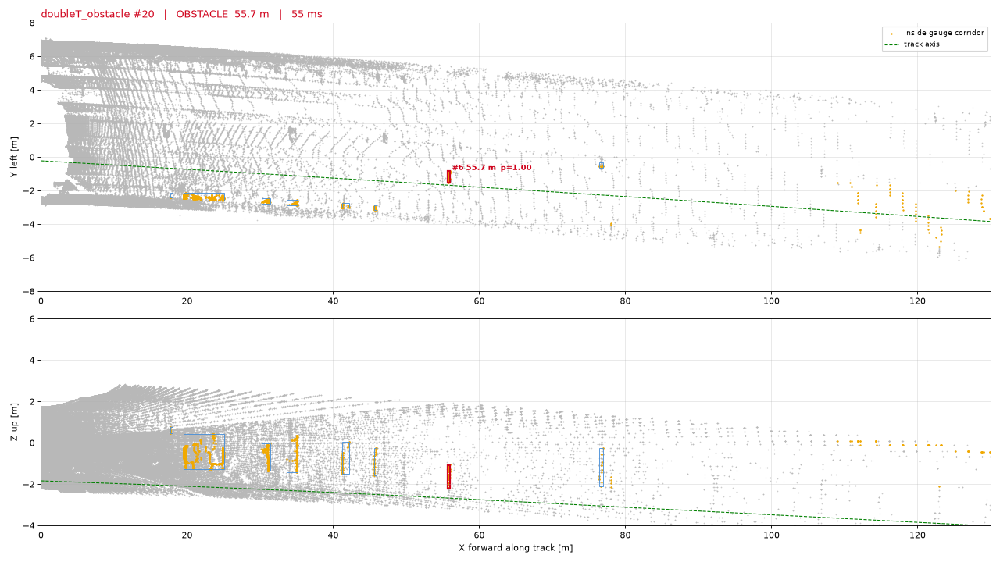
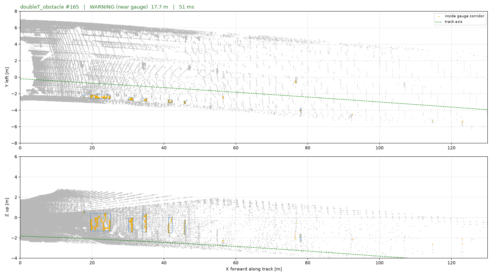

# Experiments log

Numbers are for the **v0 prototype (2026-09-15, day 1)**, pure Python, 4-core sandbox, every
5th/10th frame of the organizer bags cached as `*.npy` (`scripts/cache_frames.py`). Raw results:
[`experiments_v0_real_bags.json`](experiments_v0_real_bags.json),
[`experiments_v0_synthetic.json`](experiments_v0_synthetic.json). Renders: [`img/`](img/).

## 1. Real bags (no ground truth; one known obstacle)

*`doubleT_obstacle` #20: the person crossing the track is reported at 55.7 m (red); the track axis
(green) follows the right-hand drift of the column row / wall; side structures are advisory (blue).*

*Frame 165: the same person now stands at the column row, ~1.8 m left of the axis → warning, not an alarm.*

| bag | frames | frames with **gauge alarm** | frames with advisory warning | mean / p95 ms | comment |
|---|---|---|---|---|---|
| `doubleT_obstacle` | 41 (every 5th) | 12 | 39 | 51 / 60 | **true positive**: person crossing / standing on the track at 55–57 m, reported at 55.6 m in frames 15–70 (while moving inside the gauge); walking person at 2–11 m next to the train is outside the gauge → advisory zone only |
| `roundT_doubleT` | 26 | 1 | 1 | 41 / 52 | 1 FP at 30.7 m (side structure at the tunnel-type transition) |
| `doubleT_platform` | 35 | 14 | 3 | 73 / 108 | FPs during the platform approach/stop: signs and objects at the platform edge overhanging the 1.4 m corridor by 0.1–0.3 m, overhead fixtures |
| `roundT_pressureGate_roundT` | 27 | 3 | 3 | 42 / 53 | FPs at 15–25 m when passing the gate frame (curve + gate, corridor edge) |
| `roundT_squareT_pressureGate_squareT` | 55 | 0 | 17 | 38 / 47 | clean |
| `squareT_platform_squareT_switch` | 88 | 49 | 49 | 76 / 125 | **main open problem**: train standing at a platform + switch ahead; periodic transverse structures at 40–130 m across the track (unidentified: beams / signs / people on the platform beyond the train?) and platform-edge objects trigger persistent alarms |

Evolution during the day (same 272 cached frames):

| version | change | gauge-alarm frames on empty bags (231 frames) | ms/frame |
|---|---|---|---|
| v0.0 | fixed lateral centre, box corridor, raw DBSCAN | 149 | 42–1461 (DBSCAN blow-up on dense near points) |
| v0.1 | rail-based self-calibration, rail-relative gauge, voxelised range-normalised DBSCAN, zones | 92 | 32–75 |
| v0.2 | wall-based yaw/curvature, robust two-stage floor fit | 76 | 38–75 |
| v0.3 | nearer-boundary rule, gauge 1.4 m, hardware/linear/wall filters, corridor validity range, overhead demotion | **67** (49 of them in the platform/switch bag) | 38–76 |
| v0.4 (synthetic, 21.09) | ego-speed estimate + 5-frame ego-motion-compensated accumulation beyond 40 m, verified bed extrapolation (side-structure base) as second height anchor, retro-reflector rule, smear guard | **not measured** — no dataset in the sandbox this was built in; must be re-run on the cached frames before merge (§2b) | 30 mean / 31 p95 on the synthetic frame (base commit: 25 / 27, same machine) |

## 2. Synthetic obstacles injected into real empty frames (`resense inject` / `resense eval`)

26 frames of `roundT_doubleT` (every 10th), one object per frame (person 0.5×1.7 m, box 0.5 m,
plank 2×0.25×0.3 m), uniformly 10–220 m, 20 % placed outside the gauge as negatives. Objects
whose rays are all occluded by real geometry (7 of 26 — mostly because the per-frame height
reference is unreliable beyond ~80 m, see §4) are excluded.

| range bin | recall (v0.3) | n |
|---|---|---|
| 0–50 m | 3/3 | 3 |
| 50–100 m | 1/2 | 2 |
| 100–150 m | 0/5 | 5 |
| 150–200 m | 0/3 | 3 |
| 200–300 m | 0/3 | 3 |

First-detection distances: person 13.7 / 19.5 / 23.2 m (placed there), box 53.7 m; earlier run of
the same harness with objects on the rail head: person 68 / 80 / 110 m, box 56 m. Ray-cast point
budget (single frame): person 24 pts @80 m, 10 pts @110 m, 3–5 pts @150–190 m, 0–1 @>200 m —
consistent with the analytic estimate in DATASET.md. **Conclusion: single-frame geometry reaches
~100 m for a person; 150–300 m needs multi-frame accumulation (Sprint 2).**

Synthetic-tunnel unit tests (`tests/`): box 0.6 m detected at 30 and 80 m, person at 150 m, no
alarm on the clear tunnel, object 2.3 m off-axis not alarmed, occlusion of the background verified.

## 2b. Multi-frame accumulation on synthetic sequences (v0.4, 21.09)

**Every number in this section is synthetic** (`resense.synthetic.synthetic_tunnel_frame`, a
featureless round tunnel with benches at 1.95 m; `tests/test_algorithm.py`), measured on the
4-core sandbox, not on the organizers' bags (not available where this was built) and not on
the i7-9700E. The approach of a train at 22 m/s is emulated by injecting the object at 200,
197.8, 195.6, … m (2.2 m per 10 Hz frame) into the *same* background frame, so the background
does not move — only the object does. The injector's default dropout (120 → 260 m) gives a
person 4–7 returns at 200 m, more than the 3–5 at 150–190 m and 0–1 beyond 200 m measured on
real frames in §2; the sequences therefore use `dropout_start=60, dropout_full=200`, which
reproduces that budget (person: 2–5 returns at 185–200 m, mean 3.0; box 0.5 m: 4–6 at 100–130 m).

**What limited v0.3 at range was not the point count but the corridor validity.** On the
synthetic tunnel the bed fit ends at 107.5 m and the height reference was trusted only 60 m
further (167.5 m), so a person seen with 5–7 points at 200 m was "advisory" until 167 m and
alarmed at 162.6 m. v0.4 verifies the extrapolated bed against the base of the side structures
(ALGORITHM.md §3.1): on the synthetic tunnel the verification reaches 195 m, and the corridor
is trusted to 195 m (walls-based `axis_valid` = 221 m).

| object, sequence (given ego speed 22 m/s) | first confirmed alarm, v0.3 (base commit) | v0.4, accumulation off | v0.4, accumulation on (5 frames) |
|---|---|---|---|
| person 0.4×0.5×1.7 m from 200 m, 6 seeds | 162.6 m (corridor validity) | 167–189 m, median 178 m, frames 5–15 | **189–191 m in 6/6 seeds**, frames 4–5, distance error ≤ 0.15 m |
| box 0.5 m from 140 m, 4 seeds | 114.6 m | 89–116 m (one seed collapses to 89 m) | **113.6–115.8 m in 4/4 seeds** |

Reading: with the real-frame budget the single-frame detector needs three consecutive frames
with ≥ 3 returns and a height spread, which happens late and unpredictably; the 5-frame union
gives 6–12 voxels every frame from ~193 m on, so the alarm is repeatable at the corridor
validity limit. The 0.5 m box does not gain range: beyond ~118 m it is sampled by a single ring
(the ring pattern moves only ≈2 cm per frame on a distant object, so accumulation densifies the
same voxels but cannot widen the sampled extent within 0.5 s) and falls to the `min_height`
0.08 m rule; the gain is repeatability. The Sprint 2 targets (person ≥ 150 m, box ≥ 100 m)
are met on the synthetic tunnel; nothing is claimed for real bags yet.

**Ego-speed estimator (no odometry).** Cue: 1-D along-track texture profile of the walls
above the walkway, background-subtracted, cross-correlated between frames (ALGORITHM.md §3.4).

| scene | estimator output | consequence |
|---|---|---|
| textured tunnel (posts on both walls every 3–9 m), whole scene moving 2.2 m/frame, person from 200 m, no speed given | 22.0 m/s, confidence 0.6–0.9, from the 4th frame (3-frame warm-up); one frame in 12 dropped to "unknown" before the background subtraction was added, none after | person confirmed at 184.6 m with 5 frames merged |
| same posts, train stopped | "unknown" (confidence ≤ 0.26) | no accumulation, single-frame behaviour |
| featureless synthetic tunnel, fresh noise per frame, stopped | "unknown" | no accumulation, no alarm |
| featureless tunnel, emulated approach (background identical, only the object moves) | "unknown" | single-frame fallback: person confirmed at 189 m (seed 0), no smearing |

**Real data (21.09, independent review, every frame of the six cached bags, no speed given).**
The synthetic table above does not transfer to a stopped train: on the stationary
`doubleT_obstacle` the *tracks* cue (≥ 3 persistent static tracks with ≈ 0 velocity) reports
0.0 m/s with confidence 0.6 on 198 of 201 frames, the source is `"estimated"` and 5 frames are
merged at v = 0. The person walking across the track is then smeared *laterally* (width 1.06 m
vs 0.57 m single-frame, 97 vs 29 voxels) and stays "in gauge" four frames longer; the reported
distance is unchanged (55.4–56.5 m, first alarm frame 9 as in v0.3). The along-track smear
guard does not catch this; a lateral guard and a minimum |v| for the tracks cue are the next
fix. On the moving bags the estimator is plausible: 15.0 → 19.4 m/s through `roundT_doubleT`
(cross-checked against the approach rate of three persistent static tracks: 15.7 / 18.2 /
19.1 m/s measured vs 15.7 / 18.2 / 19.1 estimated), 14.6–15.4 m/s through the pressure gate,
0–15 m/s decelerating into the platform; it reports "none" on 42 % of the frames of
`roundT_doubleT` and 82 % of the platform-and-switch bag, so accumulation is intermittent on
real data (the buffer is cleared on every "none" frame). Full-rate false alarms with v0.4
defaults vs v0.3 on the five obstacle-free bags: 1016 vs 1001 alarm frames (+1.5 %), 187 vs
192 events, 619 vs 566 alarm frames beyond 60 m (+9 %; `roundT_squareT_pressureGate_squareT`
87 → 104, mostly from accumulation, and phantoms at 135–142 m from the verified corridor).
Per-frame time on the 4-core sandbox: `roundT_doubleT` 60 / 78 / 93 ms (mean / p95 / max) →
77 / 119 / 139 ms, `doubleT_obstacle` 71 / 78 / 90 → 94 / 102 / 153 ms: +17–23 ms mean, of
which the estimator 7–11 ms (now skipped when a speed is given), the bed verification 5–7 ms
and the clustering of the merged cloud +8 ms. With `accumulation.enabled: false`,
`estimate_speed: false`, `floor_verify_enabled: false` and `retro_intensity: 0` v0.4
reproduces v0.3 bit for bit on real data. The retro rule never fired on the six bags.

The featureless case is the honest one: a moving and a stopped train produce the same data
there, so the estimator must say "unknown" rather than a confident 0 m/s. The first version
of the count profile did return 0 m/s with confidence 0.9 on the featureless tunnel — the
ring/column grid leaves a pattern on the curved lining that is fixed in the sensor frame —
and the unshifted 5-frame union then stretched the approaching person to 8.8 m, beyond
`max_extent`, and lost it for the rest of the sequence. Two guards were added: the temporal
background of the profile (what does not move is discarded) and the smear guard in the
clusterer (a merged cluster longer than 2 m along X is re-described from its current-frame
points). With the guard, a *given* speed that is 8 m/s wrong (30 instead of 22) still confirms
the person at 93–85 m with a distance bias of at most 1.7 m towards the vehicle.

Whether the estimator finds ~22 m/s on the real bags is **not measured** — the sandbox had no
dataset. The status JSON carries `ego_speed_estimate` / `ego_speed_confidence` on every frame
even when a speed is given, so `resense run --out` on the moving bags is all that is needed
(P1/P4: compare with the frame-to-frame drift of the wall texture by eye, or with the speed
the organizers may provide).

**Retro-reflector rule** (ALGORITHM.md §3.3), single objects, 4 identical frames, synthetic:
sign plate 0.05×0.6×0.8 m with reflectivity 220 at the corridor edge (40 m) → advisory; the
same plate with reflectivity 60 → obstacle; person at 60 m with reflectivity 15 / 60 / 200 →
obstacle; 1 m crate with reflectivity 220 → obstacle (wider than a sign); 0.5 m box with
reflectivity 220 → advisory (a fully retro-reflective small cube is treated as a marker — a
documented choice); the plank 2×0.25×0.3 m of the spec on the sleepers is invisible whatever
its reflectivity (below the 35 cm hardware rule, §4 item 5), retro or not.

**Timing on this machine (4-core sandbox, synthetic frame of 127 k points; the i7-9700E is
faster):** base commit 25.4 ms mean / 27.3 ms p95; v0.4 with accumulation on 30.1 / 31.1 ms
(ego-speed profile 3.0 ms, bed verification ≈1.5 ms inside `track`, accumulate 0.1 ms,
cluster 1.9 ms). Stress frame with 32 objects in the corridor (730 corridor points, 5-frame
union): 33.9 / 35.8 ms off → 34.4 / 36.4 ms on. On real frames the profile costs scale with
the number of points at 4–25 m (denser than the synthetic tunnel); the union is bounded by
`accumulation.max_points_per_frame` = 20 000 far candidates per frame.

## 3. Timing (4-core sandbox, Python)

| stage | mean ms | notes |
|---|---|---|
| track model (bed + rails + walls) | 19–32 | numpy percentile binning; 32 ms on the 340k-point stationary bag |
| corridor mask | 9–14 | polygon test on ~190k points |
| voxel + DBSCAN + filters | 6–46 | 40+ ms only in platform scenes (tens of thousands of candidates) |
| tracking | <1 | |
| **total** | **38–76 mean, 47–125 p95** | frame period 100 ms; ROS 2 node adds decode (~5 ms) and publishing |

## 4. What we learned / hard cases

1. **Sensor mounts differ between bags** (bed 1.5 m vs 2.0 m below the sensor, axis 0.05–0.25 m
   right of the sensor axis) → any fixed calibration fails; the rail-ridge self-calibration is
   stable to ±0.05 m frame to frame.
2. **Curves**: a straight corridor hits the wall / column row at 50–130 m in three of six bags.
   The wall-boundary quadratic works on the pressure-gate curve (R ≈ 1.5–2.6 km, confirmed by the
   track-bed trough drift) but is ambiguous at tunnel-type transitions (walls diverge) and at
   stations. Next: fuse the bed-trough centre (usable to ~60–100 m), require agreement, and
   demote beyond disagreement.
3. **Height reference beyond ~80 m**: the bed is sparse/hidden (platforms, switches), the linear
   extrapolation drifts by up to 1–2 m at 120 m → phantom "overhead" obstacles and occluded
   synthetic objects. v0.4: the extrapolation is *verified* against the base of the side
   structures (walls, benches, ducts, seen to the end of the range) and the corridor is trusted
   as far as the two agree within 0.5 m (`track.floor_verify_*`); it never shrinks the v0.3
   range, but a longer trusted corridor turns advisory clusters there into alarms (measured at
   full rate on 21.09: +7 alarm frames on `roundT_squareT_pressureGate_squareT`, a phantom at
   135–142 m, and +1 on `roundT_doubleT` at 117 m), and it does not yet *correct* the bed
   (§5). Synthetic: 167.5 → 195 m; a hand-made 1500 m vertical curve starting at 120 m stops
   the verification at 180 m (1.2 m error there).
4. **Platform stop + switch bag** is where 49 of 67 residual FPs live. The advisory zone is
   inherently noisy near infrastructure (0.35 m outside the gauge).
5. **Small objects**: anything below rail head + 12 cm inside the rails and low/narrow hardware
   (< 0.35 m top, < 0.4 m wide) is filtered — a 20 cm object on the sleepers is currently
   invisible by design; revisit with the extended dataset.
6. **Point budget** is the physical limit: 0.5 m object = 7 pts @100 m, 1.6 pts @200 m.

## 5. Next experiments (owner in PLAN.md)

- **v0.4 on the cached real frames** (P3, first thing with the dataset): re-run §1 at every
  frame (not subsampled, CAPTAIN.md finding 4) with `resense run --out`; the three regression
  numbers of EVALUATION.md §3.6 plus `ego_speed_estimate` per frame on the moving bags; the
  verification range `track.floor_verified` per bag (does it extend the corridor in the
  straight bags and stop at the platform?); `n_accumulated` when the node passes a speed;
- ego-speed estimator on real texture: if the profile cue is silent on a bag, try the
  protrusion profile (minimum |dy| per bin instead of counts) and the bed profile with the ring
  stripes removed; if it is confidently wrong, the smear guard keeps detections but the
  accumulation gain is lost — then the organizers' speed / odometry is the way;
- bed-trough centre vs wall axis (design, §4 item 2): the bed trough (20th-percentile Z
  minimum across dy per 5 m bin, usable to ~60–100 m) gives a second lateral axis
  `y_trough(X)`; where |y_trough − y_walls| > 0.4 m for two consecutive bins, `axis_valid` is
  shrunk to that X (clusters beyond become advisory). Not implemented in v0.4 — no station /
  transition frame exists in the synthetic tunnel to test the disagreement on;
- second height anchor as a *correction*, not only a verification (§4 item 3): fit the
  side-base line beyond the bed range and use `z_base(X) − offset_ref` as `z_floor(X)` where
  the side base is continuous; needs the real platform / transition frames to see how the
  offset jumps;
- extended dataset with real obstacles → calibrate dropout/intensity in `inject` (the
  sequence tests use `dropout_start=60, dropout_full=200` to match §2), real recall/FP;
- FP taxonomy per scene type with the label tool (web/), report FP/km;
- GOST 23961-80 gauge polygon from the drawings (ALGORITHM.md §3.2); platform notch; overhead policy;
- timing on the i7-9700E bench; Numba for the binning stages if needed.
