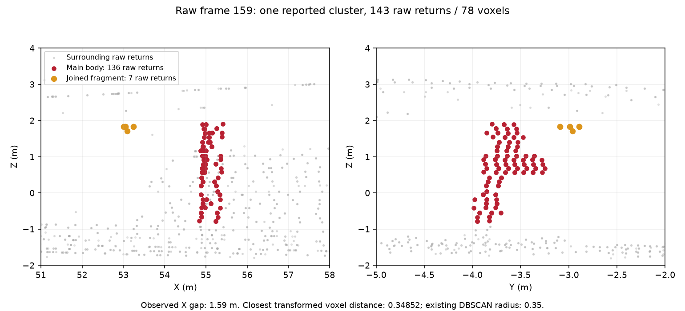

# Standalone clear trial: failed, baseline mechanism reproduced

The combined image produced one genuine core STOP at **53.0 m**, raw message 159,
header `946692947.533395`. Input freshness was valid, health was otherwise OK, and the
STOP was not held from an older result. The registered zero-alarm trial remains **FAIL**.

## Exact attribution

The same source frame and reported geometry occur in the earlier frozen stock-console
capture. The earlier successful standalone clear capture processes this frame as advisory.
Both frozen source `fa18832` and M2 `482caab` reproduce every captured detection, warning,
candidate count and corridor count exactly when given the actual processed header sequence:

| Captured sequence | Processed frames | Frozen STOPs | M2 STOPs | Replay mismatches |
|---|---:|---:|---:|---:|
| New failed standalone clear | 233 | 1 | 1 | 0 |
| Earlier stock-console clear | 243 | 1 | 1 | 0 |
| Earlier successful standalone clear | 234 | 0 | 0 | 0 |

Every compared detector field, including fitted geometry, is identical between frozen and
M2 replays of each sequence. This is a baseline detector susceptibility, not a new M2 or
freshness output effect. [Detailed comparison and recommendation](summary.json).

## Two observed mechanisms

1. **Losing a boundary increases trust.** At raw frame 152, the failed/stock sequences fit
   one boundary and trust the axis to 120 m. The successful sequence fits two disagreeing
   boundaries and trusts only 60 m. The 65.19 m structure therefore gains an extra gauge
   vote in the failed sequence. At frame 159 the tracker has six of ten gauge votes versus
   five of ten, crossing the existing 0.6 voting rule. Current strict support is strong in
   both cases: 77 versus 76 voxels. Near escalation is inactive.
2. **A small joined fragment defeats the column shape rule.** The reported 78 “points”
   are voxels backed by 143 raw returns. Seven returns/four voxels in a small upper fragment
   join 136 returns/74 voxels in a 0.57 × 0.74 × 2.69 m body. The largest observed X gap is
   1.59 m, but the nearest transformed voxel distance is 0.34852, inside the existing
   DBSCAN radius 0.35. The merged width becomes 1.10 m, exceeding the column rule's 1.0 m
   width bound. The next frame has width 0.69 m and is classified as a column.

The displayed gap partition describes the observed points; it is not a tested suppression
rule. Fitted envelope coordinates are not independent surveyed truth.

## Receipts

- [Executed observer](replay_subsets.py); full raw-message header/receive stamps and CDR
  hashes are inside each report.
- [M2 exact report](M2_exact/report.json.gz), [frozen exact report](frozen_exact/report.json.gz).
  Their folders retain all replay outputs and nine source-point neighborhood snapshots each.
- Captured source streams are retained under `captures/`; [failed node log](failed_clear_node.txt.gz).
- [M2 run log](M2_exact.txt), [frozen run log](frozen_exact.txt), [artifact hashes](manifest.json).

The first diagnostic attempt incorrectly excluded `node.frames == 0`. Its script, output,
trace and log remain under `initial_incomplete/`, `replay_subsets_without_frame_zero.py`
and `M2.txt`. It was not used for attribution. The corrected reader includes the initial
zero-based frame and exactly reproduces all three captures.

No detector fix is validated by this diagnosis. A separate preregistered experiment can
test whether losing a previously contradictory boundary should retain the conservative
range cap until two valid boundaries agree or the scene resets. Any change must preserve
the positive detections, including tall/edge objects and objects touching infrastructure.
The failed trial cannot be replaced by a favorable replay schedule.
