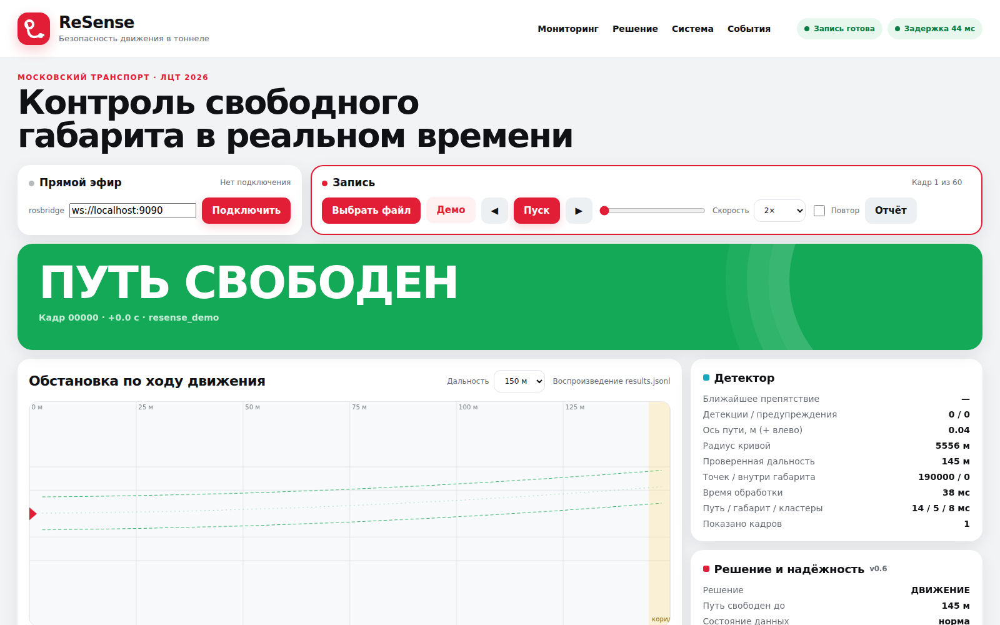
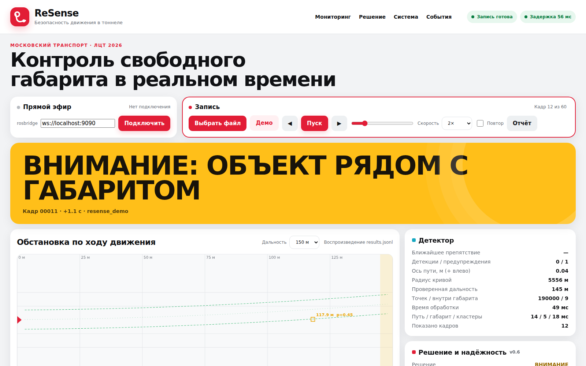

# ReSense UI screenshots

These screenshots show the current Russian-language browser dashboard in its three decision
states. Its light modular layout, red primary actions and large status typography follow the
visual direction of the Moscow Transport portal while all marks and graphics remain ReSense's.
They were captured from [`web/index.html`](../../web/index.html) at 1600 × 1000 using the built-in 60-frame
jury demo, so they are reproducible without ROS, a bag, or the organizers' dataset.

The values are synthetic UI demonstration data, not evaluation evidence. Real-data renders remain
in [`docs/img/`](../img/), and real-data videos remain in [`docs/video/`](../video/).

## ДВИЖЕНИЕ — путь свободен

## ВНИМАНИЕ — объект рядом с габаритом

## СТОП — препятствие внутри габарита

