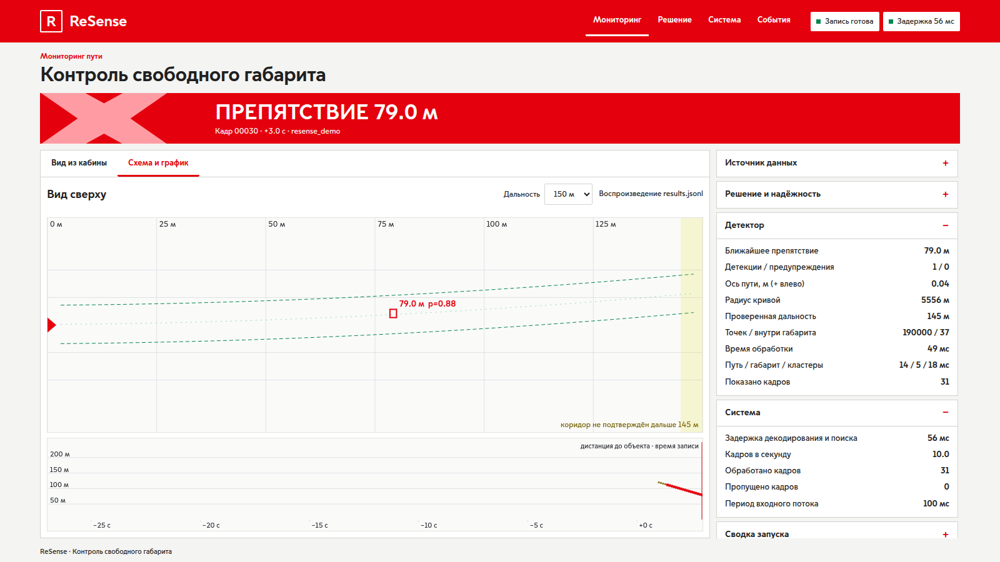
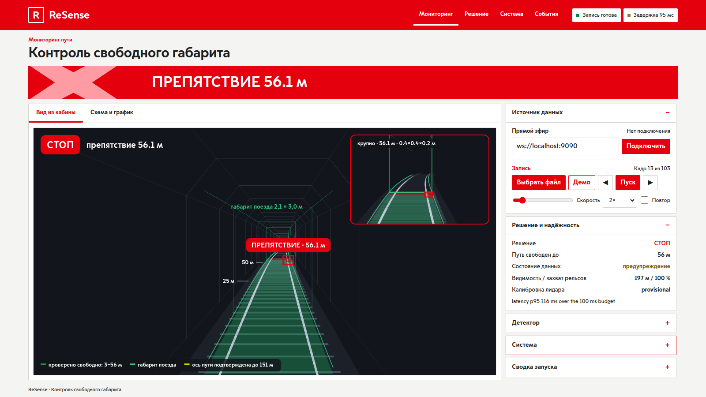

# UI Screenshots

> **Purpose:** gallery of the browser dashboard's captures and where their data comes from.
> **Audience:** jury, team · **Owner:** P2 · **Language:** EN
> **Last verified:** 2026-09-24, `ecc0f9a` · **Status:** current

These screenshots show the current Russian-language browser dashboard in its three decision states.
Its Moscow Sans typography and primary red come from the supplied Metro style archive. The 16:9
layout keeps the status and cab view on one screen; additional metrics open in the right-side list.
The red header hides on downward page scroll. The **cab
view** (Вид из кабины) under the banner is the driver's-eye picture of
[`scripts/hero_view.py`](../../scripts/hero_view.py) drawn from the status JSON alone: rails and the
2.1 × 3.0 m train envelope along the fitted track axis and bed profile, the verified-clear stretch
in green, confirmed objects as boxes with their distance and a close-up of the nearest one. The
tunnel outline is a schematic depth cue; no point cloud reaches the browser.

The three decision captures and the scheme view were taken from [`web/index.html`](../../web/index.html)
at 1600×900 using the built-in 60-frame jury demo, so they are reproducible without ROS, a bag,
or the organizers' dataset. Run `python web/demo/capture_gallery.py` from the repository root with
Playwright and Chromium installed to refresh all five images; use `--chromium` to select a browser.
The demo values are synthetic UI demonstration data, not evaluation evidence.
Real-data renders remain in [`docs/img/`](../img/), and real-data videos remain in
[`docs/video/`](../video/).

## ДВИЖЕНИЕ — путь свободен

## ВНИМАНИЕ — объект рядом с габаритом

## СТОП — препятствие внутри габарита

## Схема и показатели

## Cab view on real data

The cab view replaying the detector node's own `/resense/status` stream from the Docker dry run on
the organizers' `doubleT_obstacle` bag
([`docs/evidence/docker_2026-09-23/obstacle_status.jsonl.gz`](../evidence/docker_2026-09-23/obstacle_status.jsonl.gz),
first alarm frame); the curve, the bed profile and the object position are the node's values.
