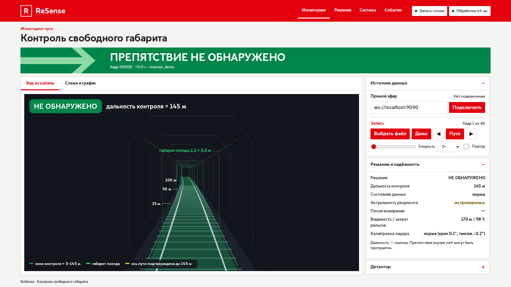
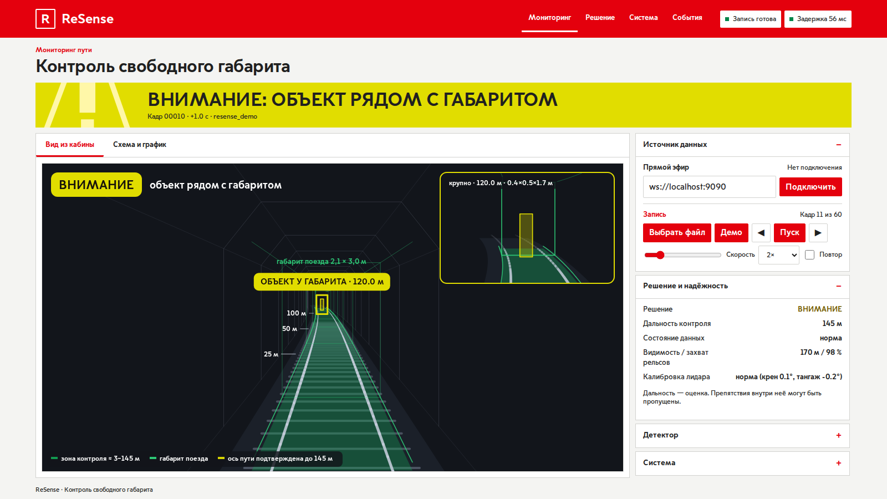
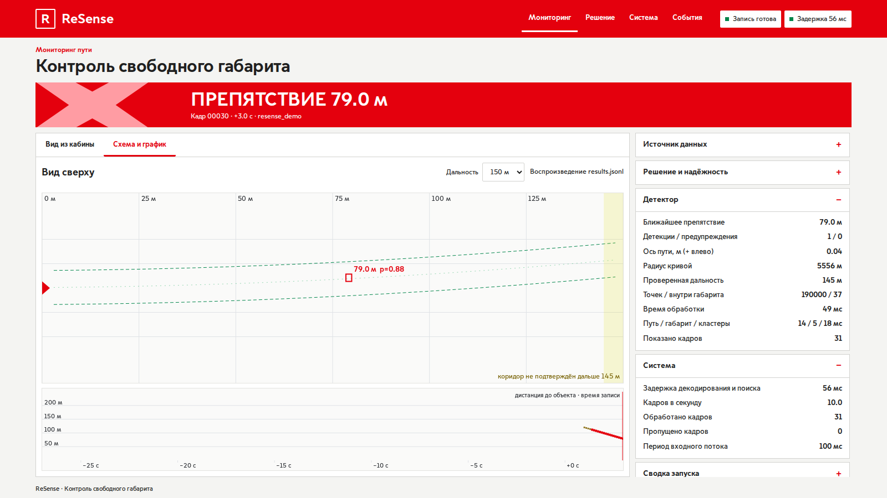
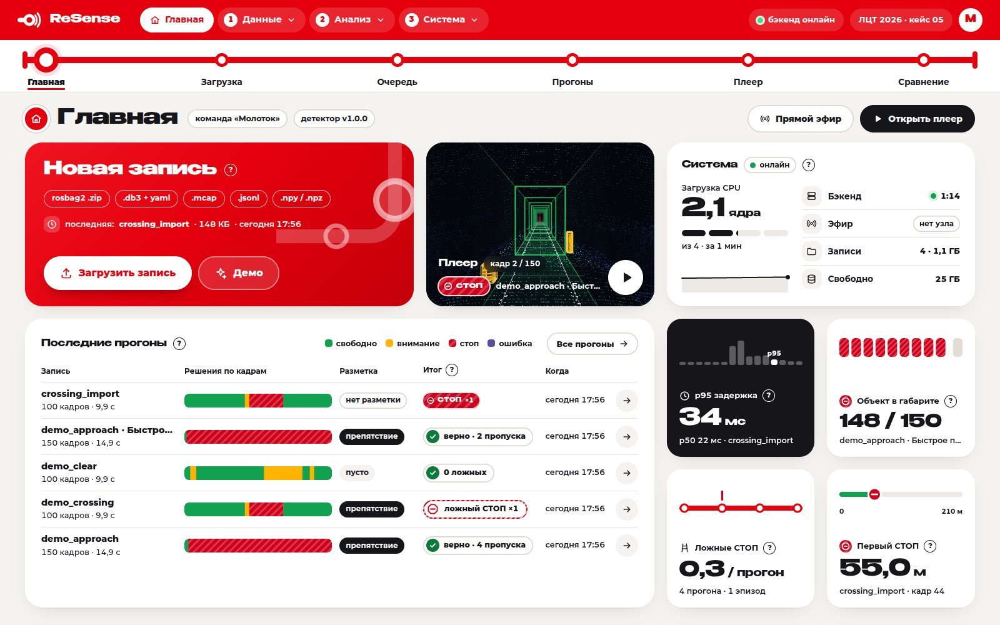
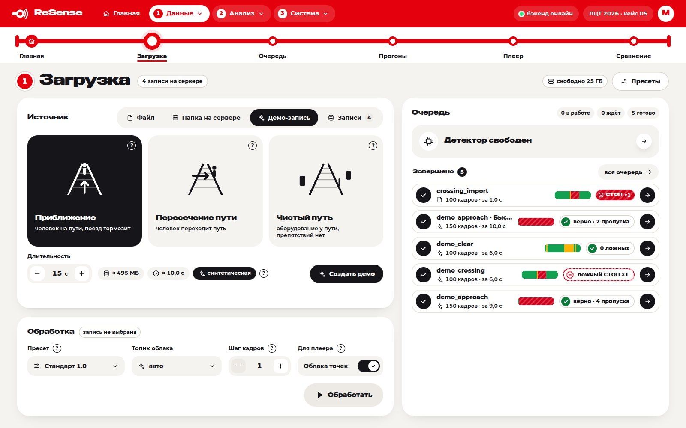
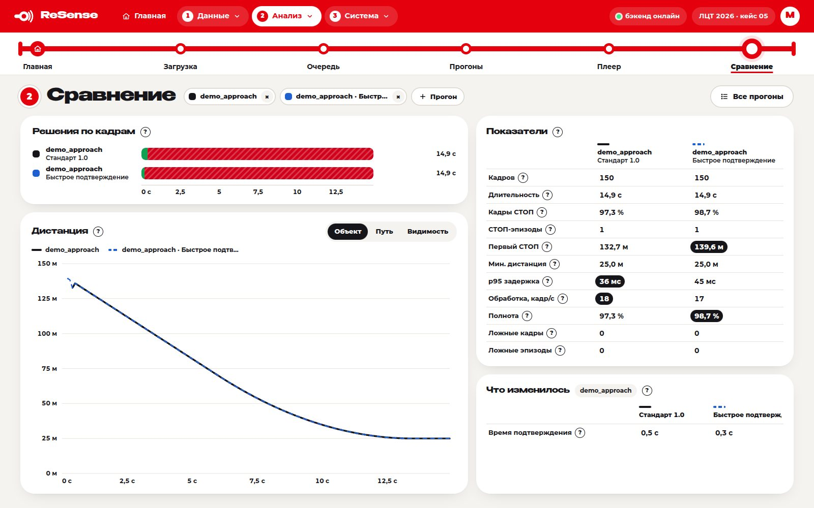
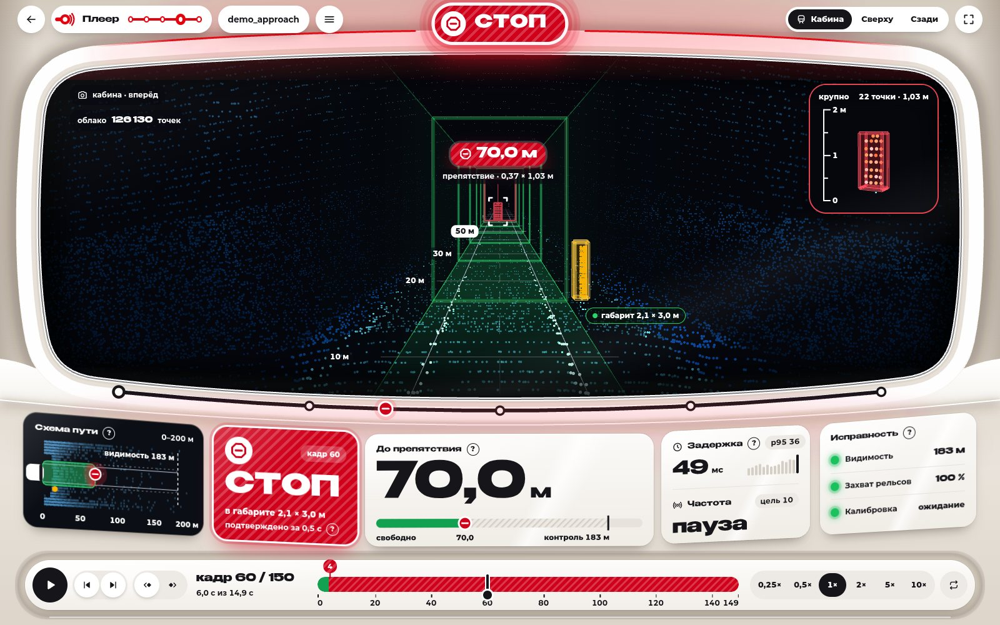

# UI Screenshots

> **Purpose:** gallery of the browser dashboard's and the web prototype's captures and where their data
> comes from.
> **Audience:** jury, team · **Owner:** P2 · **Language:** EN
> **Last verified:** 2026-09-28, screenshots refreshed against the P2 rendering update; archived
> real-node captures retain their original provenance; 2026-09-29: the five `webapp-*.jpg` web-prototype
> captures added (commit `bba5c8b`) · **Status:** current

These screenshots show the current Russian-language browser dashboard in its three decision states.
Its Moscow Sans typography and primary red come from the supplied Metro style archive. The 16:9
layout keeps the status and cab view on one screen; additional metrics open in the right-side list.
The red header hides on downward page scroll. The **cab
view** (Вид из кабины) under the banner is the driver's-eye picture of
[`scripts/hero_view.py`](../../scripts/hero_view.py) drawn from the status JSON alone: rails and the
2.1 × 3.0 m train envelope along the fitted track axis and bed profile, the estimated monitored range
in green, confirmed objects as boxes with their distance and a close-up of the nearest one. The
tunnel outline is a schematic depth cue; no point cloud reaches the browser.

The three decision captures and the scheme view were taken from [`web/index.html`](../../web/index.html)
at 1600×900 using the built-in 60-frame jury demo, so they are reproducible without ROS, a bag,
or the organizers' dataset. Run `python web/demo/capture_gallery.py` from the repository root with
Playwright and Chromium installed to refresh all five images; use `--chromium` to select a browser.
The demo values are synthetic UI demonstration data, not evaluation evidence.
Real-data renders remain in [`docs/img/`](../img), and real-data videos remain in
[`docs/video/`](../video).

## GO — препятствие не обнаружено

## ВНИМАНИЕ — объект рядом с габаритом

## СТОП — препятствие внутри габарита

## Схема и показатели

## Cab view on real data

The cab view replaying the detector node's own `/resense/status` stream from the Docker dry run on
the organizers' `doubleT_obstacle` bag
([`docs/evidence/docker_2026-09-23/obstacle_status.jsonl.gz`](../evidence/docker_2026-09-23/obstacle_status.jsonl.gz),
first alarm frame); the curve, the bed profile and the object position are the node's values.

## Web prototype (`webapp/`, PR #31)

Five 1600×1000 captures of the web prototype's production build
([`webapp/README.md`](../../webapp/README.md)), taken on 29.09. The runs
are synthetic demo recordings made by the prototype's «Демо-запись» and processed by the same sealed
detector (`crossing_import` on the overview is an uploaded file). Demo values are synthetic and
optimistic (the approach demo's first STOP at ≈ 130 m is not a measured range): UI demonstration data,
not evaluation evidence. The same files are in `gitbook/.gitbook/assets/` for the GitBook. The
prototype is outside the runtime image and the `v1.0.0` release.

**Главная** (`/`): a new recording or a demo in one click, the latest runs, the stand and key results.

**Загрузка** (`/upload`): the «Демо-запись» source with its three scenarios (Приближение, Пересечение
пути, Чистый путь), the preset, topic, frame step and point clouds for the player, and the queue.

**Прогон** (`/runs/:id`, `demo_approach`): KPIs, decisions per frame against the labels, the distance
chart, events, the score against labels, a 3D preview and the downloads.

**Сравнение** (`/compare`): `demo_approach` with «Стандарт 1.0» and with a user preset
«Быстрое подтверждение» (confirmation 0.5 → 0.3 s): aligned strips, distances, the best value per row
and «Что изменилось».

**Плеер** (`/player/:id`): the fullscreen cab view: the frame's point cloud, the 2.1 × 3.0 m envelope
along the fitted track, the obstacle with its distance and a close-up, tiles for the track scheme,
the decision, the distance, latency and health, and the scrubber coloured by decision.
