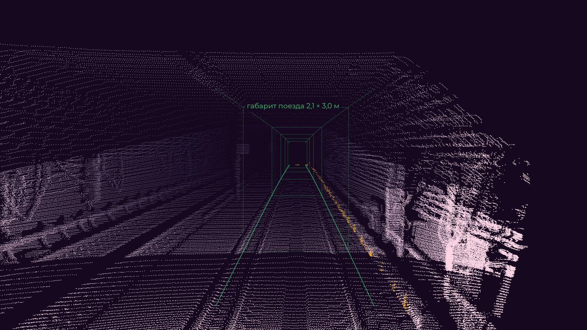
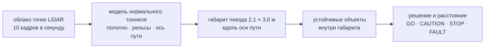

# ReSense

ReSense десять раз в секунду просматривает путь впереди и сообщает беспилотному поезду метро, есть
ли что-то в его габарите и на каком расстоянии. Проект создан для ЛЦТ 2026, кейс 05, «Обнаружение
посторонних объектов в тоннеле метро по данным 3D-лидара» (Московский транспорт / Московский
метрополитен).

По каждому облаку точек LiDAR он строит модель нормального тоннеля (полотно, головки рельсов, ось
пути и её кривизну по стенам), вырезает вдоль этой оси габарит поезда 2,1 × 3,0 м, заданный
организаторами, и сообщает о каждом устойчивом объекте в нём: расстояние вдоль пути, боковое
смещение, размер и уверенность. Классы объектов и обучающая разметка не нужны: решает геометрия, а
небольшая обученная модель лишь задерживает сомнительный дальний `STOP` на ограниченное время.

Эта книга — **практическое руководство**: как получить образ, запустить его на бэге ROS 2, прочитать
ответ, посмотреть результат в RViz, Foxglove или веб-дашборде и работать с кодом. Обоснование
решений, измерения и записи команды остаются в документах репозитория, на которые она ссылается.





## Что на выходе

| результат | где |
|---|---|
| `GO` / `CAUTION` / `STOP` / `FAULT` | топик ROS 2 `/resense/decision` |
| расстояние до препятствия вдоль пути, м (−1 — нет) | `/resense/nearest_distance` |
| оценка дальности контроля, м | `/resense/clear_distance` |
| всё по каждому кадру в JSON (объекты, модель пути, исправность, крепление датчика, время обработки, свежесть) | `/resense/status` |
| рамки объектов, контур коридора, точки коридора | `/resense/detections`, `/resense/markers`, `/resense/corridor_points` |

## Самый короткий путь

```bash
docker load -i resense-image-<version>.tar.gz     # или: docker build -t resense -f docker/Dockerfile .
scripts/play_bag.sh <bag directory>               # нода + плеер + вывод, печатает "12.3 s  STOP  55.6 m"
```

Пошагово: [Запуск на бэге](getting-started/run-on-a-bag.md). Краткая версия для жюри:
[Кратко для жюри](getting-started/jury-quickstart-ru.md).

## Где что лежит

* Исходный код и все документы: [github.com/pmixay/ReSense](https://github.com/pmixay/ReSense)
* Веб-дашборд: `web/index.html` в репозитории, открывается локально в браузере (что он умеет и
  чего не умеет — см. [Веб-дашборд](visualisation/web-dashboard.md))
* Результаты, эксперименты и их даты:
  [`docs/EXPERIMENTS.md`](https://github.com/pmixay/ReSense/blob/main/docs/EXPERIMENTS.md) и
  [сводка в README](https://github.com/pmixay/ReSense/blob/main/README.md#current-results)

> **Примечание.** Числа (дальности, ложные тревоги, время обработки) в этой книге намеренно не
> повторяются. Они собраны в одном месте — в `docs/EXPERIMENTS.md` и сводке в README — вместе с
> датой и данными, на которых измерено каждое.
