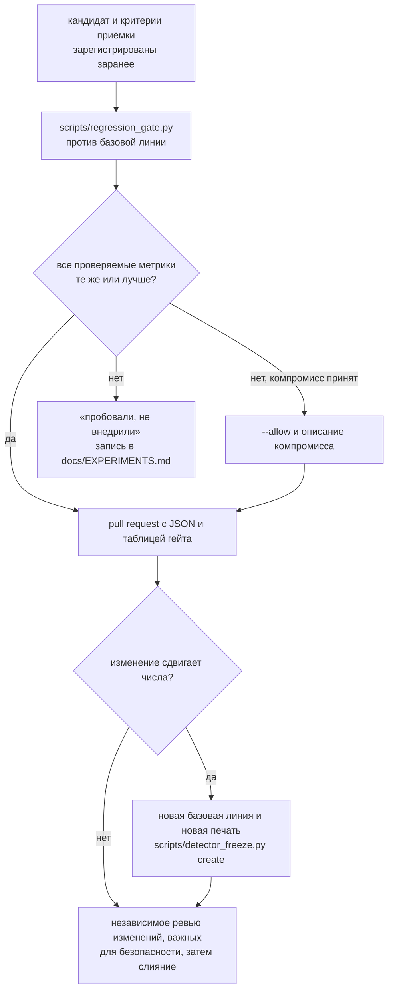

# Изменение детектора

Детектор опечатан: `docs/evidence/detector_freeze_2026-09-27.json` перечисляет по SHA256 каждый
файл, от которого зависит его выход (`resense/`, `native/`, `configs/`, копия параметров ROS,
обученная модель), и задание CI `checks` падает, если какой-то из них изменился без новой печати.
Поэтому для изменения детектора нужны доказательства (evidence), что оно ничего не ухудшает.
Печать 27.09 до сдачи не снимается; ниже — порядок для следующих изменений.

## Регрессионный гейт

Одна команда заново прогоняет строки по реальным данным (шесть записей), синтетические объекты
организаторов (набор O), 20-минутную поездку и синтетический набор на большую дальность и сравнивает
каждую проверяемую метрику с базовой линией (baseline) из репозитория:

```bash
python scripts/regression_gate.py --cache /data/cache \
    --baseline docs/evidence/results/regression_baseline_2026-09-27_quality.json
```

Код выхода 0 — каждая проверяемая метрика та же или лучше. Кадры нужно один раз закешировать
([Офлайн-анализ без ROS](../guides/offline-analysis.md#the-real-data-report-card)); поездке и набору F
нужен `/data/cache/new_data` (скачивается по частям, как в
[`docs/VM_GUIDE.md` §2.3](https://github.com/pmixay/ReSense/blob/main/docs/VM_GUIDE.md#23-the-20-minute-ride-split-by-split)).
Без него их строки проваливаются с вердиктом «missing in this run»; укажите их через
`--allow 'ride.*' --allow 'set_F_straight.*'` и напишите об этом в pull request.

## Порядок действий



1. Зарегистрируйте кандидата и критерии его приёмки заранее, до запуска.
2. Запустите гейт; приложите его JSON и таблицу к pull request. Ухудшение метрики либо принимается
   явно через `--allow` с описанием компромисса, либо изменение получает статус «пробовали, не
   внедрили» (tried, not shipped) и записывается в `docs/EXPERIMENTS.md`.
3. Изменение, которое должно сдвинуть числа, коммитит новую базовую линию и новую печать
   (`python scripts/detector_freeze.py create --evidence <full gate JSON> --manifest <new seal>`),
   а документы, где приводятся числа (`docs/EXPERIMENTS.md`, README, страница
   [Результаты и ограничения](../reference/results.md)), обновляются.
4. Изменения, влияющие на безопасность, до слияния проходят независимое ревью.

Датированная история принятых и отклонённых кандидатов до печати 27.09 — полный журнал
[`docs/archive/EXPERIMENTS_log_2026-09.md`](https://github.com/pmixay/ReSense/blob/main/docs/archive/EXPERIMENTS_log_2026-09.md);
печать и её проверка —
[`docs/DETECTOR_FREEZE.md`](https://github.com/pmixay/ReSense/blob/main/docs/DETECTOR_FREEZE.md);
краткий обзор — [Подход команды](../reference/approach.md).
