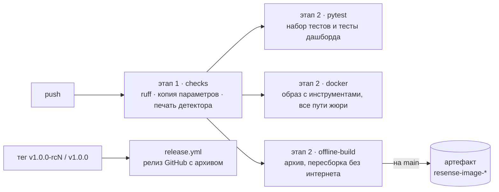

# Установка, тесты и CI

## Локальная установка

```bash
git clone https://github.com/pmixay/ReSense && cd ReSense
pip install -e ".[dev]"          # Python ≥ 3.10; при наличии компилятора собирает ядра C++
pytest -q                        # набор тестов (770); «skipped» — значит, нет open3d
pipx run ruff==0.15.8 check .    # линтер, версия закреплена как в CI
./scripts/sync_params.sh --check # копия параметров ROS совпадает с configs/default.yaml
python scripts/detector_freeze.py verify   # опечатанные файлы детектора не изменились
```

С `RESENSE_REQUIRE_SYNTHETIC=1 pytest -q` отсутствие open3d — ошибка, а не пропуск теста, как в
CI.

Для тестов дашборда нужны Playwright и сборка Chromium:

```bash
pip install playwright
python -m pytest -q web/demo
```

## В Docker

```bash
WITH_TOOLS=1 ./scripts/build.sh
docker run --rm -w / -e RESENSE_REQUIRE_SYNTHETIC=1 resense python3 -m pytest -q /opt/resense/tests
docker run --rm resense bash -lc "python3 scripts/make_smoke_bag.py /tmp/b && scripts/smoke_test.sh /tmp/b"
```

## CI

[`.github/workflows/ci.yml`](https://github.com/pmixay/ReSense/blob/main/.github/workflows/ci.yml)
запускается при каждом пуше, в два этапа:

| этап | задание | что проверяет |
|---|---|---|
| 1 | `checks` | ruff, синхронность копии параметров, печать детектора |
| 2 | `pytest` | набор тестов и тесты дашборда в Chromium без интерфейса (headless); пропуск любого теста — ошибка |
| 2 | `docker` | образ с инструментами: набор тестов внутри него, связь с нодой всеми способами, доступными жюри (другой контейнер, плеер с uid 1000, штатный Fast DDS, `scripts/play_bag.sh`, режим общей памяти, удалённый просмотр в Foxglove); на `main` ещё два исходных бэга с холодного диска и побайтовая сверка быстрого пути приёма данных ноды с преобразованием rclpy |
| 2 | `offline-build` | архив образа для жюри: собран, все образы удалены, архив загружен обратно, пересобран без интернета, оба синтетических бэга проиграны через него во внутренней сети; на `main` архив выгружается как артефакт прогона |

[`release.yml`](https://github.com/pmixay/ReSense/blob/main/.github/workflows/release.yml) публикует
архив образа как релиз GitHub при пуше тега `v1.0.0-rcN` (предварительный) или `v1.0.0`: заново
прогоняет тесты тега, собирает и экспортирует образ, загружает архив обратно и проигрывает через
него синтетические бэги без интернета, затем выкладывает архив, его `.sha256` и `SHA256SUMS`.
Ручной запасной путь с теми же шагами — `scripts/release.sh`.



## Правила репозитория

* `main` меняется только через pull request с зелёным CI; вливает капитан.
* Один источник параметров (`configs/default.yaml`); измерения — в
  [`docs/EXPERIMENTS.md`](https://github.com/pmixay/ReSense/blob/main/docs/EXPERIMENTS.md) и
  [`docs/SCORECARD.md`](https://github.com/pmixay/ReSense/blob/main/docs/SCORECARD.md), в книге — на
  странице [Результаты и ограничения](../reference/results.md); остальные документы ссылаются на них.
* JSON статуса и топики — контракты: ключи и топики добавляются, но никогда не переименовываются и
  не удаляются.
* Кто владелец каких файлов: [`docs/CAPTAIN.md` §8](https://github.com/pmixay/ReSense/blob/main/docs/CAPTAIN.md#8-ownership-map-a-file-not-listed-its-authors-lane-ask-p1).
