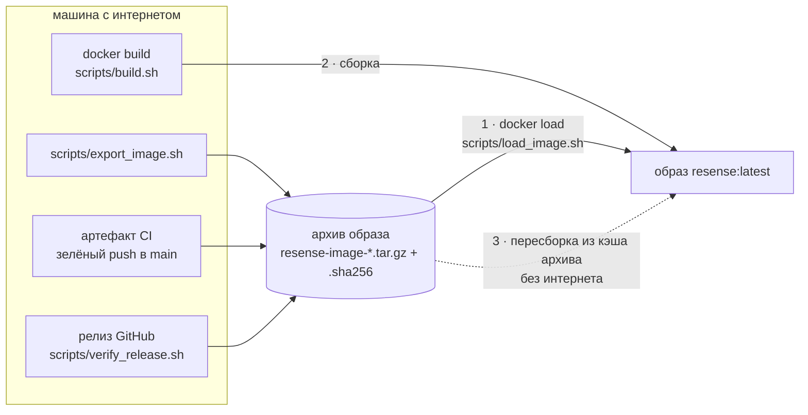

# Где взять образ Docker

Есть три способа — в зависимости от того, есть ли на машине интернет.



## 1. Загрузить готовый архив (интернет не нужен)

На стенде организаторов нет интернета, поэтому образ поставляется одним gzip-архивом, рядом с
которым лежит его контрольная сумма:

```bash
sha256sum -c resense-image-<version>.tar.gz.sha256   # необязательно: проверка
docker load -i resense-image-<version>.tar.gz        # теги resense:<version> и resense:latest
```

`scripts/load_image.sh <archive>` за один шаг проверяет контрольную сумму, загружает образ и
выполняет его первый запуск с `--network none`.

**Откуда взять архив:**

* **Артефакт CI** — его создаёт каждый зелёный пуш в `main`. На GitHub: *Actions* → прогон `ci`
  нужного коммита (задание `offline-build` зелёное) → *Artifacts* →
  `resense-image-<version>-<commit>` (zip с `.tar.gz` и его `.sha256`; хранится 30 дней; для
  скачивания нужен вход в GitHub).
* **Экспортировать самостоятельно** на любой машине с интернетом и Docker:

  ```bash
  scripts/export_image.sh          # собирает из HEAD с --no-cache → dist/resense-image-<version>.tar.gz + .sha256
  ```

  `SKIP_BUILD=1 SOURCE_IMAGE=resense:latest scripts/export_image.sh` вместо сборки сохраняет уже
  имеющийся образ.

* **Релиз GitHub** — после публикации архив и его `.sha256` лежат в *Assets* релиза;
  `scripts/verify_release.sh <tag>` скачивает архив в `dist/` и проверяет его. Вышел ли уже релиз,
  сказано в разделе README для жюри.

## 2. Собрать (нужен интернет)

```bash
docker build -t resense -f docker/Dockerfile .    # или ./scripts/build.sh
```

Сборка скачивает `ros:humble-ros-base-jammy`, ставит пакеты ROS через apt и Python-пакеты точно
зафиксированных версий через pip, а также компилирует необязательные ядра на C++. Полезные варианты:

```bash
PULL=1 ./scripts/build.sh          # сначала обновить базовый ros:humble (старый из кэша ломает apt-get update)
WITH_TOOLS=1 ./scripts/build.sh    # + rosbags / matplotlib / open3d / pytest: образ, на котором тестирует CI
```

## 3. Пересобрать без интернета из загруженного архива (без гарантий)

После шага 1, в рабочей копии того же коммита, все слои могут взяться из кэша архива:

```bash
chmod -R u+rwX,go+rX,go-w . && docker build --cache-from resense:<version> -t resense -f docker/Dockerfile .
```

Если не получилось, образ из шага 1 остаётся нетронутым и рабочим. Подробнее: [Стенд без
интернета](../guides/offline-stand.md).

## Что внутри

В рабочем образе только то, что нужно ноде: ROS 2 Humble (`ros-base`), rosbag2 с плагинами sqlite3
и MCAP, RViz, `foxglove_bridge`, пакет `resense` с зафиксированными версиями numpy / scipy /
scikit-learn / pyyaml, скомпилированные ядра на C++ и ROS-пакет `resense_ros`. Читалки бэгов без
ROS (`rosbags`), Open3D и набора тестов в нём **нет**; они добавляются с `WITH_TOOLS=1`.

Команда по умолчанию: `ros2 launch resense_ros detector.launch.py freshness_mode:=replay` — нода с
автопоиском топиков, настроенная для записанных бэгов. На поезде с живым LiDAR вместо этого
передайте `freshness_mode:=live` (собственное значение ноды по умолчанию).
