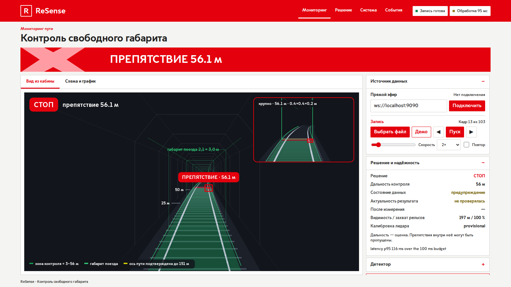

# Как читать результат

## Решение

| `/resense/decision` | значение |
|---|---|
| `STOP` | **тревога**: подтверждённое препятствие в габарите поезда 2,1 × 3,0 м, заданном организаторами |
| `CAUTION` | подсказка, **не тревога**: подтверждённый объект сразу за границей габарита, дальний кластер за пределами дальности, на которой модели пути можно доверять, известная инфраструктура, сниженная исправность или навёрстывание нодой отставания после задержки. В обычном тоннеле встречается часто |
| `GO` | препятствие не обнаружено, и нет предупреждений об исправности, влияющих на решение |
| `FAULT` | входа нет (до первого кадра или более 0,5 с без кадров) либо входу нельзя доверять |

`GO` — результат обнаружения, а **не** разрешение на движение поезда.

Как решение выбирается на каждом кадре, показывает схема в разделе
[Как это работает](../reference/how-it-works.md).

## Что оценивать

| вопрос | топик | тип | значения |
|---|---|---|---|
| есть ли препятствие? | **`/resense/decision`** | `std_msgs/String` | `STOP` = тревога |
| то же в виде булева значения | `/resense/obstacle_detected` | `std_msgs/Bool` | подтверждается за 0,5 с, удерживается при одном пропущенном кадре |
| как далеко оно? | **`/resense/nearest_distance`** | `std_msgs/Float32` | м вдоль пути, −1 — если нет |
| на какую дальность контролируется путь? | `/resense/clear_distance` | `std_msgs/Float32` | оценка дальности контроля, м; 0 при неисправности |
| исправен ли вход? | `/resense/health` | `diagnostic_msgs/DiagnosticArray` | OK / WARN / ERROR / STALE со значениями |
| всё | `/resense/status` | `std_msgs/String` (JSON) | [Топики и JSON статуса](../reference/topics.md) |

`clear_distance` — оценка по линии видимости и доверенной модели пути, ограниченная обнаруженными
препятствиями и подходящими кластерами. Объект, который не образует такого кластера, всё равно
может находиться в пределах этой дальности. Читайте `STOP` и `nearest_distance` вместе с
исправностью и предупреждениями.

## Типичный прогон на записи с препятствием

```text
FAULT     # до прихода первого кадра (плеер ещё загружает бэг)
GO        # первые кадры
CAUTION   # объект приближается к габариту сбоку
STOP      # человек на пути, затем объект на рельсе; nearest_distance ≈ 55–57 м
FAULT     # через 0,5 с после конца бэга: входа нет, путь не контролируется
```

Так выглядит вывод на записи организаторов `doubleT_obstacle`; точные кадры и расстояния зависят
от машины и зафиксированы в `docs/EXPERIMENTS.md`.



## Свежесть: использование результата в программах

Автоматическому потребителю одного `/resense/decision` недостаточно: сохранённая (latched) строка
не несёт своего возраста.

* Читайте `/resense/status` и его объект `freshness`: какие часы использованы, возрасты, `valid`,
  `reason` и `go_allowed` (true только для GO, действительного на момент оценки).
* `evaluated_at_utc_s`, `max_result_age_s` (0,5 с) и `future_tolerance_s` (0,05 с) позволяют
  своим таймером считать результат просроченным; это предполагает синхронизированные часы UTC.
* Когда вход прекращается или обработка завершается ошибкой, все выходы сообщают, что контроль
  недействителен. Предыдущий `STOP` остаётся виден с `stop_held: true`, исходной меткой времени и
  нулевой дальностью контроля, пока его не снимет свежий действительный кадр без STOP. Без
  предыдущего STOP решение — `FAULT`.
* Снимки watchdog и ошибок несут `snapshot_kind: watchdog | processing_error`; обработанные кадры —
  `snapshot_kind: frame`.

Полный контракт — в разделе README
[«Топики, публикуемые нодой»](https://github.com/pmixay/ReSense/blob/main/README.md#topics-published-by-the-node).

## Офлайн, без ROS

`resense run --bag <dir> --out results.jsonl` пишет тот же покадровый JSON, что и `/resense/status`
(по объекту на строку), — см. [Офлайн-анализ без ROS](../guides/offline-analysis.md). Такой файл
или запись `/resense/status` можно воспроизвести в
[веб-дашборде](../visualisation/web-dashboard.md).
