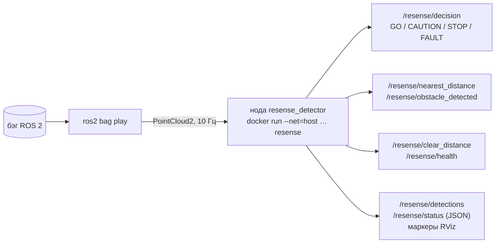

# Запуск на бэге

В режиме ROS ReSense сам никогда не открывает файлы бэгов: нода подписывается на облака точек,
которые публикует `ros2 bag play`, — точно так же, как подписалась бы на драйвер живого LiDAR.



## Одной командой

Нужны только Docker и образ (уже загруженный или переданный архивом):

```bash
scripts/play_bag.sh <bag directory>
scripts/play_bag.sh <bag directory> --archive resense-image-<version>.tar.gz
```

Скрипт по возможности поднимает буфер UDP, загружает архив, запускает ноду и слушателя (ждёт
готовности каждого не дольше `READY_TIMEOUT` с, по умолчанию 60), проигрывает бэг из того же образа
от имени вызвавшего пользователя и печатает каждую смену решения:

```text
== doubleT_obstacle: playing as uid:gid 1000:1000; decision changes (time since start, decision, nearest distance):
    0.0 s  FAULT   -
    5.2 s  CAUTION -
    5.9 s  STOP    55.6 m
   15.8 s  GO      -
   15.9 s  STOP    56.2 m
   ...
== doubleT_obstacle played; node stopped
```

(Время в примере условное.) `FAULT` — до первого кадра; `CAUTION` (иногда вперемешку с коротким
`FAULT`) — пока нода догоняет стартовую пачку плеера (ниже); на этой записи `STOP` идёт без
пропусков до конца (одиночный `GO` на кадре 111 исправлен 29.09, см.
[Результаты и ограничения](../reference/results.md)). Код выхода 2 — неверный аргумент, 3 — нет
Docker, нет образа или нода не запустилась.

## Пошагово (консоль организаторов)

Три консоли на одной машине.

**0. Один раз после загрузки системы** — буфер приёма UDP для облаков 360° (нужен с плеером на
CycloneDDS, в остальных случаях не мешает):

```bash
sudo sysctl -w net.core.rmem_max=33554432
```

**1. Нода** (консоль 1):

```bash
docker run --rm -it --net=host --ipc=host resense
```

* `--net=host` обязателен: образ передаёт DDS только по UDP; в bridge-сети Docker плеер и нода не
  находят друг друга.
* Команда образа по умолчанию передаёт `freshness_mode:=replay`, который нужен для записанных
  бэгов. Сохраните его, если задаёте свою команду (`… detector.launch.py freshness_mode:=replay …`):
  собственный режим ноды по умолчанию, `live`, сравнивает метки времени кадров с системными часами
  и на записи отвечает `FAULT`.
* Нода готова, когда в её логе появилась строка `ReSense detector listening on …` (перед ней —
  `warm-up: … ms`). Запускайте плеер после неё.

**2. Плеер** (консоль 2, любой пользователь, ROS 2 Humble на хосте):

```bash
ros2 bag play <bag> --delay 3 --read-ahead-queue-size 10
```

Без ROS 2 на хосте используйте плеер из образа:

```bash
docker run --rm --net=host -v <folder with bags>:/data:ro resense \
  ros2 bag play /data/<bag> --delay 3 --read-ahead-queue-size 10
```

* `--delay 3` даёт DDS завершить обнаружение участников до первого облака.
* `--read-ahead-queue-size 10` — поддерживаемый режим проигрывания. Со значением Humble по умолчанию
  (1 000 сообщений) плеер предзагружает короткую запись, пока уже идут его часы, а затем отправляет
  всю запоздавшую запись пачкой: на 360° бэге нода успевает обработать лишь часть кадров, и все
  результаты помечаются устаревшими.
* `ROS_DOMAIN_ID` у плеера и ноды должен совпадать (по умолчанию 0).

**3. Ответ** (консоль 3):

```bash
ros2 topic echo /resense/decision --field data          # GO | CAUTION | STOP | FAULT
ros2 topic echo /resense/nearest_distance --field data  # м вдоль пути, −1 — нет
```

Что означают значения: [Как читать результат](read-the-output.md).

## Старт и остановка ноды <a href="#startup" id="startup"></a>

1. **Прогрев** (`warmup`, по умолчанию включён). До строки «listening» нода прогоняет
   декодирование и отдельный детектор на трёх синтетических кадрах — около 0,7 с. Поэтому первый
   настоящий кадр обрабатывается так же быстро, как следующие. Собственный детектор ноды начинает
   с первого настоящего кадра: калибровка крепления и модель пути берутся из бэга.
2. **Стартовая пачка.** Даже с `--read-ahead-queue-size 10` плеер отправляет первые доли секунды
   записи почти без пауз. Нода по умолчанию обрабатывает каждый кадр стартовой
   пачки (`catchup_startup_step` = 0; допустимое отставание — до `catchup_startup_max_lag`, 20 с).
   Явное `catchup_startup_step:=0.2` включает прореживание до 5 Гц с намеренными пропусками
   (`node.catchup_skipped`), бывшее умолчанием до слияния PR #27 (29.09). Для него ещё нужна
   отдельная проверка сохранения обнаружений. Кадр, который ждёт один, обрабатывается сразу.
   Пока нода догоняет, решение — `CAUTION` (`freshness.reason`: `catchup`), если только это не
   `STOP`. Обработка каждого кадра может увеличить время навёрстывания.
3. **Позже в записи** (задержка передачи, медленный диск) отставание разбирается с шагом
   `catchup_step` = 0,3 с; кадры старше самого нового больше чем на `catchup_max_lag` (5 с)
   отбрасываются.
4. **Остановка.** Ctrl+C в консоли ноды завершает её чисто: launch не сообщает об ошибке.

Сколько это даёт по времени (первые результаты, первый `STOP`), измерено на странице
[Результаты и ограничения](../reference/results.md#speed).

## Несколько бэгов в одну ноду

Нода слушает обе известные пары топика и системы координат (`/lidar_points` в `hesai_lidar`,
`/sensing/lidar/hesai128/pointcloud` в `lidar_livox`) и, если не задано `auto_discover:=false`,
любой другой топик `PointCloud2`. Для новой записи (другой топик или frame id либо метки времени,
скачущие больше чем на `new_input_gap`, 30 с) создаётся свежий детектор, поэтому бэги можно
проигрывать один за другим в одну запущенную ноду без её перезапуска.

## Через docker compose

Папка с бэгами — `$RESENSE_DATA` (по умолчанию `/data/for_hackathon`), бэг внутри неё —
`$RESENSE_BAG`:

```bash
docker compose up detector                        # нода без GUI
docker compose --profile tools up player          # проигрывает в неё $RESENSE_BAG
docker compose --profile tools run --rm echo      # печатает /resense/decision
RESENSE_DATA=/mnt/bags RESENSE_BAG=doubleT_obstacle docker compose --profile tools up
```

Если `resense:latest` уже загружен, compose ничего не собирает и не скачивает; на машине без
интернета не передавайте `--build`.

## Другие обёртки

```bash
./scripts/run_demo.sh /data/for_hackathon/roundT_doubleT         # нода + RViz + проигрывание в одном контейнере (X11)
./scripts/run_headless.sh /data/for_hackathon/doubleT_obstacle   # то же без X11, печатает "OBSTACLE 55.7 m"
```
