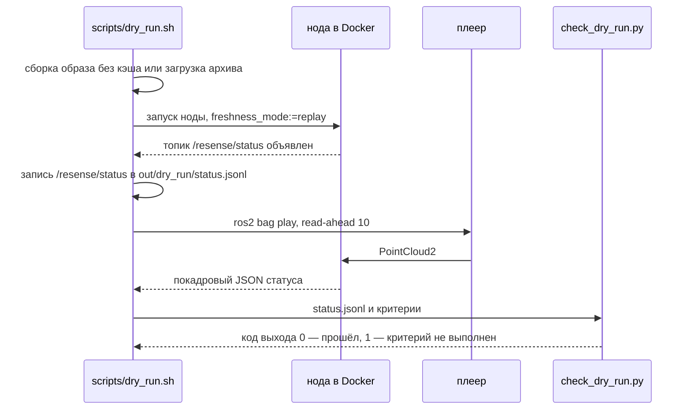

# Приёмочный тест (пробный прогон)

`scripts/dry_run.sh` — сквозная проверка сценария жюри на настоящем бэге: собирает (или загружает)
образ, запускает ноду, ждёт, пока она объявит `/resense/status`, проигрывает бэг с поддерживаемыми
настройками, записывает поток статуса и проверяет результат через `scripts/check_dry_run.py`. Код
выхода 0 — пройдено, 1 — не выполнен какой-то критерий, 2 — неверный аргумент (или в записи нет
ни одного статуса), 3 — нет Docker или нода не запустилась.



## Два стандартных прогона

```bash
./scripts/dry_run.sh <bags>/doubleT_obstacle                  # сборка с --no-cache; человек должен быть найден в 50–62 м впереди
SKIP_BUILD=1 ./scripts/dry_run.sh <bags>/roundT_doubleT --expect-clear --max-alarm-frames 2
```

Без дополнительных аргументов действуют критерии для `doubleT_obstacle`: препятствие на 50–62 м,
p95 декодирования + детекции ≤ 100 мс, ни одного необработанного кадра записи после навёрстывания
при старте и корректные поля свежести (`--require-freshness`). Аргументы после бэга передаются
проверяющему скрипту, так что пороги заданы в одном месте (`python3 scripts/check_dry_run.py --help`).

Кроме критериев, скрипт печатает:

| строка | что это |
|---|---|
| `end-to-end (current)` | сквозная задержка актуальных результатов: от публикации кадра плеером через DDS, очередь ноды, декодирование и детекцию до результата |
| `end-to-end (all)` | то же по всем результатам, включая старт (печатается, если были неактуальные) |
| `playback pace` | во сколько раз быстрее или медленнее реального времени проигралась запись: медленный диск или перегруженный плеер видны здесь |
| `node CPU`, пиковая память | загрузка ядер процессом ноды и её пиковый RSS |

Необязательные критерии: `--max-p95-e2e <ms>` — предел сквозного p95 актуальных результатов,
`--min-playback-rate <R>` (например, `0.9`) — провал, если запись проигралась медленнее R ×
реального времени.

Сырые записанные данные остаются в `out/dry_run/` (`status.jsonl`, `node.log`); `status.jsonl`
можно проиграть в [веб-дашборде](../visualisation/web-dashboard.md).

## Параметры (переменные окружения)

| переменная | значение |
|---|---|
| `SKIP_BUILD=1` | использовать `$IMAGE` (по умолчанию `resense:latest`) вместо пересборки |
| `IMAGE_TAR=<archive>` | загрузить образ из архива вместо сборки |
| `OFFLINE=1` | нода, плеер и рекордер с `--network none`; нужен `IMAGE_TAR` или `SKIP_BUILD=1` |
| `RATE=1.0` | скорость проигрывания |
| `BAG_READ_AHEAD_QUEUE_SIZE=10` | упреждающее чтение плеера; менять только для отдельно проверенной конфигурации |
| `OUT=out/dry_run` | куда сохраняется запись |
| `DOCKER_ARGS=""` | дополнительные аргументы `docker run`, например `-e RESENSE_NATIVE=0` для пути на numpy |

## Почему «после старта»

`ros2 bag play` предзагружает бэг, пока его часы уже идут, а затем отправляет просроченные первые
доли секунды подряд, без пауз. Нода по умолчанию сохраняет каждый кадр стартовой
пачки (`catchup_startup_step` = 0). Явное значение `0.2` включает прореживание до 5 Гц;
пропуски отражаются в `node.catchup_skipped` (см. [Старт и остановка ноды](../getting-started/run-on-a-bag.md#startup)).
Проверка по-прежнему считает пропуски с более позднего из двух моментов — 5 с или конца навёрстывания
(не позже 15 с), — а с `--bag` (его передаёт `dry_run.sh`) сверяются с сообщениями самой записи,
так что кадры, которых нет в самой записи, пропусками не считаются. Нулевые пропуски после этого
момента не доказывают полное покрытие стартовых кадров: для него нужна отдельная сверка всей записи.

## Консоль организаторов

Плеер от имени обычного пользователя со штатным middleware ROS 2 Humble, как на консоли жюри:

```bash
PLAYER_DDS=stock ./scripts/console_test.sh <bags>/roundT_doubleT <bags>/doubleT_obstacle -- \
  --expect-obstacle --obstacle-in 2 --expect-inputs 2 --min-frames 20 --max-p95-latency 1000 --max-dropped 100000
```

## На 8-ядерной машине вместо стенда

`scripts/bench_8core.sh <bags>/doubleT_obstacle <bags>/roundT_doubleT` одним запуском выполняет
сборку, пробные прогоны на нативном пути и на numpy, консольные тесты, `docker stats` и офлайн-замеры
времени и складывает всё в `docs/evidence/bench_<date>/`.

## Что вместо этого запускает CI

Датасета в CI нет. При каждом push CI проигрывает через образ синтетические бэги по 40 кадров точно
в формате сообщений организаторов (сначала чистый путь, затем человек на 60 м; обе пары топик /
frame id) — плеером с uid 1000 из другого контейнера и штатным плеером на Fast DDS, — а также
проигрывает их через рабочий образ, загруженный из архива, во внутренней сети без выхода наружу.
При push в `main` дополнительно проигрываются с холодного диска два исходных бэга, восстановленные
из кэша Actions с проверкой контрольной суммы. См.
[Установка, тесты и CI](../development/setup-and-ci.md).
