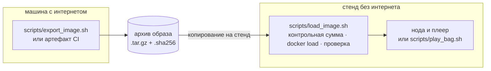

# Стенд без интернета

На тестовой машине организаторов нет интернета. `docker build` там не выполнится (базовому образу,
apt и PyPI нужна сеть), поэтому образ переносится архивом; во время работы сеть не нужна ничему.

| этап | нужна сеть? |
|---|---|
| `docker build` | да: Docker Hub, apt-архивы ROS и Ubuntu, PyPI |
| `docker load` архива | нет |
| нода, launch-файл, entrypoint, сервисы compose, RViz, `foxglove_bridge` | нет (DDS по UDP на интерфейсах хоста; достаточно одного loopback) |
| веб-дашборд | нет (шрифты и `roslib` входят в комплект) |
| настольное приложение Foxglove на ноутбуке зрителя | нет |



## Подготовка (на машине с интернетом)

```bash
scripts/export_image.sh            # → dist/resense-image-<version>.tar.gz и .sha256
```

или скачайте артефакт CI нужного коммита ([Где взять образ Docker](../getting-started/get-the-image.md)).
Скопируйте оба файла на стенд.

## На стенде

```bash
scripts/load_image.sh resense-image-<version>.tar.gz    # контрольная сумма, docker load, запуск с --network none
```

затем команды жюри из [Запуск на бэге](../getting-started/run-on-a-bag.md) или одним шагом
`scripts/play_bag.sh <bag> --archive resense-image-<version>.tar.gz`.

Коды выхода `load_image.sh`: 2 — неверный аргумент, 3 — нет Docker, 4 — не совпала контрольная
сумма, 5 — загруженный образ не прошёл проверку.

## Репетиция

Отключите сеть (выньте кабель, выключите Wi-Fi), затем:

```bash
IMAGE_TAR=dist/resense-image-<version>.tar.gz OFFLINE=1 ./scripts/dry_run.sh <bags>/doubleT_obstacle
SKIP_BUILD=1 OFFLINE=1 ./scripts/dry_run.sh <bags>/roundT_doubleT --expect-clear --max-alarm-frames 2
```

`IMAGE_TAR` загружает архив вместо сборки; `OFFLINE=1` запускает ноду, плеер и рекордер с
`--network none` и не допускает сборку. Затем проиграйте бэг вручную из консоли обычного
пользователя, по-прежнему без интернета. См. [Приёмочный тест](acceptance-test.md).

Пошаговая репетиция без интернета на облачной ВМ, со страховкой, которая восстанавливает сеть:
[`docs/VM_GUIDE.md` §5](https://github.com/pmixay/ReSense/blob/main/docs/VM_GUIDE.md#5-offline-rehearsal).

## Сборка без интернета (без гарантий)

После `docker load`, в дереве исходников того же коммита:

```bash
chmod -R u+rwX,go+rX,go-w . && docker build --cache-from resense:<version> -t resense -f docker/Dockerfile .
```

Образ из архива несёт собственный кэш слоёв и тег базового образа, так что каждый шаг может
взяться из него. Если не получится, загруженный образ останется нетронутым и будет работать как
прежде.
