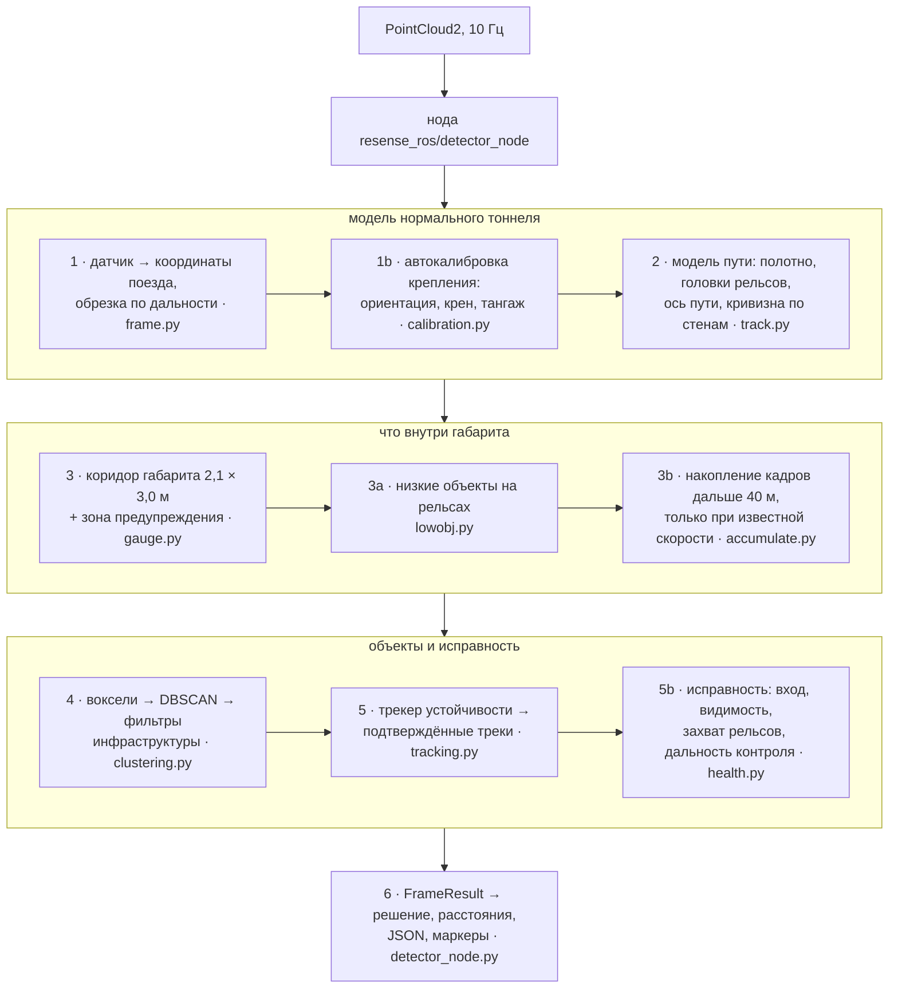
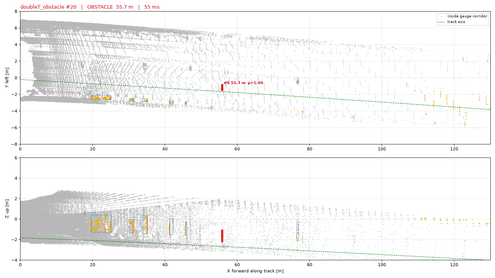
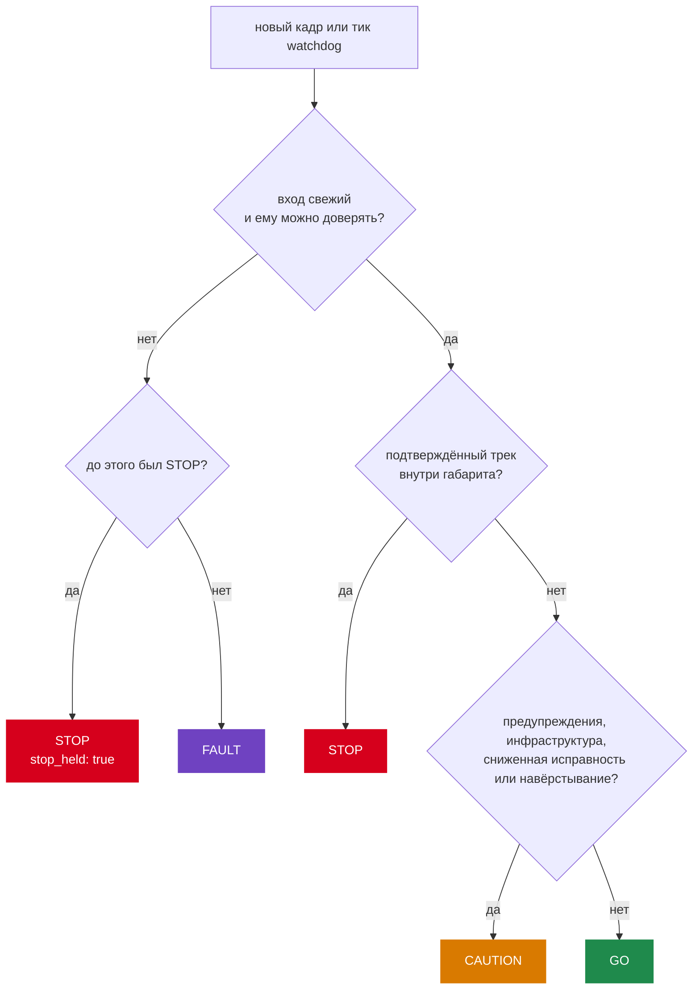

# Как это работает

Идея: не пытаться распознавать объекты. По данным каждого кадра описать нормальный тоннель, вырезать
объём, через который пройдёт поезд, и сообщать обо всём, что устойчиво его занимает. Карты нет:
модель тоннеля заново строится по каждому кадру.

## 1. Где стоит датчик

LiDAR стоит не на каждом поезде в одном и том же месте. Детектор переводит оси датчика в систему
координат поезда (это настраивается) и по умолчанию сам калибрует крепление по первым кадрам: пара
рельсов даёт ориентацию и крен, уклон полотна — тангаж. Результат — в JSON статуса под ключом
`mount`.

## 2. Модель пути

На каждом кадре: высота полотна вдоль пути (робастная подгонка по участкам), уровень головок рельсов,
центр пути и курсовой угол по шаблону из двух рельсов (колея 1,52 м), а кривизна — по левой и правой
границам тоннеля (стены, ряды колонн). Оси доверяют лишь на той дальности, где границы
действительно видны; дальше объекты могут быть только предупреждениями.

## 3. Габарит

Габарит поезда, заданный организаторами, — 2,1 м в ширину и 3,0 м в высоту над головкой рельса —
протягивается вдоль подогнанной оси. Полоса на 0,35 м шире — зона предупреждения. Вблизи поезда на
прямом пути габарит — объединение габарита, построенного по рельсам, и габарита, отмеренного от оси
датчика (не шире габарита по рельсам больше чем на 0,2 м), так что ни одна сторона не сужается.
Организаторы отсчитывают габарит от головки рельсов (ответ 29.09). О предметах, лежащих на полотне между рельсами ниже
нижней границы габарита, детектор не сообщает (организаторы подтвердили, что такой объект не
препятствие); объекты на рельсе или пересекающие нижнюю границу находит отдельный этап низких
объектов.

## 4. Кандидаты и инфраструктура

Точки внутри коридора вокселизуются и кластеризуются DBSCAN, радиус которого растёт с дальностью.
Оборудование тоннеля, которое штатно подходит близко к габариту, — тонкие протяжённые элементы,
низкое путевое оборудование, поверхности стен, колонны, короба над головой — распознаётся по
сигнатурам формы и понижается до предупреждения, но никогда не удаляется из выхода. Тонкие
объекты, свисающие у оси (оборванный кабель), не понижаются никогда. Правило `shell` (высокий
кластер дальше 40 м, над которым продолжается обделка тоннеля, — инфраструктура) было включено
вечером 29.09 и выключено той же ночью после ревью безопасности: объект, продолжающийся выше
габарита, — кабель, висящий от свода до рельсов, столб, стоящий состав — сам давал «обделку» над
собой и получал `CAUTION` вместо `STOP`.

## 5. Устойчивость и решение

Кластер становится треком; трек становится препятствием, только когда он **подтверждён**: виден
минимум в 3 кадрах не менее чем за 0,5 с, сопоставлен в большинстве недавних кадров, имеет
достаточную уверенность и в большинстве недавних попаданий находится внутри строгого габарита.
Сообщённое препятствие удерживается при одном пропущенном кадре. Небольшая обученная модель
(градиентный бустинг деревьев) может отложить сомнительный дальний STOP не более чем на 10
обработанных кадров за жизнь трека (около 1 с при 10 Гц) — никогда ближе 25 м, никогда для фигуры
высотой от 1 м ближе 40 м, и она никогда не может запретить или снять STOP.

С 29.09 два правила из открытых решений других команд не дают треку **начать** STOP (он остаётся
предупреждением; ближняя эскалация сильнее): трек, у которого среди недавних попаданий было
понижение как инфраструктура, ждёт 5 чистых попаданий подряд в строгом габарите; а пока поезд идёт
не медленнее 4 м/с, трек дальше 25 м, расстояние до которого не сокращается вместе с пробегом
поезда (артефакт, «едущий» с поездом), STOP не начинает. Скорость для этого запрета — оценка по
LiDAR или измеренная скорость из топика, но не постоянная `ego_speed_mps`: на стоящем поезде она
не дала бы начать STOP дальше 25 м. Параметры — [Файл конфигурации](configuration.md#rules-2909).

Решение на каждом кадре:

* `STOP` — подтверждённый трек внутри габарита;
* `CAUTION` — только треки в зоне предупреждения, известная инфраструктура, сниженная исправность
  или навёрстывание;
* `GO` — ничего из перечисленного;
* `FAULT` — нет входа, вход устарел или часам нельзя доверять (удерживаемый STOP важнее).

## 6. Исправность и дальность контроля

Каждый кадр также сообщает, на какую дальность путь действительно просматривается (`clear_distance`):
по прямой видимости и доверенной дальности модели пути, с ограничением по любому обнаруженному
препятствию или учитываемому кластеру. Это оценка, а не гарантия, что путь свободен.

## Производительность

Не больше одного ядра CPU на ноду, без GPU, 10 кадров в секунду. На 120° облаках декодирование и
обнаружение занимают малую долю периода датчика 100 мс, на 360° облаках (24 МБ) укладываются в него
с небольшим запасом; самые медленные — плотные сцены на станциях, где отдельные кадры могут его
превышать. Необязательные ядра на C++ (встроены в образ) сокращают время детектора примерно вдвое
с побитово идентичным результатом.

Нода читает облако прямо из сериализованных байтов (те же массивы, что и штатное преобразование
rclpy, но быстрее) и до начала работы прогревается на синтетических кадрах. Стартовую пачку
плеера она по умолчанию обрабатывает целиком, кадр за кадром; явное `catchup_startup_step:=0.2`
разбирает её с частотой 5 Гц, чтобы актуальные результаты появлялись быстрее
([Старт и остановка ноды](../getting-started/run-on-a-bag.md#startup)). Измеренное время:
[Результаты и ограничения](results.md#speed).

## Подробнее

* [`docs/ARCHITECTURE.md`](https://github.com/pmixay/ReSense/blob/main/docs/ARCHITECTURE.md) —
  компоненты, поток данных, бюджет реального времени, развёртывание без интернета
* [`docs/ALGORITHM.md`](https://github.com/pmixay/ReSense/blob/main/docs/ALGORITHM.md) — все
  этапы, правило решения, параметры, ограничения
* [`docs/EXPERIMENTS.md`](https://github.com/pmixay/ReSense/blob/main/docs/EXPERIMENTS.md) —
  измерения; полный журнал экспериментов, включая подходы, которые не сработали, —
  [`docs/archive/EXPERIMENTS_log_2026-09.md`](https://github.com/pmixay/ReSense/blob/main/docs/archive/EXPERIMENTS_log_2026-09.md)
* [`docs/DECISIONS.md`](https://github.com/pmixay/ReSense/blob/main/docs/DECISIONS.md) — ключевые
  решения: гипотеза → эксперимент → результат; кратко — [Подход команды](approach.md)
* [Результаты и ограничения](results.md) — что измерено и где детектор ошибается
* [Веб-прототип](../visualisation/web-prototype.md) — тот же детектор и то же правило решения на
  любой записи: решение, расстояние и облако точек каждого кадра в браузере
