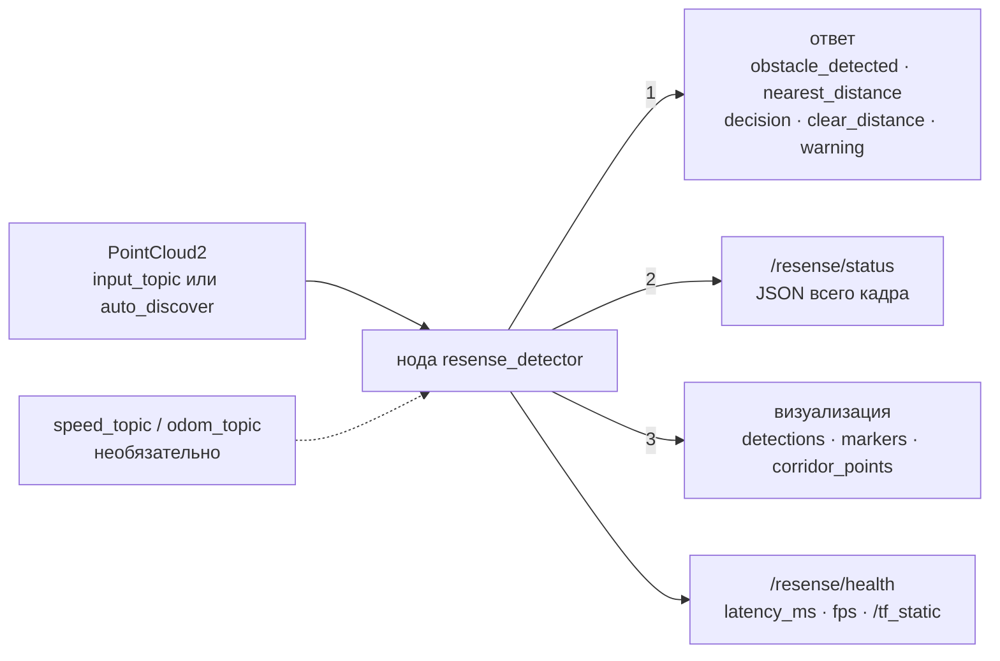

# Топики и JSON статуса

Цифры на стрелках — порядок публикации в каждом кадре.

## Публикуемые топики

| топик | тип | значение |
|---|---|---|
| `/resense/decision` | `std_msgs/String` | `GO` / `CAUTION` / `STOP` / `FAULT` ([Как читать результат](../getting-started/read-the-output.md)) |
| `/resense/obstacle_detected` | `std_msgs/Bool` | подтверждённый объект внутри габарита |
| `/resense/warning` | `std_msgs/Bool` | подтверждённый объект только в зоне предупреждения |
| `/resense/nearest_distance` | `std_msgs/Float32` | расстояние в м вдоль пути до ближайшего препятствия в габарите, −1 — препятствия нет |
| `/resense/clear_distance` | `std_msgs/Float32` | оценка дальности контроля в м, ограниченная обнаруженными препятствиями и учитываемыми кластерами; 0 при сбое |
| `/resense/health` | `diagnostic_msgs/DiagnosticArray` | OK / WARN / ERROR / STALE с сообщениями и значениями: точки, загрязнение окна, закрытые секторы, видимость, захват рельсов, задержка p95, дальность контроля, калибровка крепления |
| `/resense/detections` | `vision_msgs/Detection3DArray` | рамки в системе координат датчика; `class_id` = `gauge_obstacle` / `warning_obstacle`, score — уверенность |
| `/resense/status` | `std_msgs/String` | полный результат кадра в виде JSON (ниже) |
| `/resense/latency_ms`, `/resense/fps` | `std_msgs/Float32` | время декодирования + обнаружения + публикации на кадр; кадры в секунду, раз в `stats_period` с |
| `/resense/markers`, `/resense/corridor_points` | `visualization_msgs/MarkerArray`, `sensor_msgs/PointCloud2` | для RViz / Foxglove: рамки, подписи, контур коридора, текст статуса; точки внутри коридора |
| `/tf_static` | `tf2_msgs/TFMessage` | тождественное преобразование `resense_lidar` → frame id входного облака |

На каждом кадре нода сначала публикует ответ (`obstacle_detected`, `nearest_distance`,
`decision`, `clear_distance`, `warning`), затем `/resense/status`, затем визуализацию.

## Подписки

* `sensor_msgs/PointCloud2` на `input_topic` (по умолчанию — оба известных имени) и, при
  `auto_discover`, любой другой топик `PointCloud2` в графе; обрабатывается один вход за раз.
* Скорость, по желанию: `speed_topic` (`std_msgs/Float32`) или `odom_topic` (`nav_msgs/Odometry`).

## JSON статуса

Один объект на каждый обработанный кадр (и на каждый тик watchdog, пока вход молчит). Тот же объект
без `node` построчно пишет `resense run --out`.

| ключ | содержимое |
|---|---|
| `stamp` | время кадра, с |
| `decision` | `GO` / `CAUTION` / `STOP` / `FAULT` |
| `obstacle`, `warning` | булевы значения, как в топиках |
| `nearest_distance` | м до ближайшего препятствия в габарите, `null` — препятствия нет |
| `clear_distance`, `detector_clear_distance` | опубликованная дальность контроля (0, если контроль недостоверен) и исходная оценка детектора |
| `detections[]`, `warnings[]` | препятствия в габарите и объекты в зоне предупреждения: `id`, `zone`, `distance` (вдоль пути), `lateral`, `center` [x, y, z], `size` (размеры по x, y, z), `n_points`, `confidence`, `age` (в кадрах), `height_min`, `intensity`, `reason`, `kind` |
| `track` | модель пути: `center`, `yaw`, `curvature`, `axis_valid` (доверенная дальность), `floor_coef`, `floor_range`, `rail_offset`, `rail_score`, `wall_quality`, … |
| `health` | `level`, `decision_level`, `messages[]`, `points`, `visibility`, `blocked_sectors`, `rail_lock`, `monitored_range`, `latency_p95_ms`, поля свежести, … |
| `mount` | автокалибровка: `status`, `orientation`, `roll_deg`, `pitch_deg`, `yaw_deg`, `height`, `lateral`, `drift_deg`, `frames_used`, `message` |
| `timing_ms` | по этапам: `track`, `corridor`, `egomotion`, `accumulate`, `cluster`, `tracking`, `total` |
| `freshness` | `mode`, `clock_reference`, `valid`, `reason` (`current`; `catchup` — нода догоняет отставание; `source_stale`, `queue_stale`, `epoch_unconfirmed`, …), `go_allowed`, возраст данных (`source_age_s`, `acquisition_age_s`, `publication_age_s`, `residence_age_s`, `queue_lag_s`), `evaluated_at_utc_s`, `max_result_age_s`, `future_tolerance_s` |
| `stop_held` | предыдущий STOP остаётся видимым, пока вход недостоверен |
| `snapshot_kind` | `frame`, `watchdog` или `processing_error` |
| `ego_speed`, `ego_speed_source`, `ego_speed_estimate`, `ego_speed_confidence`, `n_accumulated` | использованная скорость, если есть, и накопление кадров |
| `n_points`, `n_corridor`, `n_candidates` | точки в кадре, в коридоре, кластеры-кандидаты |
| `node` | добавляет нода: `latency_ms`, `fps`, `frames`, `dropped_frames`, `catchup_skipped`, `catchup`, `input_period_ms`, `ego_speed_mps`, `ego_speed_source`, `input_topic`, `recording`, `decode_ms` и `detect_ms` (за этот кадр), `cpu_cores` (процесс ноды за последний `stats_period`), `rss_peak_mb` |

Этот объект формирует `FrameResult.to_dict()` в
[`resense/detector.py`](https://github.com/pmixay/ReSense/blob/main/resense/detector.py); ключи
только добавляются — никогда не переименовываются и не удаляются.

## Системы координат

Детектор работает в системе координат поезда: X — вперёд вдоль пути, Y — влево, Z — вверх, начало
в датчике. `distance` измеряется вдоль оси пути, `lateral` — поперёк неё. Опубликованные рамки и
маркеры — в системе координат входного облака (или `output_frame`).
