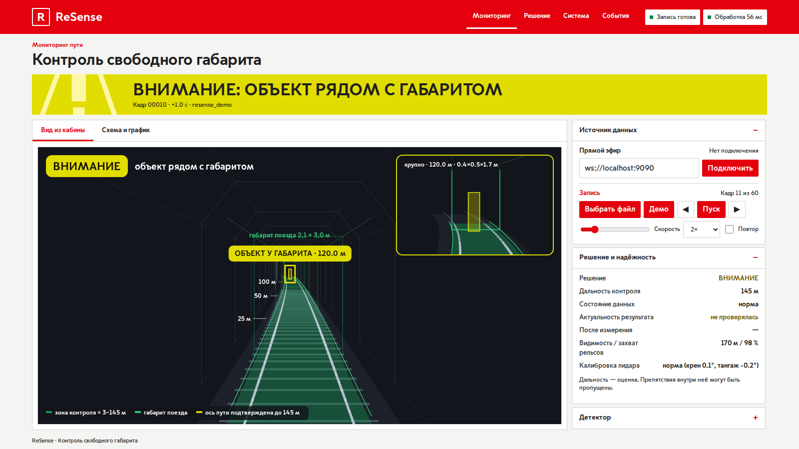
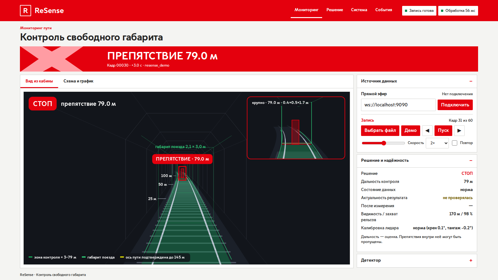
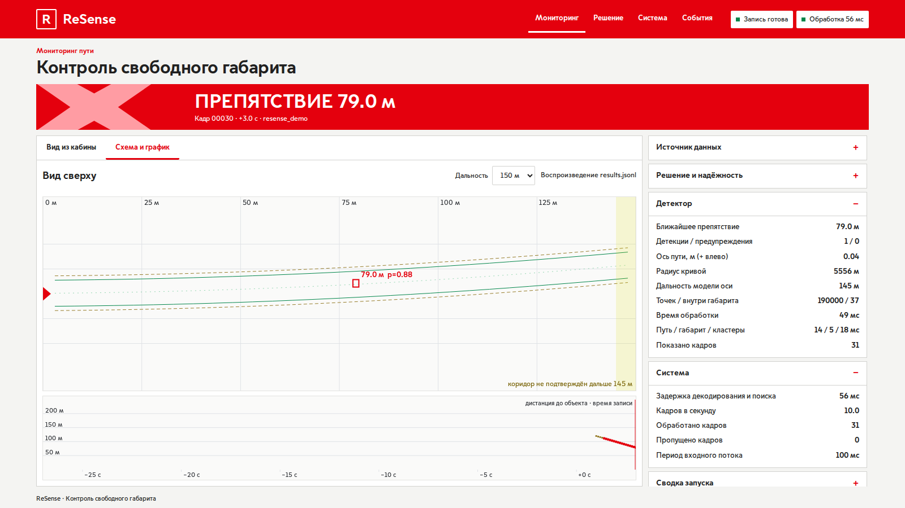
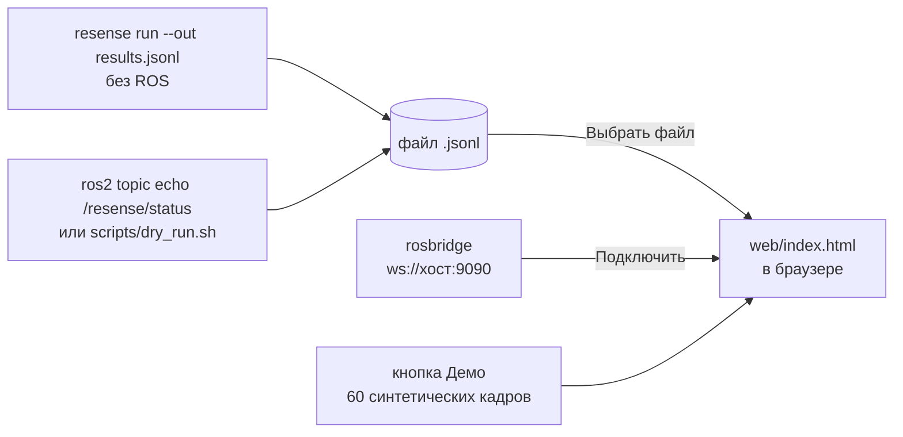

# Веб-дашборд

Одна статическая страница (`web/index.html`, русский интерфейс, без сборки и без сервера), которая
покадрово показывает, что решил детектор: баннер решения, вид из кабины глазами машиниста
с габаритом и рамками препятствий, вид сверху, график расстояния во времени, исправность
и статистику ноды, сводку запуска и журнал тревог.

Откройте `web/index.html` из клона репозитория в браузере; устанавливать и собирать ничего
не нужно.

## Как это выглядит








Эти четыре снимка сделаны на встроенном демо (кнопка **Демо**, 60 синтетических кадров): это
демонстрация интерфейса, а не результат оценки. Снимок на реальных данных — ниже, в разделе
«Попробовать на реальных записях».

## Что он умеет и чего не умеет

| вы хотите… | можно? | как |
|---|---|---|
| посмотреть интерфейс без данных | да | нажмите **Демо**: 60 кадров синтетического приближения к препятствию (демонстрация интерфейса, а не результат оценки) |
| воспроизвести результаты реального запуска | да | **Выбрать файл** (или перетащите файл на страницу): `results.jsonl` или запись `/resense/status` |
| следить за работающей нодой в живом режиме | да, если браузер может достучаться до сервера rosbridge | введите `ws://<host>:9090`, нажмите **Подключить** |
| **загрузить бэг ROS 2 и получить его обработку** | **нет** | у страницы нет бэкенда; детектор работает на Python/C++ в образе Docker, а не в браузере. Сначала обработайте бэг (см. ниже), затем воспроизведите результат |
| скачать отчёт о запуске | да, для загруженного воспроизведения | раздел *Сводка запуска* → **Скачать отчёт** (`resense_run_report.json`) |

Страница читает только **результаты** (один JSON `FrameResult` на кадр). Облака точек в браузер
не передаются, и ничего из загруженного вами не покидает браузер.



## Попробовать на реальных записях

В репозитории лежат два потока статуса ноды, записанные в CI на исходных бэгах организаторов
с поддерживаемыми настройками проигрывания (`--read-ahead-queue-size 10`) и сжатые gzip:

* [`doubleT_obstacle_status.jsonl.gz`](https://github.com/pmixay/ReSense/blob/main/docs/evidence/p1_p2_supported_playback_2026-09-27/cached_bags_run_36319767736/doubleT_obstacle_status.jsonl.gz)
  — человек переходит путь, затем объект на рельсе, ≈ 55–57 м впереди (STOP)
* [`roundT_doubleT_status.jsonl.gz`](https://github.com/pmixay/ReSense/blob/main/docs/evidence/p1_p2_supported_playback_2026-09-27/cached_bags_run_36319767736/roundT_doubleT_status.jsonl.gz)
  — проезд без препятствий из круглого тоннеля в двухпутный

Скачайте один из них, распакуйте через `gunzip`, откройте веб-дашборд, нажмите **Выбрать файл**
и выберите `.jsonl`. Происхождение файлов: [README прогона](https://github.com/pmixay/ReSense/blob/main/docs/evidence/p1_p2_supported_playback_2026-09-27/cached_bags_run_36319767736/README.md).


## Воспроизвести свой бэг

1. Получите результаты — либо офлайн (ROS не нужен):

   ```bash
   pip install -e ".[dev]"
   resense run --bag /data/for_hackathon/doubleT_obstacle --out results.jsonl
   ```

   либо записью статуса ноды во время проигрывания бэга:

   ```bash
   ros2 topic echo /resense/status --field data > status.jsonl    # эту команду использует scripts/dry_run.sh
   ```

   (`scripts/dry_run.sh <bag>` сам сохраняет такую запись в `out/dry_run/status.jsonl`.)
2. Откройте веб-дашборд и загрузите файл. Строки не в формате JSON (например, разделители `---`
   из `ros2 topic echo`) и пустые строки пропускаются; некорректные записи игнорируются, а не
   отображаются.

Воспроизведение: пробел — пуск/пауза, ← → — шаг, ползунок перемотки, скорость 0,25×–10×, повтор
по кругу. По оси X графика отложено время записи.

## Живой режим

Веб-дашборд подписывается на `/resense/status` через **rosbridge**, которого нет в образе
ReSense:

```bash
sudo apt install ros-humble-rosbridge-suite
ros2 launch rosbridge_server rosbridge_websocket_launch.xml     # на машине, где работает нода
```

Затем введите `ws://<host>:9090` и нажмите **Подключить**. Открывайте страницу как локальный файл:
копия, отданная по HTTPS, не может открыть незашифрованное соединение `ws://` с другой машиной
(смешанный контент), если rosbridge не стоит за `wss://`. На машине без интернета используйте
[Foxglove](foxglove.md) — его мост уже есть в образе.

Для живого режима часы ноды и браузера должны быть синхронизированы по UTC. Панели закрыты
заглушкой до первого актуального результата, а также при обрыве связи или когда результат
устаревает; некорректные данные или данные без решения никогда не сделают баннер зелёным.

## Подробнее

Описание каждого виджета, headless-проверки (`python -m pytest -q web/demo`) и рецепты записи
видео: [`web/README.md`](https://github.com/pmixay/ReSense/blob/main/web/README.md).
