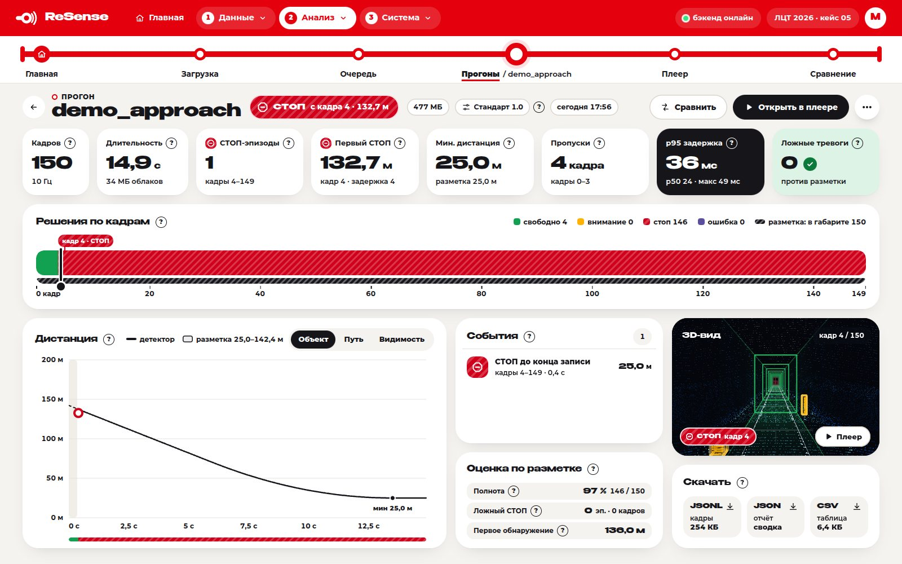

# Веб-прототип

Многостраничный сайт для жюри (`webapp/`, русский интерфейс): загрузите запись или создайте демо —
сервер обработает её тем же детектором, а на сайте можно посмотреть каждый кадр (решение,
расстояние, оценку по разметке, 3D-вид из кабины) и сравнить прогоны и наборы параметров. ROS и
Docker для него не нужны.

> **Открыть онлайн: [resense.arbuz.lol](https://resense.arbuz.lol/)** — развёрнутый экземпляр, ничего устанавливать не нужно. Свой экземпляр
> запускается одной командой (ниже, «Запуск»).

> **Статус.** Прототип добавлен [PR #31](https://github.com/pmixay/ReSense/pull/31) и не входит ни в
> релиз `v1.0.0`, ни в образ Docker: это необязательный стенд рядом с нодой. Детектор он не меняет:
> рабочий процесс вызывает тот же опечатанный `resense.Detector`, а решение по кадру выбирается по
> правилу ноды.


Все снимки на этой странице сделаны на синтетических демо-записях: это демонстрация интерфейса, а
не результат оценки. Измерения детектора — [Результаты и ограничения](../reference/results.md).

## Запуск <a href="#run" id="run"></a>

Онлайн — [resense.arbuz.lol](https://resense.arbuz.lol/). Свой экземпляр на своём компьютере или стенде:

```bash
scripts/run_webapp.sh --install    # первый раз, нужен интернет: pip install -e . -e webapp/backend и npm ci
scripts/run_webapp.sh              # http://localhost:8080 — сайт и API на одном порту
```

Нужны Python ≥ 3.10 и Node.js 20.19+ или 22.12+ (Node.js — только чтобы собрать фронтенд). Скрипт
пересобирает фронтенд, когда исходники новее сборки, и печатает адрес в локальной сети; без npm
работает только API, а страница `/` объясняет, как собрать сайт. Остановка — Ctrl+C.

| переменная | по умолчанию | что задаёт |
|---|---|---|
| `RESENSE_WEB_PORT` | `8080` | порт сайта и API |
| `RESENSE_DATA` | `/data/for_hackathon`, если он есть, иначе `/data` | корень «Папки на сервере» (только чтение) |
| `RESENSE_WEB_DATA` | `webapp/data` | база, загрузки, записи и прогоны |

Режим разработки и тесты — [Установка, тесты и CI](../development/setup-and-ci.md#webapp).

## Страницы

Красная верхняя панель делит страницы на три группы — **1 Данные**, **2 Анализ**, **3 Система**; под
ней «линия метро» со станциями Главная → Загрузка → Очередь → Прогоны → Плеер → Сравнение.
Пояснения спрятаны в кнопки «?». Решения подписаны по-русски: СВОБОДНО — `GO`, ВНИМАНИЕ — `CAUTION`,
СТОП — `STOP`, ОШИБКА — `FAULT`.

| адрес | страница | зачем |
|---|---|---|
| `/` | Главная | новая запись или демо в один клик, последние прогоны, состояние стенда |
| `/upload` | Загрузка | файлы и папки (можно перетащить), папка на сервере, демо-запись; пресет и опции; **Обработать** |
| `/queue` | Очередь | текущее задание (этап, %, кадров в секунду, сколько осталось), ожидающие и готовые, лог, отмена и повтор |
| `/runs` | Прогоны | все прогоны с полосой решений и итогом; поиск, фильтры, переименование, удаление, выбор для сравнения |
| `/runs/:id` | Прогон | показатели, решения по кадрам с дорожкой разметки, график расстояния, события, оценка по разметке, 3D-превью, скачивание |
| `/player`, `/player/:id` | Плеер | 3D-кабина на весь экран ([ниже](#player)) |
| `/compare?runs=a,b` | Сравнение | 2–4 прогона рядом: лучшее значение в каждой строке, выровненные полосы решений, наложенные графики расстояния, различия пресетов |
| `/live` | Прямой эфир | нода ROS 2 через rosbridge или симуляция по готовому прогону ([ниже](#live)) |
| `/presets` | Параметры | опечатанный «Стандарт 1.0» и свои пресеты ([ниже](#presets)) |
| `/about` | О системе | конвейер, правила решения, результаты, как проверить, документы |

## Типичный путь жюри

1. **Загрузка** — бэг (файлом, папкой или из «Папки на сервере») или демо-запись, пресет
   «Стандарт 1.0», **Обработать**. Кнопка **Демо** на Главной делает это сама: создаёт
   15-секундное «Приближение», ставит его в очередь и открывает Очередь.
2. **Очередь** — этап, процент, кадры в секунду и сколько осталось; задания выполняются по одному.
3. **Прогон** — показатели (кадры, длительность, эпизоды СТОП, первый СТОП, минимальная дистанция,
   пропуски, задержка p95, ложные тревоги), решения по кадрам, график расстояния, события и оценка
   по разметке (полнота, ложные СТОП в кадрах и эпизодах, дальность первого обнаружения);
   скачиваются `results.jsonl`, `report.json` и `frames.csv`.
4. **Плеер** — тот же прогон кадр за кадром из кабины; полоса решений, график и события прогона
   открывают его на нужном кадре.
5. **Сравнение** — та же запись с другим пресетом или другая запись рядом.



## Что можно загрузить

| вход | что получится |
|---|---|
| бэг rosbag2: `.zip` его папки, `.db3` + `metadata.yaml` или `.mcap` | обработка детектором и облака точек для плеера |
| кадры `.npy` / `.npz` из кэша | обработка детектором |
| `results.jsonl`, записанный `resense run --out` | решения пересчитываются по правилу ноды; облаков нет, плеер работает в схематичном режиме |
| «Папка на сервере» | запись из `RESENSE_DATA` регистрируется на месте, без копирования |
| «Демо-запись» | синтетический бэг тоннеля ([ниже](#demo)) |

Файлы и целые папки можно перетащить на страницу, прогресс загрузки виден. Опции обработки: пресет,
топик облака (по умолчанию «авто»), шаг кадров, **Облака точек** для плеера (до 30 000 точек на
кадр, не больше 3 000 облаков на прогон) и **По разметке**: файл `labels/*.json` подбирается по
имени записи, свой JSON разметки можно прикрепить.

### Демо-записи <a href="#demo" id="demo"></a>

«Демо-запись» создаёт на сервере настоящий бэг rosbag2 (10 Гц, `/lidar_points`) из синтетических
кадров тоннеля (open3d не нужен) вместе с эталонной разметкой, поэтому прогон сразу оценивается.

| сценарий | что происходит |
|---|---|
| Приближение | человек на пути, поезд тормозит и останавливается ≈ в 25 м от него |
| Пересечение пути | поезд стоит, человек переходит путь ≈ в 55 м впереди |
| Чистый путь | оборудование у пути, препятствий нет |

Длительность 5–60 с, на диске ≈ 33 МБ на секунду записи. Такие записи помечены «синтетическая»:
кадры проще реальных, и результаты на них оптимистичны (первый СТОП на «Приближении» — около
130 м); дальности на реальных данных — на странице
[Результаты и ограничения](../reference/results.md).


## Плеер <a href="#player" id="player"></a>

«Кабина поезда будущего» на весь экран: облако точек каждого кадра с места машиниста, габарит
2,1 × 3,0 м вдоль найденной оси пути, рамки объектов с расстояниями и крупный план ближайшего.
Плитки внизу: схема пути, решение, расстояние до препятствия на шкале дальности контроля, задержка
и частота, исправность (видимость, захват рельсов, калибровка). Шкала кадров окрашена по решениям и
несёт метки событий; скорость 0,25×–10×, повтор по кругу. Прогон без облаков (из `.jsonl`)
проигрывается схематично.

| клавиша | действие |
|---|---|
| пробел | пуск / пауза |
| `←` / `→` | кадр назад / вперёд; с `Shift` — на 10 кадров |
| `[` / `]` | предыдущее / следующее событие |
| `1` / `2` / `3` | камера «Кабина» / «Сверху» / «Сзади»; мышью — свободный обзор |
| `+` / `-` | быстрее / медленнее |
| `F` | весь экран |
| `Esc` | сброс свободного обзора, выход из полноэкранного режима, иначе назад |


## Прямой эфир <a href="#live" id="live"></a>

| источник | что показывает | что нужно |
|---|---|---|
| **Узел ROS 2** | работающую ноду: `/resense/status` через rosbridge по адресу `ws://<хост>:9090` | rosbridge, которого нет в образе: `ros2 launch rosbridge_server rosbridge_websocket_launch.xml` на машине, где работает нода (пакет `ros-humble-rosbridge-suite`) |
| **Симуляция** | готовый прогон, который сервер отдаёт по WebSocket с частотой 10 Гц × скорость | только обработанный прогон |

Если сообщений нет дольше 0,5 с, страница пишет «данные устарели» и никогда не показывает такие
данные зелёным.

## Параметры и пресеты <a href="#presets" id="presets"></a>

«Стандарт 1.0» — опечатанный встроенный пресет: конфигурация детектора по умолчанию, изменить его
нельзя. Свои пресеты меняют 20 настраиваемых параметров в 7 группах (датчик, габарит,
кластеризация, трекинг, низкие объекты, накопление, исправность); у каждого — пояснение в «?».
Пресет меняет только параметры, которые получает детектор, а не его код. Чтобы увидеть, что даёт
параметр, обработайте одну запись с двумя пресетами и откройте Сравнение: блок «Что изменилось»
покажет разницу пресетов.


## Известные ограничения <a href="#limits" id="limits"></a>

* Плавность 60 кадров в секунду в плеере не измерена: браузерные тесты рисуют 3D программно
  (SwiftShader, без видеокарты).
* Режим «Узел ROS 2» проверен только на заменителе rosbridge, а не на настоящей ноде.
* При 1280 × 800 часть страниц слегка прокручивается; без прокрутки — от 1440 × 900.
* Входа по паролю нет: это локальный стенд, а сервер слушает все интерфейсы
  (`RESENSE_WEB_HOST`, по умолчанию `0.0.0.0`).
* Сервер — один процесс: очередь заданий живёт в нём, поэтому не запускайте его с `--workers`.
* Демо-записи синтетические, результаты на них оптимистичны ([выше](#demo)).

## Подробнее

* [`webapp/README.md`](https://github.com/pmixay/ReSense/blob/main/webapp/README.md) — страницы,
  архитектура, тесты
* [`webapp/API.md`](https://github.com/pmixay/ReSense/blob/main/webapp/API.md) — HTTP-контракт
  бэкенда и фронтенда
* [`webapp/backend/README.md`](https://github.com/pmixay/ReSense/blob/main/webapp/backend/README.md) —
  переменные окружения и данные сервера;
  [`webapp/e2e/README.md`](https://github.com/pmixay/ReSense/blob/main/webapp/e2e/README.md) —
  браузерные тесты
* [Веб-дашборд](web-dashboard.md) — одностраничный просмотрщик результатов без сборки и сервера;
  чем они отличаются — там же
