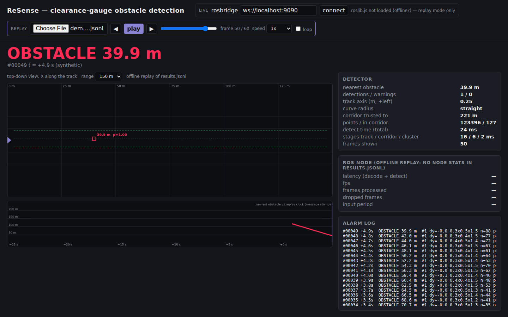

# ReSense web dashboard, RViz / Foxglove layouts, demo tooling (frontend track, P2)

Everything the jury sees: the RViz layout the launch file loads, a Foxglove layout for remote
demos, a browser dashboard that works live (rosbridge) and offline (replay of `results.jsonl`),
the scripts that verify the dashboard headlessly, and the video recipe.

| file | what |
|---|---|
| [`index.html`](index.html) | dashboard: banner, top-down view, timeline, node stats, alarm log; live + offline replay; no build step |
| [`foxglove_layout.json`](foxglove_layout.json) | Foxglove Studio layout (3D + plots + indicator + status), see "Remote demo with Foxglove" |
| [`demo/make_demo_run.py`](demo/make_demo_run.py) | synthetic approach sequence → `out/demo_run.jsonl` in the `resense run --out` format |
| [`demo/check_dashboard.py`](demo/check_dashboard.py) | Playwright + headless Chromium: loads the JSONL into the dashboard, plays it, asserts the banner, screenshot / video |
| [`demo/test_web.py`](demo/test_web.py) | pytest for the layouts, the JSONL format and the browser replay: `python -m pytest -q web/demo` |
| `../ros2_ws/src/resense_ros/rviz/resense.rviz` | RViz2 layout (P2-owned, loaded by `detector.launch.py rviz:=true` and the compose `rviz` service) |


*Offline replay of `web/demo/make_demo_run.py` output (synthetic ray-cast tunnel, not the
organizers' data): the person is confirmed at 115.7 m and tracked down to 40 m.*

## Dashboard (`index.html`)

Open the file in a browser; nothing to install or build. Two modes, same widgets:

* **Live**: enter the rosbridge URL (`ws://<host>:9090`, from
  `ros2 launch rosbridge_server rosbridge_websocket_launch.xml` on the machine running the
  detector) and press *connect*. The page subscribes to `/resense/status` (`std_msgs/String`,
  one JSON `FrameResult` per frame plus the node's `node` object) and needs nothing else — no
  point cloud is streamed to the browser. roslibjs comes from a CDN; without internet the
  live mode is unavailable and the page says so, the replay mode still works.
* **Replay**: *Choose file* → a `results.jsonl` written by
  `python -m resense.cli run --bag <bag> --out results.jsonl` (one `FrameResult` JSON per line
  with the extra `frame` and `frame_id` keys). Play / pause (space), step (◀ ▶, arrow keys),
  seek slider, speed 0.25×–10×, loop. Playback is 10 Hz × speed; the timeline's x-axis is the
  message `stamp` (seconds relative to the first frame), in live mode it is the wall clock.
  Broken or blank lines are skipped.

What is shown:

| widget | source in the status JSON |
|---|---|
| banner **PATH CLEAR / WARNING / OBSTACLE 55.6 m** | `obstacle`, `warning`, `nearest_distance` |
| top-down canvas (100 / 150 / 250 m): track axis, ±1.4 m gauge corridor, untrusted range shaded, red gauge boxes, orange advisory boxes with distance and confidence | `track.center/yaw/curvature/axis_valid`, `detections[]`, `warnings[]` |
| timeline (last 30 s): nearest gauge obstacle (red), nearest advisory object (orange) | `nearest_distance`, `warnings[].distance` |
| detector card: counts, axis, radius, trusted range, points, per-stage timing | `track`, `n_points`, `n_corridor`, `timing_ms` |
| **ROS node card**: `latency_ms`, `fps`, `frames`, `dropped_frames`, `input_period_ms` | `node` (only in the node's messages; a replay file says "no node stats") |
| alarm log: one line per alarm frame (id, lateral offset, size, points, confidence), one line when the alarm ends | `detections[]` |

Health warnings: latency above 100 ms (the 10 Hz period) and fps below 9 turn orange; when
`dropped_frames` **grows** the node card flashes red for 3 s and the log gets a line, and it
stays orange-bordered while the count is above zero.

### Verify headlessly (Playwright)

```bash
pip install playwright                      # the Python package; a Chromium build must be reachable
python web/demo/make_demo_run.py            # synthetic tunnel, person 120 -> 40 m over 40 frames, 10 clear frames before/after
python web/demo/check_dashboard.py          # loads out/demo_run.jsonl, plays it, asserts, screenshot -> docs/img/dashboard_synthetic.png
python -m pytest -q web/demo                # the same as tests (+ layout checks); browser tests skip without Chromium
```

`check_dashboard.py` asserts PATH CLEAR at the start and OBSTACLE with a distance in 40–125 m
during playback, then seeks to the frame with the nearest obstacle for the screenshot. If
Playwright's own browser is missing it falls back to any Chromium under
`$PLAYWRIGHT_BROWSERS_PATH` (or `--chromium <binary>`). `make_demo_run.py` needs open3d (ray
casting); its output is exactly the `resense run --out` format, so the dashboard treats it like
a real run. Both scripts run from the repository root.

## RViz layout (`ros2_ws/src/resense_ros/rviz/resense.rviz`)

* **Fixed frame `resense_lidar`.** The detector node broadcasts a static identity TF
  `resense_lidar → <frame_id of the input cloud>` when the first frame arrives and publishes
  markers, detections and the corridor cloud in the input frame, so the layout no longer
  depends on the bag's frame id (`hesai_lidar` in `roundT_doubleT`, `lidar_livox` in
  `doubleT_obstacle`, unknown in the control bag).
* **Two raw-cloud displays**, `/lidar_points` and `/sensing/lidar/hesai128/pointcloud`, both
  Best Effort / Keep Last / depth 5 (the bag publisher is best-effort): the one the bag carries
  renders, the other stays grey with "No messages received". **A generic third display is not
  possible**: RViz2 subscribes to one literal topic name per display (no wildcard, regex or
  "first PointCloud2 topic" option), so a control bag with a third topic name needs either the
  node's `output_frame` / a `ros2 topic` remap, or one more display added in the *Displays*
  panel during the demo (10 s of clicking: Add → PointCloud2 → pick the topic). The node itself
  auto-discovers the topic, so the detections and the corridor cloud show up regardless.
* Colours: raw cloud by height (−2.5…3.5 m, grey scale), corridor candidates orange, gauge
  boxes red, advisory boxes orange, corridor edges green, status text
  (`PATH CLEAR` / `OBSTACLE 55.6 m`) 1.2 m tall at 8 m ahead of the sensor.
* Camera: orbit view 18 m behind and 15 m above the sensor looking down the track (the sensor
  frame's forward axis is −Y), ~0–90 m in the frame; saved views *Top-down 150 m* and
  *Driver's seat* in the *Views* panel.
* Validated by parsing (`python -m pytest -q web/demo`) and by using only keys RViz2 Humble
  writes into its own saved configs; it has not been opened in RViz in this sandbox (no ROS).

## Remote demo with Foxglove

The spec (§4) rewards a live demo, e.g. over a remote desktop. Foxglove replaces the remote
desktop: the container already runs `foxglove_bridge` on port 8765, the audience opens the
layout in their own Foxglove.

```bash
# on the demo machine (with the bags in $RESENSE_DATA, default /data/for_hackathon)
docker compose --profile viz up                          # detector + foxglove bridge (+ RViz if X11)
docker compose --profile tools up player                 # play $RESENSE_BAG once (add --loop to the player command in docker-compose.yml for a looping demo)
```

Then in Foxglove Studio (desktop app or https://app.foxglove.dev): **Open connection → Foxglove
WebSocket → `ws://<demo host>:8765`**, then **Layout → Import from file → `web/foxglove_layout.json`**.

What the audience sees: a 3D panel (dark, camera behind the sensor looking down the track, both
raw-cloud topics, `/resense/corridor_points` in orange, `/resense/markers` with the boxes, labels,
corridor edges and the status text), an indicator that switches from green *PATH CLEAR* to red
*OBSTACLE* on `/resense/obstacle_detected`, plots of `/resense/nearest_distance` (−1 = none),
`/resense/latency_ms` and `/resense/fps` over the last 30 s, and the raw `/resense/status` JSON.

Known limits:

* **The layout is untested on a live bridge** — no ROS 2 or Foxglove in the sandbox it was
  written in; it parses and uses only documented panel keys (3D: `topics` keyed by name with
  `visible`; Plot: `paths[].value` / `timestampMethod`; Indicator: `path` + `rules`). If a panel
  comes up empty after import, re-pick its topic in the panel settings.
* The 3D panel follows `resense_lidar`; until the node's static TF exists in the running
  version, the raw cloud and the markers still render (same frame), only "follow" is off.
* **Bandwidth**: the raw cloud is 8 MB (120° window) to 24 MB (360°, `doubleT_obstacle`) per frame at 10 Hz. Over a remote link uncheck
  `/lidar_points` / `/sensing/lidar/hesai128/pointcloud` in the 3D panel and keep
  `/resense/corridor_points` (a few thousand points), the markers and the plots — that is the
  full picture of what the algorithm does, at a few hundred kB/s.
* `foxglove_bridge` and the 3D panel expect `sensor_msgs/PointCloud2` with `x y z` float32,
  which both bags provide; the `timestamp` field (year-2000 sensor clock) is ignored.

## Video

Spec §5 asks for a short video of the algorithm at work. Two recipes below produce one from a
run; **the real video on the organizers' bag is a human task (P2) on a machine with the dataset**
— nothing in this section has been run on real data, the numbers are from the synthetic demo run.

### 1. Offline: bag → PNG per frame → mp4

```bash
python -m resense.cli run --bag /data/for_hackathon/doubleT_obstacle --out out/doubleT.jsonl --render out/frames --x-max 150
ffmpeg -framerate 10 -pattern_type glob -i 'out/frames/frame_*.png' \
       -c:v libx264 -pix_fmt yuv420p -vf 'scale=trunc(iw/2)*2:trunc(ih/2)*2' out/doubleT_obstacle.mp4
```

`--render` writes one 1280×720 PNG per frame (top view + side view, corridor points in orange,
detections in red with distance and confidence, status in the title); all 201 frames of
`doubleT_obstacle` give a 20 s clip at 10 fps. `--every 2` halves the work at 5 fps
(`-framerate 5`). Verified on a synthetic bag (`scripts/make_smoke_bag.py` → `resense run --render` →
ffmpeg → mp4); not yet run on the organizers' data. The Playwright package version must match the
Chromium build it drives (`playwright==1.56.0` for the pre-installed chromium-1194 in the team
sandbox; elsewhere `pip install playwright && python -m playwright install --with-deps chromium`
fetches a matching browser), or pass `--chromium <binary>`.

### 2. Dashboard replay recorded with Playwright

```bash
python web/demo/check_dashboard.py --jsonl out/doubleT.jsonl --video out/dashboard.webm --screenshot ''
ffmpeg -i out/dashboard.webm -c:v libx264 -pix_fmt yuv420p out/dashboard.mp4      # optional, for players without VP8
```

Playwright records the whole replay (1440×900, WebM/VP8, with its bundled ffmpeg, no system
ffmpeg needed) and the script moves the file to the path given. `--speed 2` halves the length.
On the synthetic 60-frame demo run in the 4-core sandbox: 905 kB, 7.3 s at 1× (60 frames at
10 Hz plus the load / seek moments at the ends). Videos are not committed (`out/` is gitignored).

### 3. The real video (to do, P2, needs the dataset)

Storyboard for 1–2 minutes, following the organizers' chain *tunnel → point cloud → algorithm →
obstacle → distance*: (1) `./scripts/run_demo.sh /data/for_hackathon/doubleT_obstacle` with
RViz — the raw cloud of the double-track tunnel; (2) toggle *Corridor points* — the orange
gauge corridor; (3) the person crossing the track: red box, label and the banner
`OBSTACLE 55.6 m` (real number, `docs/EXPERIMENTS.md` §1); (4) the dashboard's timeline and
node card (latency / fps / dropped frames) during the same playback; (5) one empty bag
(`roundT_squareT_pressureGate_squareT`) staying `PATH CLEAR` through the gate. Screen-record
with OBS or `ffmpeg -f x11grab -framerate 25 -i :0.0 out/demo.mp4`; the captain links the file
from the README.

## Label tool (`label_tool.html`) and the `gt.json` key convention

A minimal per-frame labelling page for real obstacles (the organizers' extended dataset, or the
person in `doubleT_obstacle`). Open it in a browser, load the `results.jsonl` of the bag
(`python -m resense.cli run --bag <bag> --out results.jsonl`) to get the frame list with the
detector's own output as a reference, or type bag frame indices by hand. For each frame add one
or more obstacles (kind, label, distance along the track, lateral offset, size L/W/H, yaw,
reflectivity, in-gauge flag, point count) — *add from detection* prefills a row from what the
detector reported — or tick *checked, clear* for a verified empty frame. *Export gt.json*
downloads the file; *import gt.json* continues an earlier session. Arrow keys move between
frames; the canvas shows detector boxes (red / orange) and labels (cyan) top-down.

Format, identical to what `resense inject` writes (`cmd_inject` in `resense/cli.py`), so
`resense eval` and `resense/metrics.py` read it unchanged:

```json
{"00042": [{"kind": "person", "size": [0.4, 0.5, 1.7], "distance": 55.6, "lateral": 0.1,
            "yaw_deg": 0.0, "reflectivity": 40.0, "label": "person_crossing", "in_gauge": true,
            "n_points": 1}],
 "00043": []}
```

Key convention (P4 documents the same in `docs/DATASET.md`; the captain reconciles):

* **key = absolute bag frame index, zero-padded to 5 digits** (`"00042"`): the `frame` value in
  `results.jsonl`, the index `resense run` prints, and the `frame_00042.png` name of `--render`.
  `--every N` / `--start` do not renumber (`resense.io.iter_bag_compact` yields the absolute
  index), so labels made on a subsampled run stay valid for the full run. One `gt.json` per bag,
  next to the bag's results, e.g. `data/labels/<bag>/gt.json`.
* `distance` = m along the track to the obstacle's nearest face, `lateral` = m from the track
  axis (+ left), both in the detector's track frame (what the status JSON reports), not in the
  raw sensor frame; `size` = `[L along track, W across, H]` in m.
* `in_gauge` defaults to `|lateral| < 1.3 m` (the rule `cmd_inject` uses) and can be overridden;
  `n_points = 1` means "visible, count unknown" — `resense eval` drops entries with `n_points = 0`
  as occluded, so never export 0 for a real object you can see.
* A frame exported as an empty list is a verified negative (checked, nothing in the gauge);
  frames absent from the file are unlabelled and count as empty in `resense eval` today.
