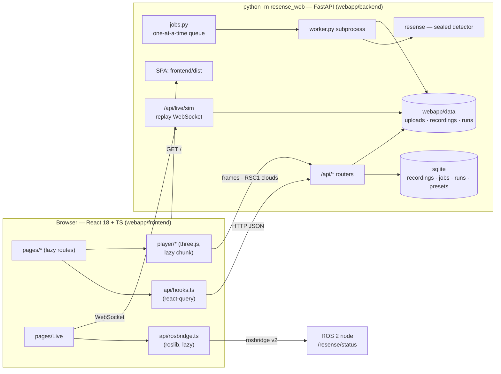

# ReSense web — the jury prototype

A web stand for the ReSense LiDAR obstacle detector of a driverless metro train (ЛЦТ 2026, кейс 05,
Московский метрополитен). Upload a ride (rosbag2, `.mcap`, `.npy/.npz`, a results `.jsonl`) or make
a synthetic demo, run the **sealed** detector on it, and inspect every frame: decisions
СВОБОДНО / ВНИМАНИЕ / СТОП / ОШИБКА, distances, latency, the score against labels, a 3D player
from the cab, comparisons of runs and presets, and a live view of the ROS 2 node. Russian UI,
design «Линия» ([`design/mockup/`](design/mockup/README.md)).

## Run it

```bash
scripts/run_webapp.sh              # http://localhost:8080 — builds the frontend if needed, one port
scripts/run_webapp.sh --install    # first time, with internet: pip install -e . -e webapp/backend, npm ci
```

Development (hot reload on both sides):

```bash
python -m resense_web --port 8000 --reload          # backend (webapp/backend)
cd webapp/frontend && npm ci && npm run dev         # http://localhost:5173, /api proxied to :8000
```

Data lives in `webapp/data/` (`RESENSE_WEB_DATA`); «Папка на сервере» browses `RESENSE_DATA`
(`/data/for_hackathon` when present). More in [`backend/README.md`](backend/README.md) and
[`frontend/README.md`](frontend/README.md).

## Pages

| route | page | what it is for |
|---|---|---|
| `/` | Главная | a new recording or a demo in one click, the latest runs, the stand and key results |
| `/upload` | Загрузка | file / folder / drag-and-drop, a server folder, demo scenarios; preset and options; «Обработать» |
| `/queue` | Очередь | the running job (stage, %, frames/s, ETA), waiting and finished jobs, logs, cancel / retry |
| `/runs` | Прогоны | every run with its decision strip and verdict; search, filters, rename, delete, pick for compare |
| `/runs/:id` | Прогон | one run: KPIs, decisions per frame against labels, distance chart, events, 3D preview, downloads |
| `/player`, `/player/:id` | Плеер | fullscreen 3D cab: point cloud, envelope, objects, HUD tiles, scrubber with events, keyboard |
| `/compare?runs=a,b` | Сравнение | 2–4 runs side by side: KPI table with the best values, aligned strips, distances, preset diff |
| `/live` | Прямой эфир | the ROS 2 node through rosbridge, or a replay of a run over the WebSocket, as the driver sees it |
| `/presets` | Параметры | the sealed «Стандарт 1.0» and user presets of the detector's tunable parameters |
| `/about` | О системе | the pipeline, the decision rules, results, how to check it (ROS 2 and web), docs, team |

## Architecture



The HTTP contract of both sides is [`API.md`](API.md). The backend never changes the detector: the
worker builds a `DetectorConfig` from a preset and calls `Detector.process` frame by frame.

## Tests

```bash
cd webapp/backend && python -m pytest -q                 # backend: units + the real worker chain (~1 min)
cd webapp/frontend && npx tsc --noEmit && npm test       # frontend: types + vitest (~10 s)
python -m pytest -q webapp/e2e                           # browser end to end on the built site (~5 min)
```

The e2e suite is described in [`e2e/README.md`](e2e/README.md).
